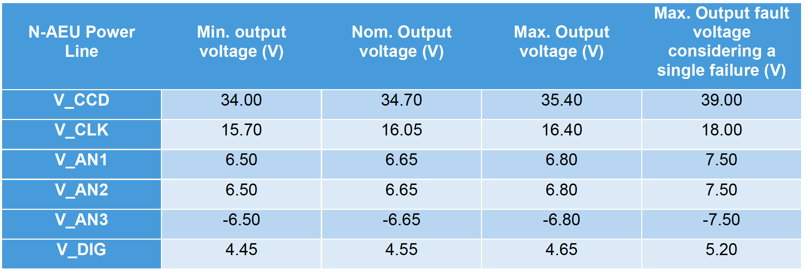
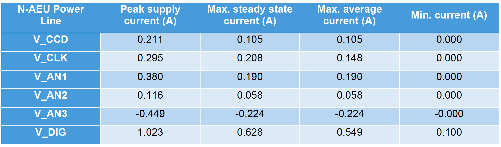
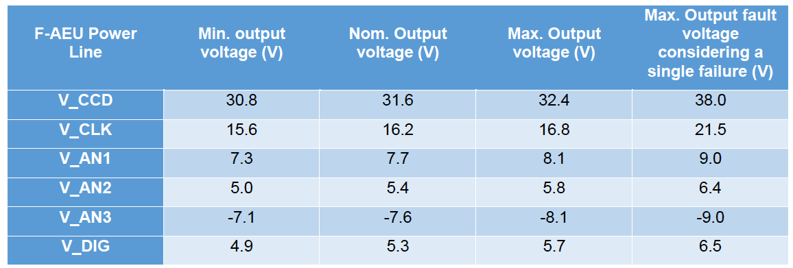
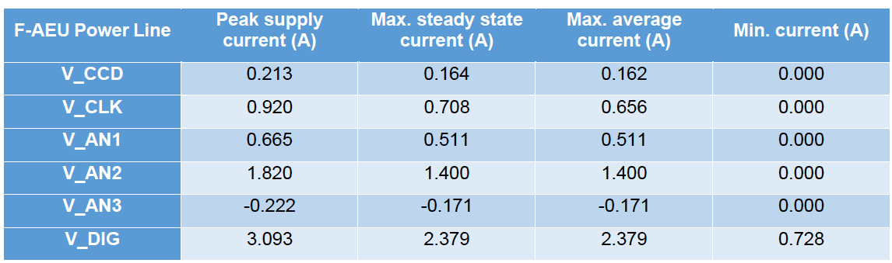
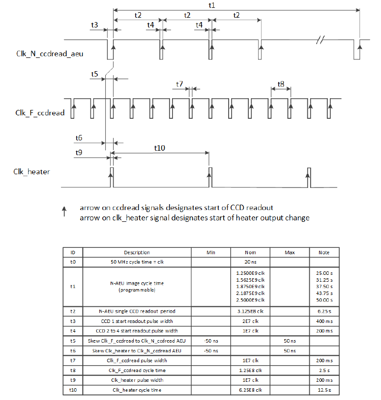
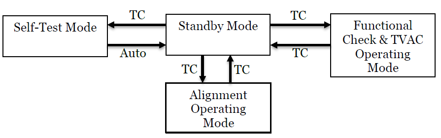
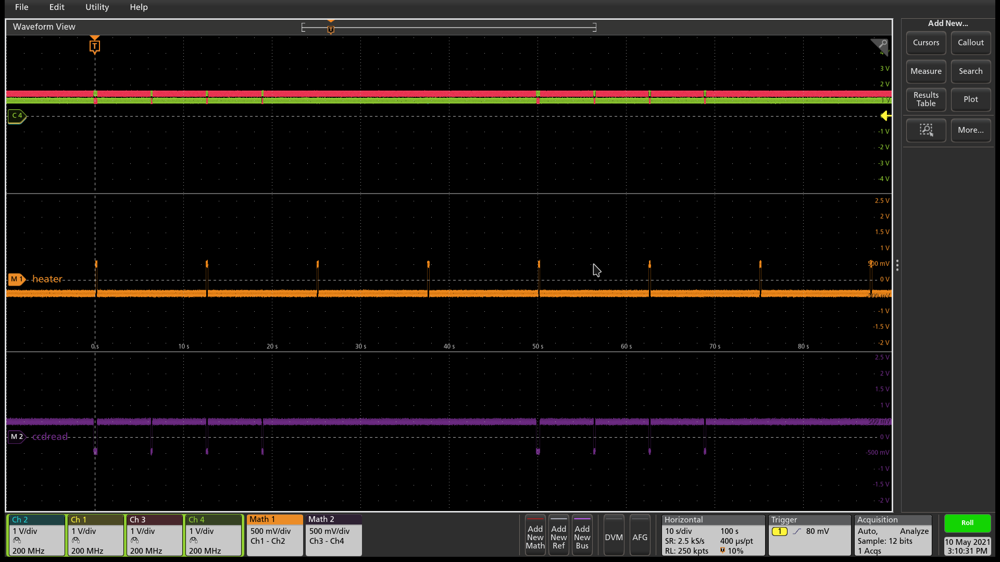
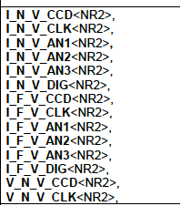
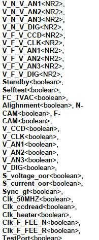

[#aeu-operations]
== Operating the AEU EGSE

=== Introduction

On the spacecraft, the Ancillary Electronics Unit (AEU) is providing the
FEE with the necessary stabilised secondary voltages and is also
providing synchronisation signals to allow the different FEEs to
synchronise their CCD readout cycle to the temperature control system
(TCS) heater power switching.

On CAM level, we do not use a flight-like AEU. A dedicated AEU EGSE is
providing the power supplies and synchronisation signals needed to
operate a single N-type or single F-type camera.

The AEU EGSE supplies 6 voltages to the FEE:

* V_CCD
* V_CLK
* V_AN1
* V_AN2
* V_AN3
* V_DIG

xref:fig-n-aeu-default-voltages[xrefstyle=short], xref:fig-n-aeu-default-currents[xrefstyle=short], xref:fig-f-aeu-default-voltages[xrefstyle=short], and xref:fig-f-aeu-default-currents[xrefstyle=short]  list the default voltage and current values for the N-AEU and F-AEU.

.Default voltage values for the N-AEU.
[#fig-n-aeu-default-voltages]

.Default current values for the N-AEU.
[#fig-n-aeu-default-currents]

.Default voltage values for the F-AEU.
[#fig-f-aeu-default-voltages]

.Default current values for the F-AEU.
[#fig-f-aeu-default-currents]

The AEU EGSE provides sync pulses to the N-FEE, F-FEE, TCS EGSE, and the
EGSE (e.g. shutter controller of the OGSE). The following
synchronisation signals can be configured:

* `Clk_N_ccdread_AEU` / `Clk_F_ccdread_AEU`;
* `Clk_heater` (nominal/redundant in case of operating an F-CAM);
* `Clk_50MHz` (nominal redundant in case of operating an N-CAM)

The synchronisation output signal timings are shown in xref:fig-aeu-sync-sgnals[xrefstyle=short].

.Synchronisation output signal timings: Clk_ccdread & Clk_heater, as taken from RD-05.
[#fig-aeu-sync-sgnals]

=== AEU switch on and off

The AEU is switched on by the operator by powering up the unit. During
the first 3 minutes after powering up no AEU commanding shall take
place. The front-panel leds stand-by, self-test, functional check &
TVAC, and alignment will be blinking until the system is ready.

[#changing-aeu-op-mode]
=== Changing between AEU EGSE operation modes

The AEU EGSE has 4 functional modes:

*Stand-by:*

* AEU EGSE has power and is ready to receive commands;
* AEU EGSE distributes telemetry;
* No sync signal is generated;
* All FEE secondary voltages are down and cannot be activated.

*Functional check & TVAC mode*

* AEU EGSE has power and is ready to receive commands;
* AEU EGSE distributes telemetry;
* All sync signals can be commanded on/off;
* Secondary voltage generation can be commanded on and off.

*(ambient) Alignment operating mode*

* AEU EGSE has power and is ready to receive commands;
* AEU EGSE distributes telemetry;
* Only following synchronisation signals can be commanded on/off:
** `Clk_50MHz_N-AEU_N-FEE`;
** `Clk_50MHz_F-AEUnom_F-FEE`;
** `Clk_50MHz_F-AEUred_F-FEE`.
* The secondary voltage generation can be commanded on/off;

*Self-test*

* EGSE runs a self-diagnostic to check the status of its sync and
secondary voltage outputs, and reports the results in its TM;
* The GSE autonomously reverts to stand-by mode once the self-diagnostic
is complete;
* In this mode, the FEE and TCS EGSE have to be physically disconnected
from the AEU EGSE, and their connectors on the AEU EGSE have to be
connected to the test port connector on the AEU EGSE.

.AEU EGSE mode transitions.

Switching modes:
----
>>> from egse.aeu.aeu import OperatingMode
>>> aeu.set_operating_mode(OperatingMode.STANDBY)
>>> aeu.set_operating_mode(OperatingMode.FC_TVAC)
>>> aeu.set_operating_mode(OperatingMode.ALIGNMENT)
>>> aeu.set_operating_mode(OperatingMode.SELFTEST)
----
Checking in which mode the AEU is:
----
>>> mode = aeu.get_operating_mode()
----

=== Power supply Unit: Setting and checking Current and voltage protections

To read the voltage and current setpoints, and the corresponding
over-protection values (OVP and OCP) from the power supply units:
[source%nowrap]
----
>>> v_ccd, v_clk, v_an1, v_an2, v_an3, v_dig = aeu.get_psu_voltage_setpoints()
>>> ovp_ccd, ovp_clk, ovp_an1, ovp_an2, ovp_an3, ovp_dig = aeu.get_psu_ovp()
>>> i_ccd, i_clk, i_an1, i_an2, i_an3, i_dig = aeu.get_psu_current_setpoints()
>>> ocp_ccd, ocp_clk, ocp_an1, ocp_an2, ocp_an3, ocp_dig = aeu.get_psu_ocp()
----
To read the measured voltages and currents from the power supply units:
[source%nowrap]
----
>>> v_ccd, v_clk, v_an1, v_an2, v_an3, v_dig = aeu.get_psu_voltages()
>>> i_ccd, i_clk, i_an1, i_an2, i_an3, i_dig = aeu.get_psu_currents()
----

=== FEE voltages and currents

To read the measured values for the voltages and currents, and the
corresponding protection values (UVP, OVP, and OCP):

For the N-CAM:
[source%nowrap]
----
>>> v_ccd, v_clk, v_an1, v_an2, v_an3, v_dig = aeu.get_n_cam_voltages()
>>> uvp_ccd, uvp_clk, uvp_an1, uvp_an2, uvp_an3, uvp_dig = aeu.get_n_cam_uvp()
>>> ovp_ccd, ovp_clk, ovp_an1, ovp_an2, ovp_an3, ovp_dig = aeu.get_n_cam_ovp()
>>> i_ccd, i_clk, i_an1, i_an2, i_an3, i_dig = aeu.get_n_cam_currents()
>>> ocp_ccd, ocp_clk, ocp_an1, ocp_an2, ocp_an3, ocp_dig = aeu.get_n_cam_ocp()
----

For the F-CAM:

[source%nowrap]
----
>>> v_ccd, v_clk, v_an1, v_an2, v_an3, v_dig = aeu.get_f_cam_voltages()
>>> uvp_ccd, uvp_clk, uvp_an1, uvp_an2, uvp_an3, uvp_dig = aeu.get_f_cam_uvp()
>>> ovp_ccd, ovp_clk, ovp_an1, ovp_an2, ovp_an3, ovp_dig = aeu.get_f_cam_ovp()
>>> i_ccd, i_clk, i_an1, i_an2, i_an3, i_dig = aeu.get_f_cam_currents()
>>> ocp_ccd, ocp_clk, ocp_an1, ocp_an2, ocp_an3, ocp_dig = aeu.get_f_cam_ocp()
----

=== FEE voltage memories

The AEU EGSE provides three memory positions to store default values for
the FEE voltages: position A, B, C.

TBD: We store the nominal N-FEE values in memory position A, the nominal
values for F-FEE in memory position B. + commands to store voltages,
currents, protection values in the memory positions

=== AEU powering up and down FEE

To power on and off the N- or F-CAM, the following building blocks can
be used:
[source%nowrap]
----
>>> aeu.n_cam_swon()
>>> aeu.n_cam_swoff()

>>> aeu.f_cam_swon()
>>> aeu.f_cam_swoff()
----

Note that switching on the camera, will put the AEU in functional check
and TVAC mode. Switching off, will put it back to stand-by mode.

=== AEU configuring synchronisation signals

For the N-CAM, the synchronisation signals must be configured according
to the desired image cycle time. Allowed values for the image cycle time
are: 25, 31.25, 37.50, 43.75, and 50s. Note that - for image cycle times
longer than 25s - not all heater sync pulses are synchronised with a
Clk_ccdread sync pulse.

The following building blocks enable and disable the clock sync signals
that are sent to the N-FEE (i.e. Clk_50MHz, Clk_ccdread (here with an
image cycle time of 25s), and Clk_heater (synchronised with
Clk_ccdread)):

[source%nowrap]
----
>>> aeu.n_cam_sync_enable(image_cycle_time=25)
>>> aeu.n_cam_sync_disable()
----
For the F_CAM, the following building blocks enable and disable the
clock sync signals that are sent to the F-FEE (i.e.Clk_50MHz,
Clk_F_ccdread, and Clk_heater (synchronised with Clk_F_ccdread); nominal
clocks only):

[source%nowrap]
----
>>> aeu.f_cam_sync_enable()
>>> aeu.f_cam_sync_disable()
----
To check the sync status of the clocks (i.e. whether or not they are
enabled) and whether or not a synchronisation failure has been detected:

For the N-CAM:

[source%nowrap]
----
>>> clk_50mhz, clk_ccdread = aeu.get_n_cam_sync_status()
>>> clk_50mhz, clk_ccdread = aeu.get_n_cam_sync_quality()
----
For the F-CAM:

[source%nowrap]
----
>>> clk_50mhz_nom, clk_50_mhz_red, clk_ccdread_nom, clk_ccdread_red = aeu.get_f_cam_sync_status()
>>> clk_50mhz_nom, clk_50_mhz_red, clk_ccdread_nom, clk_ccdread_red = aeu.get_f_cam_sync_quality()
----
For the SVM/heater:

[source%nowrap]
----
>>> clk_50mhz_nom, clk_50mhz_red, clk_heater_nom, clk_heater_red = aeu.get_svm_sync_status()
>>> clk_50mhz_nom, clk_50mhz_red, clk_heater_nom, clk_heater_red = aeu.get_svm_sync_quality()
----
.Clk_N_ccdread (purple) sync pulses and Clk_heater pulses(orange) with image cycle time set to 50s (instead of the nominal 25s). Note that the pulse to read the 1st CCD is wider. The Clk_heater pulses continue with a period of 12.5s, independently of the image cycle time so if the image cycle time is not 25s, the heater will not always be synchronised with a CCD readout.

=== AEU self test

When the AEU is put in self-test mode (see <<changing-aeu-op-mode>>), the loopback
option can be set as follows:

[source]
----
>>> aeu.selftest(LoopBack.NO_LOOPBACK)
>>> aeu.selftest(LoopBack.F_CAM_NOM)
>>> aeu.selftest(LoopBack.F_CAM_RED)
>>> aeu.selftest(LoopBack.N_CAM)
>>> aeu.selftest(LoopBack.SVM_NOM)
>>> aeu.selftest(LoopBack.SVM_RED)
----

=== AEU Telemetry parameters

=== Functional summary

At the start of a test day, the following two AEU building blocks must
be executed (either independently or in another building block):

[cols="5,3",options="header",]
|===
|For N-CAM testing: |For F-CAM testing:
a|----
>>> aeu.n_cam_swon()
>>> aeu.n_cam_sync_enable(image_cycle_time)
----
a|----
>>> aeu.f_cam_swon ()
>>> aeu.f_cam_sync_enable()
----
|===

At the end of a test day, the following two AEU building blocks must be
executed (either independently or in another building block):

[cols="5,3",options="header",]
|===
|For N-CAM testing: |For F-CAM testing:
a|----
>>> aeu.n_cam_sync_disable()
>>> aeu.n_cam_swoff()
----
a|----
>>> aeu.f_can_sync_disable()
>>> aeu.f_cam_swoff()
----
|===
