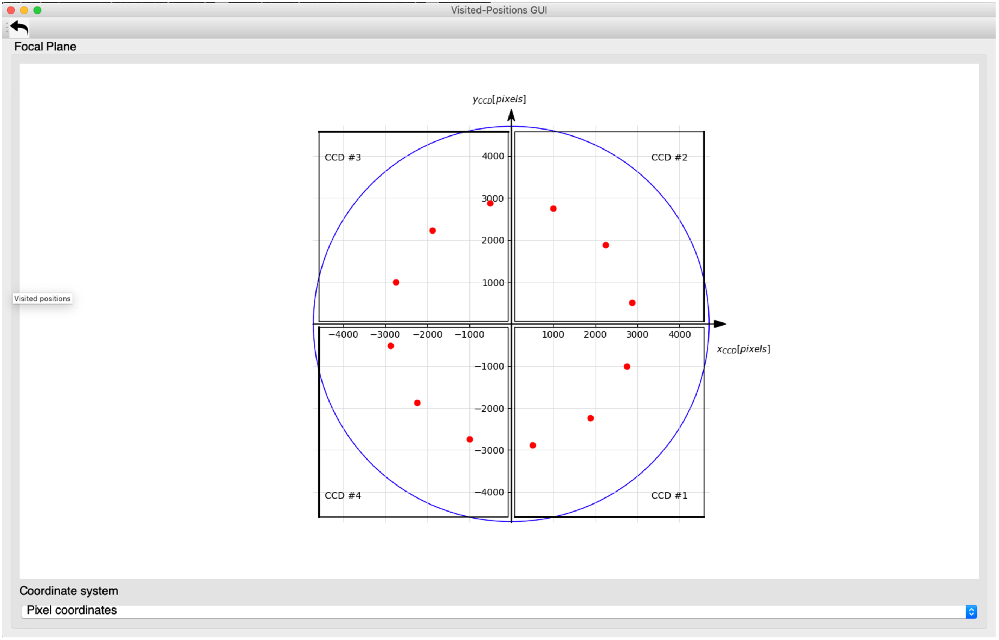

== Appendices

=== Appendix A: Examples of CCD acquisition timing sequence

*Commanding:* To keep notations light, the building blocks in the examples below are presented directly at the python prompt, but in operations they will be refused outside of either another function or building-block, or (if they by themselves constitute the entire test) an execute() command (see <<test-execution>>).

*Timing:* In all cases, our time reference starts at the pulse triggering

[loweralpha]
. the commanded configuration
. the readout of CCD 1 (integrating previously, but readout under the new configuration)

In most cases, as long as the cycle-time and the ccd_order remain unchanged by the configuration occurring at t = 0, the images read out during the first cycle can probably be used directly since, e.g. the just commanded partial readout would be applied. This must be assessed on a case-by-case basis. It will make a difference of one cycle wrt the first moment where a representative set of images corresponding to the new configuration has been recorded. This explains why an apparently redundant cycle is represented in all examples below.

For instance, in the example of <<ex-4-ccd-alt-e-f>>, if the images acquired during cycle 1 can be used, the 4 CCDs will be covered in 2 cycles, i.e. the FEE can be reconfigured after 2 long pulses, at t=50; else another cycle will be necessary and a new configuration can only be commanded after t = 72.75, to take effect on t=75 seconds.

[#ex-4-ccd-alt-e-f]
==== 4 CCDs nominal cycle time, alternating E & F sides (full-image mode)

Different commanding options are equivalent.
[%nowrap]
----
>>> n_cam_full_standard(num_cycles=0, ccd_side=”ALT”)
>>> n_cam_full_ccd (num_cycles=0, ccd_order=[1,2,3,4], ccd_side=”ALT”)
>>> n_cam_partial_ccd (num_cycles=0, row_start=0, row_end=4539, ccd_order=[1,2,3,4], ccd_side=”ALT”)
----
This is equivalent to explicit calls for ‘E’ and ‘F’ sides
----
>>> while condition:
... n_cam_full_standard(num_cycles=1, ccd_side=”E”)
... n_cam_full_standard(num_cycles=1, ccd_side=”F”)
----
[%nowrap]
----
start readout CCD1_E: 0.00 long pulse, FEE config, start cycle 1, readout E-sides of previously ongoing exposures
start integr. CCD1: 4.00
start readout CCD2_E: 6.25 short pulse
start integr. CCD2: 10.25
start readout CCD3_E: 12.50 short pulse
start integr. CCD3: 16.50
start readout CCD4_E: 18.75 short pulse
start integr. CCD4: 22.75
start readout CCD1_F: 25.00 long pulse, start cycle 2, readout F-sides
start integr. CCD1: 29.00
start readout CCD2_F: 31.25
start integr. CCD2: 35.25
start readout CCD3_F: 37.50
start integr. CCD3: 41.50
start readout CCD4_F: 43.75
start integr. CCD4: 47.75
start readout CCD1_E: 50.00 long pulse, start cycle 3
start integr. CCD1: 54.00
start readout CCD2_E: 56.25
start integr. CCD2: 60.25
start readout CCD3_E: 62.50
start integr. CCD3: 66.50
start readout CCD4_E: 68.75
start integr. CCD4: 72.75
start readout CCD1_F: 75.00 long pulse, start cycle 4
start integr. CCD1: 79.00
----
[#ex-4-ccd-alt-e-f-long]
==== 4 CCDs nominal cycle time, alternating E & F sides, longer cycle-time (full-image mode)
[%nowrap]
----
>>> n_cam_partial_cycle_config (num_cycles=0, row_start=0, row_end=4539, rows_final_dump=0, ccd_order=[1,2,3,4], ccd_side=”ALT”, cycle_time=50)
----
[%nowrap]
----
start readout CCD1_E: 0.00 long pulse, FEE config, start cycle 1, readout E-sides of previously ongoing exposures
start integr. CCD1: 4.00
start readout CCD2_E: 6.25 short pulse
start integr. CCD2: 10.25
start readout CCD3_E: 12.50 short pulse
start integr. CCD3: 16.50
start readout CCD4_E: 18.75 short pulse
start integr. CCD4: 22.75
start readout CCD1_F: 50.00 long pulse, star cycle 2, readout F-sides
start integr. CCD1: 54.00
start readout CCD2_F: 56.25
start integr. CCD2: 60.25
start readout CCD3_F: 62.50
start integr. CCD3: 66.50
start readout CCD4_F: 68.75
start integr. CCD4: 72.75
start readout CCD1_E: 100.00 long pulse, start cycle 3
start integr. CCD1: 104.00
start readout CCD2_E: 106.25
start integr. CCD2: 110.25
start readout CCD3_E: 112.50
start integr. CCD3: 116.50
start readout CCD4_E: 118.75
start integr. CCD4: 122.75
start readout CCD1_F: 150.00 long pulse, start cycle 4
start integr. CCD1: 154.00
----

[#ex-4-ccd-both]
==== 4 CCDs nominal cycle time, acquiring E & F sides simultaneously (full-image or windowing mode)

Examples of building block parametrisation to achieve this:
----
>>> n_cam_full_standard(ccd_side=”BOTH”)
>>> n_cam_full_ccd (num_cycles=0, ccd_order=[1,2,3,4], ccd_side=”BOTH”)
----
[%nowrap]
----
start readout CCD1: 0.00 long pulse, FEE config, start cycle 1, readout E & F-sides of previously ongoing exposures
start integr. CCD1: 4.00
start readout CCD2: 6.25 short pulse
start integr. CCD2: 10.25
start readout CCD3: 12.50 short pulse
start integr. CCD3: 16.50
start readout CCD4: 18.75 short pulse
start integr. CCD4: 22.75
start readout CCD1: 25.00 long pulse, start cycle 2, readout *E & F-sides*
start integr. CCD1: 29.00
start readout CCD2: 31.25
start integr. CCD2: 35.25
start readout CCD3: 37.50
start integr. CCD3: 41.50
start readout CCD4: 43.75
start integr. CCD4: 47.75
start readout CCD1: 50.00 long pulse, start cycle 3
start integr. CCD1: 54.00
----

==== Non-standard CCD order, nominal cycle time, alternating E & F sides (full-image mode)
----
>>> n_cam_full_ccd (num_cycles=0, ccd_order=[1,1,1,3], ccd_side=”ALT”)
----
[%nowrap]
----
start readout CCD1_E: 0.00 long pulse, FEE config, start cycle 1, readout E-sides of previously ongoing exposures
start integr. CCD1: 4.00
start readout CCD1_E: 6.25 short pulse
start integr. CCD1: 10.25
start readout CCD1_E: 12.50 short pulse
start integr. CCD1: 16.50
start readout CCD3_E: 18.75 short pulse
start integr. CCD3: 22.75
start readout CCD1_F: 25.00 long pulse, start cycle 2, readout F-sides
start integr. CCD1: 29.00
start readout CCD1_F: 31.25
start integr. CCD1: 35.25
start readout CCD1_F: 37.50
start integr. CCD1: 41.50
start readout CCD3_F: 43.75
start integr. CCD3: 47.75
start readout CCD1_E: 50.0000 long pulse, start cycle 3
start integr. CCD1: 54.00
start readout CCD1_E: 56.25
start integr. CCD1: 60.25
start readout CCD1_E: 62.50
start integr. CCD1: 66.50
start readout CCD3_E: 68.75
start integr. CCD3: 72.75
start readout CCD1_F: 75.0000 long pulse, start cycle 4
start integr. CCD1: 79.00
----

==== Partial readout, external sync, single side (full-image mode)

[%nowrap]
----
>>> n_cam_partial_ccd (num_cycles=0, row_start=500, row_end=1000, rows_final_dump=4510, ccd_order=[1,1,1,1], ccd_side=”E”)
----
For the same of simplicity, the timing below assumes the readout & clearout take exactly one second in total.
----
start readout CCD1_E: 0.00 long pulse, FEE config, start cycle 1
start integr. CCD1: 1.00
start readout CCD1_E: 6.25 short pulse
start integr. CCD1: 7.25
start readout CCD1_E: 12.50 short pulse
start integr. CCD1: 13.50
start readout CCD1_E: 18.75 short pulse
start integr. CCD1: 19.75
start readout CCD1_E: 25.00 long pulse, FEE config, start cycle 2
start integr. CCD1: 26.00
----

==== Partial readout, internal sync, single side (full-image mode)

[%nowrap]
----
>>> n_cam_partial_ccd_int_sync (num_cycles=0, row_start=500, row_end=1000, rows_final_dump=4510, ccd_order=[1,1,1,1], ccd_side=”E”, exposure_time=3)
----
For the same of simplicity, the timing below assumes the readout & clearout take exactly one second in total. In fact they are estimated from row_start, row_end and rows_final_dump, and the cycle time is then commanded to (readout_time + exposure_time)

[%nowrap]
----
start readout CCD1_E: 0.00 long pulse, FEE config, start cycle 1
start integr. CCD1_E: 1.00
start readout CCD1_E: 4.00 long pulse, start cycle 2
start integr. CCD1_E: 5.00
start readout CCD1_E: 8.00 long pulse, start cycle 3
start integr. CCD1_E: 9.00
----

=== Appendix B: Field of view representation with visited positions in CSL

Starting a GUI on the operator screen showing the FOV:
----
from egse import visitedpositions +
view = visitedpositions.start_visited_positions_gui()
----
Then you can add the visited locations as follows:

* in focal-plane coordinates (x_fp, y_fp) [mm]:
+
----
>>> view.visit_focal_plane_position(x_fp, y_fp)
----
* in CCD coordinates (row, column) [pixel] on a given CCD:
+
----
>>> view.visit_ccd_position(row, column, ccd_code)
----
* in field angles (theta, phi) [degrees]:
+
----
>>> view.visit_field_angles(theta, phi)
----
At each of these locations, a red dot will appear on the plot. You can switch between coordinate system (used in the plot) with the combobox below the plot window (focal-plane coordinates, pixel coordinates, and field angles).

.Visited positions gui. From the commanding script you can launch the gui visible to the operator and add positions (red dots) to visualise the progress of a measurement.

Alternatively, you can fire up this GUI with
----
$ visited_positions_ui
----
and add the visited locations with the following commands:

* in focal-plane coordinates (x_fp, y_fp) [mm]:
+
----
>>> visit_focal_plane_position(x_fp, y_fp)
----
* in CCD coordinates (row, column) [pixel] on a given CCD:
+
----
>>> visit_ccd_position(row, column, ccd_code)
----
* in field angles (theta, phi) [degrees]:
+
----
>>> visit_field_angles(theta, phi)
----
These commands can be used in test scripts, to visualise visited positions, without having to pass on the GUI object (or checking for its existence). In case the GUI has been fired up, the positions will be marked in the GUI. If not, nothing will happen (no error will occur).

In `camtest.commanding.csl_gse`, there are a couple of building blocks to move the mechanisms (i.e. hexapod and stages) such that the point sources falls on a specified position:

----
>>> point_source_to_fov(theta, phi)
>>> point_source_to_fp(x, y)
----
When executing these building blocks, a red dot will be added to the GUI, marking that position (in case the GUI was fired up).
