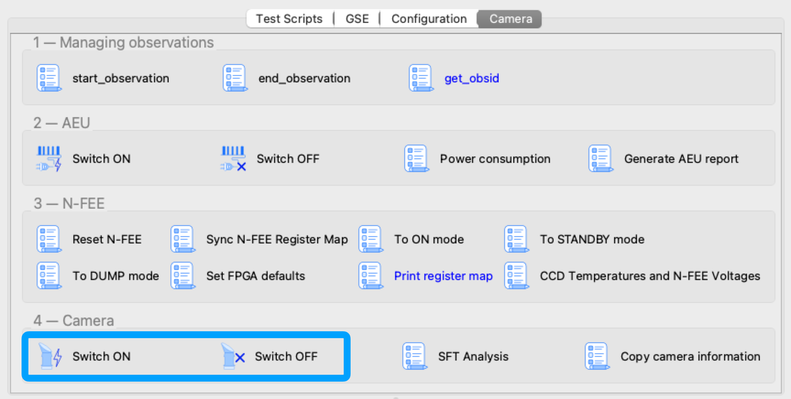
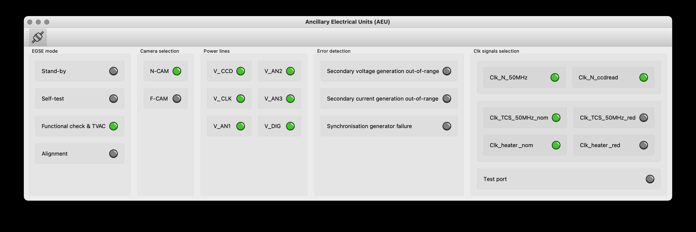

[#camera-switch-on-off]
== Switching ON/OFF the Camera

Before you can start any operations or tests, you will need to switch on the Camera N-CAM following a dedicated Camera Switch ON procedure. Also for switching off the Camera you will need to follow a series of steps to be executed in the correct order.

The procedure for Camera Switch ON is the following:

. Send commands to the AEU to power on the camera and enable the sync signals → Camera is now in ON mode
. Send the FPGA defaults to the N-FEE
. Go to STANDBY mode
. Go to DUMP mode, external sync

The procedure for the Camera Switch OFF:

. Go to STANDBY mode
. Go to ON mode
. Send commands to the AEU to disable the sync signals and power off the camera

Note that, although the individual steps all exist as tasks in the Operator GUI, the procedure to switch OFF and ON the Camera should be used from the Operator GUI:  `Camera TAB > 4 — Camera > Switch ON / Switch OFF`. These tasks step through the different steps in the procedure and perform additional checks like voltages/currents/power, N-FEE mode etc. prompting the user for confirmation at each step.

.Screenshot of the Operator Task GUI where the Camera Switch On and Switch OFF have been framed.

=== Detailed description of Camera Switch ON

This section describes what is done during the Camera Switch ON procedure, i.e. by running the task 'Camera Switch ON' in the Operator GUI. Although the individual steps are explained in detail, you should still run the `Camera Switch ON` task instead of each step separately. *Only use the individual commanding when in a contingency*.

The AEU Test EGSE shall be on StandBy mode before we start. You can check that in the AEU GUI where the _Stand-by_ LED in the left panel (EGSE mode) shall be green.

WARNING: Before powering on the AEU, stop all AEU related control servers. When you power on the AEU, the LEDs on the front panel start blinking (you won't see anything in the AEU GUI since the control servers are not running). This blinking takes about three minutes and you shall NOT start the AEU control servers before the LEDs stop blinking.

*Step 1. Send commands to the AEU to power on the camera and enable the sync signals*

The AEU Test EGSE is now ready to power the camera and enable the synchronisation. This is the first step in the procedure. The individual task is: `Task GUI > Camera TAB > 2 — AEU > Switch ON`. From the Python REPLfootnote:[A REPL (Read-Eval-Print Loop) is an interactive programming environment that allows users to enter Python code, which is then executed, and the results are immediately displayed, aka the Python command prompt.], you can execute these commands:
[source,%nowrap]
----
>>> from camtest import start_observation, end_observation  <1>
>>> from camtest.commanding import aeu

>>> start_observation("AEU N-CAM Switch ON")
>>> aeu.n_cam_swon()
>>> aeu.n_cam_sync_enable(image_cycle_time=25, svm_nom=1, svm_red=0)
>>> end_observation()
----
<1> import statements will be given only once, they are normally automatically loaded from the `startup.py` file.

The camera shall now be in ON mode (check this in the DPU GUI) and the AEU GUI should have the following LEDs turned green: 'Functional check & TVAC', 'N-CAM', all power lines

.The state of the AEU Test EGSE after a AEU N-CAM Switch ON

At this point, the Camera Switch ON procedure will perform a few additional tasks that are not done when you execute the individual steps:

. The AEU (cRIO & PSU) HK sampling frequency will be increased to 4Hz for the time of the Camera Switch ON procedure. The frequency can be changed in the arguments panel of the task GUI.
. The N-FEE register map is loaded by the DPU Processor. This will synchronise the DPU Processor internal state with the N-FEE state. This step requires that the DPU CS was started and is running.
. The AEU cRIO voltages and currents will be printed in an overview table and checked against their limits. The operator is asked to confirm or abort.

*Step 2. Send the FPGA defaults to the N-FEE*

NOTE: This step shall be skipped for the EM camera as there are not updated FPGA defaults defined for EM.

Each camera N-FEE requires a update of a number of FPGA parameters in the register map. That is what we call the _FPGA defaults_. Please note that these settings are camera specific and influence the proper readout of the CCDs, so it's important that this step is executed at the right time in the procedure. The individual task is: `Task GUI > Camera TAB > 3 — N-FEE > Set FPGA defaults`. From the REPL you can execute these commands:
[source]
----
>>> from camtest.commanding import dpu
>>> execute(dpu.n_fee_set_fpga_defaults)
----
The user will be prompted to confirm the values have been correctly applied in the N-FEE FPGA.

The FPGA defaults are read from the current Setup. In the Setup there is an entry `setup.camera.fee.fpga_defaults` that loads the YAML file with the correct values for the camera. The values are expressed as registers (32bit values) and not as individual parameters. You can inspect the values as follows:
----
>>> setup.camera.fee.fpga_defaults

NavigableDict
├── reg_0_config: 119D0000
├── reg_1_config: 0
├── reg_2_config: E40FA36B
├── reg_3_config: 8F60000
├── reg_4_config: 186A7D8C
├── reg_5_config: 3EA030D4
├── reg_6_config: 0
├── reg_7_config: 0
├── reg_8_config: 0
├── reg_9_config: 0
├── reg_10_config: 0
├── reg_11_config: 0
├── reg_12_config: 0
├── reg_13_config: 0
├── reg_14_config: 0
├── reg_15_config: 0
├── reg_16_config: 0
├── reg_17_config: 0
├── reg_18_config: 7FE7EF16
├── reg_19_config: FE7EE7FE
├── reg_20_config: 19BCD
├── reg_21_config: 5E5000
├── reg_22_config: 4241AE9
├── reg_23_config: 0
├── reg_24_config: 0
├── reg_25_config: 6400000
└── reg_26_config: 3E807D0

>>> setup.camera.fee.get_raw_value('fpga_defaults')
'yaml//../../common/n-fee/nfee_fpga_defaults_brigand.yaml'
----

*Step 3. Go to STANDBY mode*

Now, the camera will be brought into STANDBY mode. This means the CCDs will be powered and start accumulating flux. The individual task is: `Task GUI > Camera TAB > 3 — N-FEE > To STANDBY mode`. From the REPL, the command is:
----
>>> execute(dpu.n_cam_to_standby_mode)
----
In the Camera Switch ON procedure, the user will be prompted to confirm the N-FEE is actually in STANDBY mode.

Again, the procedure will check the AEU cRIO voltages and currents and print an overview table. Please note that the configured limits are different for ON mode, STANDBY mode and also DUMP mode. At each step the procedure will perform this check. The operator is asked to confirm or abort.

*Step 4. Go to DUMP mode, external sync*

The last step in the switch-on procedure is to bring the camera in DUMP mode (external sync). As explained in <<n-fee-operations>>, DUMP mode is not a genuine FEE operation mode, but is defined in the CGSE as a state in which the N-FEE is in FULL IMAGE mode in which the dump gate is kept high, continuously resetting the readout register. No data is acquired or send to the DPU. The indicidual task is: `Task GUI > Camera TAB > 3 — N-FEE > To DUMP mode`. The command you can use in the REPL is:
----
>>> execute(dpu.n_cam_to_dump_mode)
----
The user will then be prompted to confirm that the N-FEE is actually in DUMP mode. After confirmation, the AEU cRIO voltages and currents will be checked against their limits and printed in an overview table asking the user for another confirmation.

One last step that is part of the Camera Switch ON procedure is to take a series of single images without the light source on. That is, it will be full frame darks with the dump gate enabled.
[source,%nowrap]
----
>>> dpu.n_cam_acquire_and_dump(num_cycles=5, row_start=0, row_end=4539, rows_final_dump=0, ccd_order=[1, 2, 3, 4], ccd_side="BOTH")
----

Finally, the AEU cRIO and PSU HK frequency is reset to their default values from the Settings, i.e. `HK_DELAY`.

This concludes the Camera Switch ON procedure as it is currently implemented and required to execute. The camera will be in DUMP mode after this switch-on which is the starting state for all the TVAC tests that will be executed.

=== Detailed description of Camera Switch OFF

Switching OFF the camera is much simpler and doesn't require specific checks. The N-FEE should normally be in DUMP mode when you start this switch-off and is brought first to STANDBY mode, then to ON mode. Each of these steps require confirmation from the operator. Finally, the AEU Switch OFF is executed which disables the sync signals and powers off the camera. The individual tasks are `Camera TAB > 3 — N-FEE > To STANDBY mode`, `Camera TAB > 3 — N-FEE > To ON mode`, and `Camera TAB > 2 — AEU > Switch OFF`. From the REPL, the following commands accomplish the same result:
[source]
----
>>> start_observation("AEU N-CAM Switch OFF")
>>> dpu.n_cam_to_standby_mode()
>>> dpu.n_cam_to_on_mode()
>>> aeu.n_cam_sync_disable()
>>> aeu.n_cam_swoff()
>>> end_observation()
----

IMPORTANT: As with the Camera Switch ON procedure, also for the switch-off, you shall use the Camera Switch OFF task from the `Task GUI > Camera TAB > 4 — Camera > Switch OFF` instead of using the individual tasks or commands.
