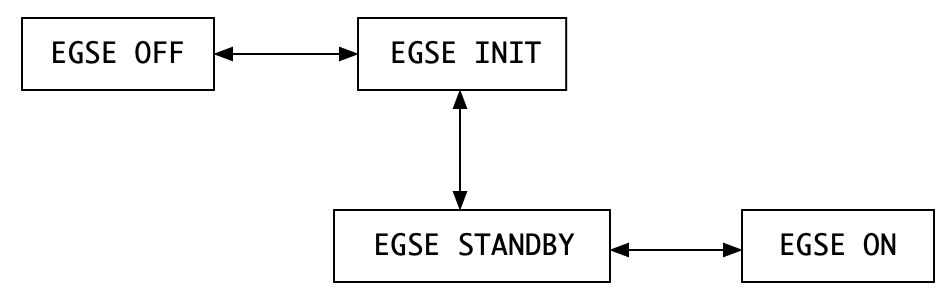
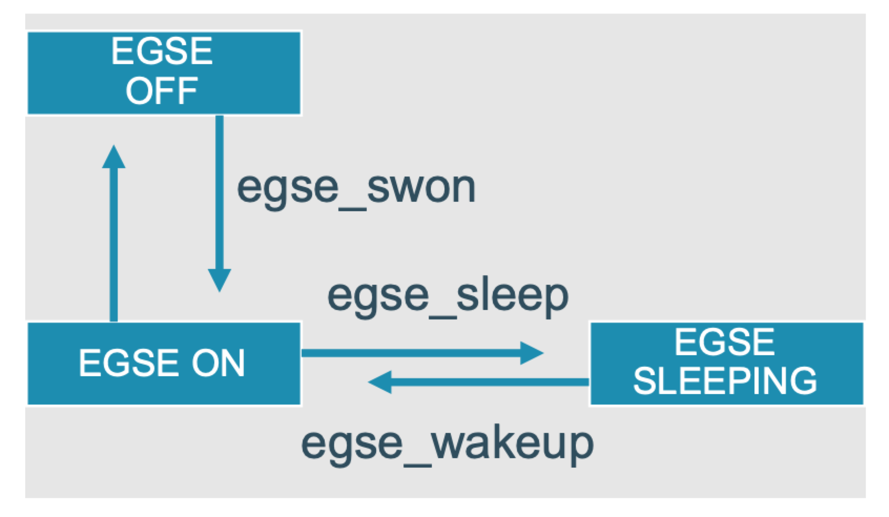
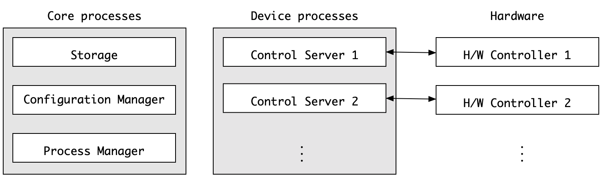
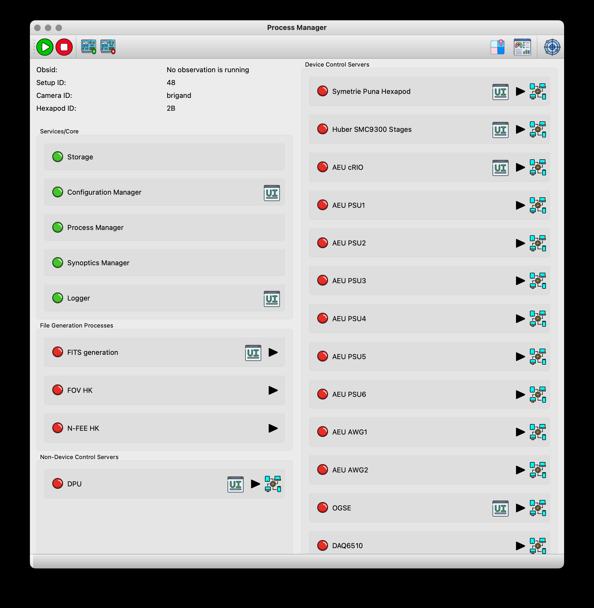

== Common-EGSE startup, shutdown, sleep

Intended readers: site-operator, test-operator

=== EGSE States

The following states have been defined for the EGSE system, as depicted in xref:fig-egse-states[xrefstyle=short]:

* EGSE OFF: all systems are powered off;
* EGSE INIT: egse-server is booted, user logged in as plato-user;
* EGSE STANDBY: critical housekeeping is being acquired, a sub-set of critical functions is available (e.g. temperature and safety monitoring of the test-environment and test-article);
* EGSE ON: the system and hardware are ready to receive commands.

.Transitions between the EGSE states.
[#fig-egse-states]

The transitions between these states are all handled by the Process Manager GUI. Under the hood, the Process Manager queries the setup (from the Configuration Manager) for information on the relevant processes. A distinction is made between core and devices processes.

=== Core & Device Processes

The following processes are considered as Common-EGSE *core processes* (depicted in the left panel of Figure ‎8‑2) and should always be running:

* the *Storage*, which is responsible for archiving of housekeeping and image data (see Sect.‎6);
* the *Configuration Manager,* which manages of the configuration and setup of the system (see Sect. ‎7);
* the *Process Manager*, which can be used to start device processes and monitor their status (typically via the corresponding GUI; see further), * the *Logger*, which collects all log messages from the different components of the Common-EGSE and test scripts. The log messages are saved in a log file at a location denoted by the environment variable PLATO_LOG_FILE_LOCATION.

These processes are started automatically when the egse-server is booted. They cannot be re-started nor shut down via the Process Manager GUI; they can only be monitored there.

The *device processes* (depicted in the middle panel of Figure ‎8‑2) are the so-called Control Servers that talk to the hardware Controllers(depicted in the right panel of Figure ‎8‑2), for commanding and monitoring the devices.

These processes can be (re-)started and shut down individually from the Process Manager GUI. They will be running on the same machine as the Process Manager itself, which is the egse-server during normal operations.

.Core and devices processes. The latter are Control Servers that talk to the hardware Controllers, for commanding and monitoring thedevices.

=== Process Manager GUI

A desktop icon will be provided to start the Process Manager GUI. Alternatively, it can be started from the terminal command line with the following command:
----
$ pm_ui
----
This will fire up the GUI shown in Figure ‎8‑3.

.The screenshot of the Process Manager GUI. The colour of the leds (green/orange/red) indicates what the status is of the core processes and the device processes in the current setup. Devices processes can be started (either in operational or in simulator mode) or shut down by pressing the corresponding on/off buttons. If a GUI has been implemented for a process, it can be opened (in a separate window)by pressing the corresponding "GUI" button.

On the top left, an overview of the core services will be given. When a(new) setup is loaded (see Sect. ‎7.3), the content of the lower left part (with the device processes) will be updated. Only the processes for the devices that are included in the current setup will be shown.

A led in front of the process name will give you a quick impression of the state of the process. It can have the following colour for device processes:

* *green*: the process is running and a connection with the hardware Controller has been established;
* *orange*: the process is running, but the connection with the hardware Controller could not be established or was lost;
* *red*: the process is not yet or no longer running.

For the core processes, the led should always be green (indicating the process is running). In case one of them turns read, the corresponding core process is no longer alive, and the system may have to be re-started. Consult your site-operator in this case.

More detailed information on the status of a process can be found in the tabs on the right-hand side (there is one tab per process). By clicking on the device name on the left, the corresponding tab will come into focus on the right. Information on the items in the process status tabs will be shown in a pop-up window that appears when the information icon in the toolbar is clicked on.

For the processes for which a "GUI" button is present, a GUI for the corresponding device can be opened in a separate window by pressing this button.

In contrast to the core processes, the device processes can be started from the Process Manager GUI, either in operational mode (when a hardware Controller is available) or in simulator mode (when no hardware Controller is available; for testing purposes).

==== EGSE OFF ⟷ EGSE INIT

When booting the egse-server, the core processes (i.e. Storage, Configuration Manager, Process Manager, and Logger) will be started automatically. If the Process Manager GUI is started at this point, the area with the device processes will be empty, and the three core processes will show a green LED in the GUI. More detailed information on the status of the core processes can be found in the corresponding tabs.

Note that the Process Manager GUI can only be used to monitor the core processes, not to (re-)start them. Should any of the LEDs for the core processes turn red (at any point), more detailed inspection of the system will be needed (and the system may even have to be re-booted).

Any GUI for these processes can be started by pressing the GUI button. Note that although the core processes are running on the egse-server, GUIs that are launched from the process manager will be started on your local machine, desktop client.

==== EGSE INIT ⟷ EGSE STANDBY

After having brought the Common-EGSE into its INIT state, a Setup must be loaded (see Sect. ‎7.3). This comprises (amongst others) all devices that are currently relevant to you. Once a Setup is loaded, the area with the device processes will be updated in the process manager GUI.

To start the critical device processes, click on the start/stop button for these devices. To start the Control Servers in operational mode, the corresponding checkboxes must be unchecked. If all goes well, the LEDs for these processes should turn green in the GUI and the information in the corresponding tabs will be constantly updated.

To shut down these critical processes (to return to INIT mode), the start/stop button of these devices must be pressed a second time.

Any GUI for these processes can be started by pressing the GUI button. The GUI will start on your local machine.

==== EGSE STANDBY ⟷ EGSE ON

In STANDBY mode, only the critical processes will be running. The other device processes can be started by pressing their start/stop button, bringing the Common-EGSE into ON mode. To return to STANDBY mode, press the buttons again.

Any GUI for these processes can be started by pressing the GUI button.
