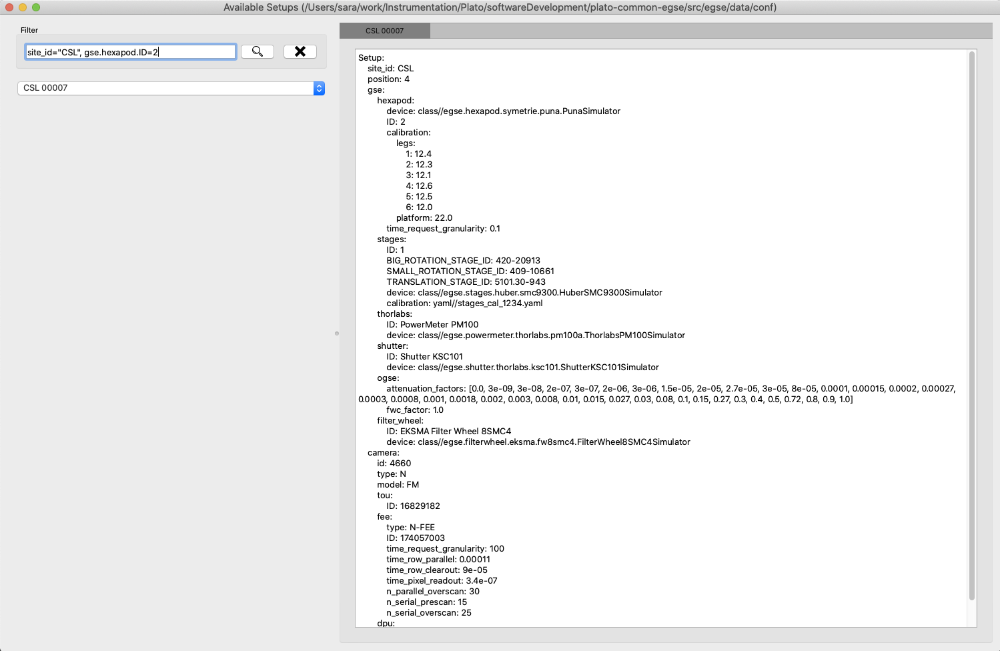

[#conf-setup]
== Configuration and Setups
:image-dir: ../images

The complete documentation on the EGSE configuration and on the concept of Setup can be found in the https://ivs-kuleuven.github.io/plato-cgse-doc/asciidocs/developer-manual.html#_the_setup[developer manual.]

Setup is the concept we attach to the entity encapsulating the entire set of

* Identifiers and configuration items
* Calibration values and calibration files

Necessary to

* Describe the test-environment and the item under test
* operate the test

=== Example Setup file

A snippet of a setup file is shown below. It shows the tree structure of the YAML file. At the top level are the main components: gse (devices), camera (fpa, tou, fee), telemetry, etc. The snippet only shows part of the Setup. Under the *gse* branch we have *hexapod* and *stages* and many more that are not shown. All ground equipment that is part of the test setup shall have an entry under the *gse* branch. The information that shall go into these entries is device identification, calibration information, specific device settings, etc.

Everything that is connected to the Camera, i.e. SUT, shall go under the *camera* branch. This is e.g. identifiers for the TOU, FEE, FPA, DPU, CCD, ..., calibration information, defaults, numbering, avoidance information, etc.

NOTE: The gse branch is also used by the process manager to determine which devices are part of the Setup and for which devices it should present a status LED and a start/stop button.

The users are allowed to modify or add items and branches to the setup and save a new version of it. As an example, the stages branch in this example contains calibration values defining metrology of the rotation and translation stages used to position the light beam at CSL.

.Snippet of a Setup file from CSL
----
NavigableDict
├── site_id: CSL2
├── position: 2
├── gse
│   ├── hexapod
│   │   ├── device: class//egse.hexapod.symetrie.puna.PunaProxy
│   │   ├── device_name: Symetrie Puna Hexapod
│   │   ├── ID: 2B
│   │   ├── time_request_granularity: 0.1
│   │   ├── CID: 603382
│   │   └── label: 172543 - PUNA
│   ├── stages
│   │   ├── ID: 1
│   │   ├── BIG_ROTATION_STAGE_ID: 420-20913
│   │   ├── SMALL_ROTATION_STAGE_ID: 409-10661
│   │   ├── TRANSLATION_STAGE_ID: 5101.30-943
│   │   ├── device: class//egse.stages.huber.smc9300.HuberSMC9300Proxy
│   │   ├── device_name: Huber SMC9300 Stages
│   │   ├── calibration
│   │   │   ├── height_collimated_beam: 513.9
│   │   │   ├── offset_phi: 0.4965
│   │   │   ├── offset_alpha: 0.0
│   │   │   ├── offset_delta_x: 96.884
│   │   │   ├── phi_correction_coefficients: [-0.0049, 0.0003]
│   │   │   ├── alpha_correction_coefficients: [0.0856, -0.5]
│   │   │   └── delta_x_correction_coefficients: [-0.1078, 0.2674, -0.0059]
│   │   ├── big_rotation_stage
│   │   │   ├── avoidance: 3.0
│   │   │   ├── hardstop: 179.316
│   │   │   └── default_speed: 15000
│   │   ├── small_rotation_stage
│   │   │   └── default_speed: 15000
│   │   └── translation_stage
│   │       └── default_speed: 15000

...

├── camera
│   ├── TOU
│   │   └── ID: BA-N1-11130000-FM-01
│   ├── fpa
│   │   ├── avoidance
│   │   │   ├── clearance_xy: 2.0
│   │   │   ├── clearance_z: 2.0
│   │   │   ├── vertices_nb: 60
│   │   │   └── vertices_radius: 100.0
│   │   ├── ID: N-FPA-11200000-FM-01
│   │   └── max_offset: 20
│   ├── dpu
│   │   ├── device: class//egse.dpu.DPUProxy
│   │   └── device_name: DPU

...

├── telemetry
│   ├── dictionary: pandas//../../common/telemetry/tm-dictionary-brigand.csv
│   └── separator: ;
├── sensor_calibration
│   └── callendar_van_dusen
│       └── EN60751
│           ├── A: 0.0039083
│           ├── B: -5.775e-07
│           └── C: -4.183e-12
├── history
│   ├── 0: Initial zero Setup for CSL2
│   ├── 1: Copy of CSL setup 97 (last EM setup)
│   ├── 2: Removed TCS block
----

=== Available Setups

Setups will be available in the form of YAML files that are stored in the `plato-cgse-conf` repository and are located (probably) at `~/git` where the repos are kept.

WARNING: Do never edit these YAML files directly since they are maintained through changes on the operational machine. The configuration manager on the egse-server machine manages these Setups and brings them under configuration control in GitHub automatically upon submitting a new Setup.

Browsing through the available setups can either be done in Python or via a GUI.

[#list-setups]
==== Browsing the Setups in Python

To get a list of the setups that are available in the system, execute the following command (to be imported from `camtest`):
----
>>> list_setups()
----
This will return a list of (setup identifier, site identifier) pairs, e.g.
[source%nowrap]
----
('00037', 'CSL2', 'Use v2 of N-FEE sensor calibration for Chimay (#293)', 'brigand')
('00038', 'CSL2', 'Incl. nominal ranges for power consumption checks (#312)', 'brigand')
('00039', 'CSL2', 'Updated N-cam voltages for the AEU PSU (#315)', 'brigand')
('00040', 'CSL2', 'New CSLReferenceFrameModel [csl_model_from_file]', 'brigand')
('00041', 'CSL2', 'Putting back N-cam voltages for the AEU PSU', 'brigand')
('00042', 'CSL2', 'updated stages calibration (beam height and phi correction)', 'brigand')
('00043', 'CSL2', 'Updated AEU voltages + voltage/current protection values (#324)', 'brigand')
('00044', 'CSL2', 'updated translation stage zero position', 'brigand')
('00045', 'CSL2', 'Update AEU configuration according to - NRB NCR-CSL-0036 disposition, email by Yves on 24/05/2023', 'brigand')
----
The list_setups() command also allows you to filter the results, by using any of the keywords inside the setups. For instance, to list all the setups related to the STM version of the TOU, tested with the hexapod No 1 at CSL, you would type
----
>>> list_setups(camera__ID="achel")  <1>
----
<1> Note that the double underscore “__” is used to navigate the Setup. All parameters passed will be joined with a logical AND.
[source%nowrap]
----
list_setups(camera__ID="achel")
('00004', 'CSL2', 'Copy camera and telemetry info for achel from CSL1 setup 38', 'achel')
('00005', 'CSL2', 'Incl. sensor calibration', 'achel')
('00006', 'CSL2', 'Updated hexapod ID', 'achel')
('00007', 'CSL2', 'Updated device name for DAQ6510 (#235)', 'achel')
('00008', 'CSL2', 'Using short sync pulses of 200ms (instead of 150ms)', 'achel')
('00009', 'CSL2', 'Copy camera and telemetry info for achel from CSL1 setup 45', 'achel')
('00010', 'CSL2', 'Incl. MGSE calibration coefficients (#255)', 'achel')
('00011', 'CSL2', 'New CSLReferenceFrameModel [csl_model_from_file]', 'achel')
('00012', 'CSL2', 'Changed offset_phi for validation purposes', 'achel')
('00013', 'CSL2', 'Recalibration of the SMA (#258)', 'achel')
('00014', 'CSL2', 'Updated reference Hartmann positions (#254)', 'achel')
('00015', 'CSL2', 'fixed alpha correction coefficients', 'achel')
('00016', 'CSL2', 'Incl. reference_full_76 (taken from CSL1 setup 46)', 'achel')
('00017', 'CSL2', 'New CSLReferenceFrameModel [csl_model_from_file]', 'achel')
('00018', 'CSL2', 'Copy camera and telemetry info for achel from CSL1 setup 47', 'achel')
('00019', 'CSL2', 'Updated x, y measured positions w.r.t. LDO input (#266)', 'achel')
----

==== Using the Setup GUI

To open the GUI to inspect all available setups, type the following command:
----
$ setup_ui
----
This will fire up a window as shown in xref:fig-setup-ui[xrefstyle=short]. The directory that is mentioned in the window title, is the one where the available setups are located.

A text field on the left-hand side allows you to filter the setups, similar to the arguments of the `list_setups` command from xref:list-setups[xrefstyle=short]. You can navigate through the tree both with the '__' and the dot notation. For the available setups that pass the filtering, the site and setup identifier will appear in the drop-down menu, after either hitting the return key in the filter text field or by pressing the search button next to it.

.Screenshot of the GUI to inspect all available setups.
[#fig-setup-ui]

[#sec-loading-a-setup]
=== Loading a Setup

After inspection of the available setups, a specific setup can be loaded, based on the identifier.

IMPORTANT: _loading_ a Setup means to load it in the system such that it then becomes the reference for the system configuration. This means *it impacts the GlobalState and the ConfigurationManager*! It is different from getting a copy of a Setup as a variable in a python script (see below).

Ideally, the Setup will be loaded *one single time* at the start of a test phase, with a setup reflecting the HW present in the test environment. *The preferred way to do so is via the setup GUI*. That can be launched via
----
$ setup_ui
----
In python:
----
>>> from camtest import load_setup
>>> setup = load_setup(7)
----

=== Inspecting, accessing, and modifying a Setup

First, make sure a Setup is already loaded in the system, and that you have a variable attached to a setup in your Python session. Here we call it `setup`.

You can get a Setup with the following command
----
>>> from camtest import get_setup
>>> setup = get_setup(7)
----
This will read the content of Setup "00007" for the site you are currently at and assign it to a variable called `setup`.

NOTE: This has no effect on the system configuration (the ConfigurationManager will not know about it, and the GlobalState won’t be affected).

==== Content of the setup

To print the entire content of the setup:
----
>>> print(setup)
----
The Setups, as well as all of their branches are “navigable dictionaries”. In practice that means that they have a tree structure, and every part of the tree can be accessed with a simple syntax, using dot notation (in contrast to using a double underscore (__) when filtering the available Setups).

==== Inspect a given branch or leaf

You can inspect any branch or leaf of the Setup by navigating the Setup and printing the result:
----
>>> print(setup.branch.subbranch.leaf)
----
For instance, printing the hexapod configuration at CSL:
----
>>> print(setup.gse.hexapod)
NavigableDict
├── device: class//egse.hexapod.symetrie.puna.PunaProxy
├── device_name: Symetrie Puna Hexapod
├── ID: 2B
├── time_request_granularity: 0.1
├── CID: 603382
└── label: 172543 - PUNA
----

==== Modify an entry

Any Setup entry can be assigned to with a simple assignment statement.
----
>>> setup.branch.subbranch.leaf = object
----
For instance:
----
>>> setup.camera.fpa.avoidance.clearance_xy = 3
----

==== Add a new entry

When you want to replace a complete sub-branch in the Setup, use a dictionary.
----
>>> setup.branch.subbranch = {}
>>> setup.branch.subbranch.leaf = object
----
for instance, to introduce the fpa subbranch in the example file above, one would write:
----
>>> setup.camera.fpa = {}
>>> setup.camera.fpa.ID = "STM"
>>> setup.camera.fpa.avoidance = {}
>>> setup.camera.fpa.avoidance.clearance_xy = 3
----
The above can be simplified by adding a predefined dictionary to the Setup:
----
>>> setup.camera.fpa = {"ID": "STM", "avoidance": {"clearance_xy": 3}}
----

=== Saving a new setup

The setups are stored under configuration control in the plato-cgse-conf repository. The EGSE is taking care of the interface with that repository when a user is submitting a new setup, with no additional action necessary than:
----
>>> response = submit_setup(setup, description="A senseful description of this setup")
>>> if isinstance(response, Setup):
...     setup = response
... else:
...     print(response)
----
The new setup receives a unique setup_id, and a new entry is created in the list of setups. The new Setup is then loaded and made active in the configuration manager. When the Setup is processed by the system, brought under configuration control and no errors occurred, the new Setup is returned and will be assigned to the `setup` variable. In case of a error, the response contains information on the cause of the Failure and is printed.

NOTE: Do not directly catch the returned Setup in the `setup` variable, because you will lose your modified Setup in case of an error.

NOTE: the description is mandatory. Setups keep track of their history, so we strongly encourage to provide concise but accurate descriptions each time this command is used.
