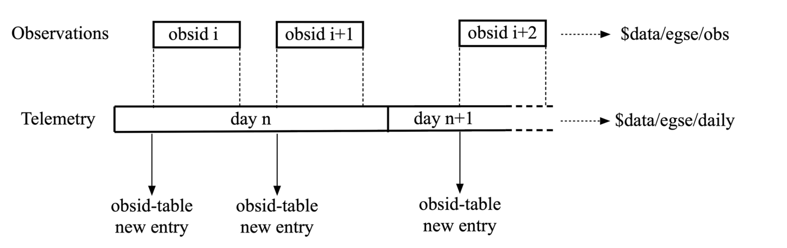

== Data acquisition and storage

All device housekeeping data and all camera telemetry data (image data and FEE HK) are automatically stored by the Storage Manager. You don’t need to collect and save data from within your scripts. Data is stored in a location on the egse-server and accessible from the desktop client machines running the tests and analysis scripts. This location is defined in the environment variable `PLATO_DATA_STORAGE_LOCATION`, which points to a `/data` directory.

NOTE: Since release 2023.6.0+CGSE, the environment variable will not include the SITE ID anymore.

Several types of data are generated during a test campaign

* Housekeeping telemetry (saved in CSV files)
** From the test-item (e.g. TOU TRP-1 temperature)
** From the test-environment (e.g. OGSE filter wheel position)
* SpaceWire packets and register maps received from the FEE (saved in HDF5 files)
* Image data from the camera (saved in FITS files)
* Command history logging the test executions

=== Housekeeping telemetry

The acquisition of housekeeping telemetry is automatically started by the egse-server. In practice that means that the telemetry from all devices connected to the active egse-server is automatically, and constantly recorded (see the Common-EGSE documentation for further details).

IMPORTANT: Please note that *all timestamps* saved in housekeeping files are UTC.

The housekeeping telemetry is structured this way

* One file per day saved in a sub-folder of ‘daily’. The sub-folder is the `YYYYMMDD` of that day.
* One CSV file per source of telemetry, i.e. for example one from the TCS, one for the hexapod (controller), one for the FEE etc.
* Each CSV file contains a timestamp in the first columns, and the various entries in the subsequent columns.
* All TM are recorded at 1Hz by default. This is configurable on a per-device-controller basis (= per CSV file)

The csv filenames have the following structure:
----
YYYYMMDD_SITE_DEVICE-MNEMONIC.csv
----
Where:

* `YYYYMMDD` is the day the telemetry was taken
* `SITE` is the identifier for the test facility: CSL, IAS, INTA, SRON, KUL, ESA, …
* `DEVICE-MNEMONIC` is a mnemonic referring to the device controller issuing these data

For example, the daily file at CSL for the Hexapod PUNA housekeeping on June 8th, 2023 is 20230608_CSL_PUNA.csv. The header of the CSV files contains explicit column-names. The complete information on the content and format of the telemetry files is contained in the ICD (RD-04, see <<reference-documents>>).

.Excerpt of the PUNA hexapod telemetry file `20230608_CSL_PUNA.csv`:
[%collapsible]
====
[source%nowrap]
----
timestamp,GCSL1_HEX_USER_T_X,GCSL1_HEX_USER_T_Y,GCSL1_HEX_USER_T_Z,GCSL1_HEX_USER_R_X,GCSL1_HEX_USER_R_Y,GCSL1_HEX_USER_R_Z,GCSL1_HEX_MACH_T_X,GCSL1_HEX_MACH_T_Y,GCSL1_HEX_MACH_T_Z,GCSL1_HEX_MACH_R_X,GCSL1_HEX_MACH_R_Y,GCSL1_HEX_MACH_R_Z,GCSL1_HEX_ALEN_1,GCSL1_HEX_ALEN_2,GCSL1_HEX_ALEN_3,GCSL1_HEX_ALEN_4,GCSL1_HEX_ALEN_5,GCSL1_HEX_ALEN_6,GCSL1_HEX_HOMED,GCSL1_HEX_IN_POS
...
2023-06-08T10:00:01.560+0000,0.014144539424,-0.003925761937,-3.489246984,-0.013989085157,0.0010419456108,-0.00799891817,0.390713812,0.1455886605,17.7970682,0.03226852454,0.06991046997,0.2646041152,205.93219583,206.1653351,205.52915657,205.97228441,205.88274269,206.14508725,True,True
2023-06-08T10:00:02.560+0000,0.014144539424,-0.003925761937,-3.489246984,-0.013989085157,0.0010419456108,-0.00799891817,0.390713812,0.1455886605,17.7970682,0.03226852454,0.06991046997,0.2646041152,205.93219583,206.1653351,205.52915657,205.97228296,205.88274269,206.14508725,True,True
2023-06-08T10:00:03.563+0000,0.014144539424,-0.003925761937,-3.489246984,-0.013989085157,0.0010419456108,-0.00799891817,0.390713812,0.1455886605,17.7970682,0.03226852454,0.06991046997,0.2646041152,205.93219583,206.1653351,205.52915657,205.97227986,205.88274269,206.14508725,True,True
2023-06-08T10:00:04.562+0000,0.014144539424,-0.003925761937,-3.489246984,-0.013989085157,0.0010419456108,-0.00799891817,0.390713812,0.1455886605,17.7970682,0.03226852454,0.06991046997,0.2646041152,205.93219583,206.1653351,205.52915657,205.97227986,205.88274579,206.14508725,True,True
2023-06-08T10:00:05.562+0000,0.014144539424,-0.003925761937,-3.489246984,-0.013989085157,0.0010419456108,-0.00799891817,0.390713812,0.1455886605,17.7970682,0.03226852454,0.06991046997,0.2646041152,205.93219583,206.1653351,205.52915657,205.97227986,205.88274269,206.14508725,True,True
2023-06-08T10:00:06.581+0000,0.014144539424,-0.003925761937,-3.489246984,-0.013989085157,0.0010419456108,-0.00799891817,0.390713812,0.1455886605,17.7970682,0.03226852454,0.06991046997,0.2646041152,205.93219583,206.16534276,205.52915967,205.97228296,205.88274579,206.14508725,True,True
----
====

=== Observation

Image data are usually only generated during a test execution. In order to facilitate the selection of data pertaining to a particular test execution, we are using the concept of ‘observation’ interchangeably with the name “test”.

An observation corresponds to a single execution of a given test, i.e. a single use of the execute() command, or all commands executed between a `start_observation` and an `end_observation`.

A unique obsid is automatically attributed to every observation. The filenames of housekeeping files are constructed from the unique obsid and a limited set of useful metadata about the test execution, with the following structure:
----
TEST-ID_SITE-ID_SETUP-ID_DEVICE-MNEMONIC_YYYYMMDD_HHMMSS.csv
----
where:

* `TEST-ID` is a unique test identifier, this is the first part of a full OBSID,
* `SITE-ID` is the identifier for the test facility: CSL, IAS, INTA, SRON, KUL, ESA, …
* `SETUP-ID` is the unique setup_id (section below)
* `DEVICE-MNEMONIC` is a mnemonic referring to the source of the data, e.g. the device controller issuing these data, the TCS EGSE, the N-FEE, etc.
* `YYYYMMDD_HHMMSS` points to the start of the test execution (UTC)

The first three items in the above list form the full OBSID. The OBSID can be abbreviated to the TEST-ID and the SITE-ID thereby omitting the SETUP-ID which can be automatically recovered frm the meta data.

For instance, CSV files for observation 00757 performed at CSL could be:

* `00757_CSL_00009_PUNA_20201013_162037.csv`
* `00757_CSL_00009_CM_20201013_162037.csv`

(PUNA points to a hexapod controller and CM refers to the Configuration Manager of the Common-EGSE).

For fits files with the camera image data, the naming convention is similar, with a sequencing number in the end when the data volume justifies splitting.

* `00757_CSL_00009_DPU_20201013_162037_0001.fits`
* `00757_CSL_00009_DPU_20201013_162037_0002.fits`

All data corresponding to the obsid are gathered in a dedicated directory named ‘obs’. That means that the fraction of the regular housekeeping data acquired during the execution of the observation is duplicated in that directory, keeping the same format as in the “daily” directory.

The data is hence stored in two different directories:

* A “daily” directory, accumulating housekeeping telemetry data all day long (e.g. for trend analysis). Each day has its own sub-folder.
* An “obs” directory, recording only observation-specific data and housekeeping in sub-folders containing the camera name also, e.g. `01061_CSL1_duvel` is observation 1061 taken in clean room 1 at CSL for the FM#3, i.e. Duvel.

.Timeline illustrating how data is generated and stored. Telemetry for all devices is continuously generated and stored in the daily files. When an observation is started, telemetry is also stored in the 'obs' area under the sub-folder for the current observation. These telemetry are a mirror of the daily telemetry for that observation. Time goes from left to right.

=== Image data

Image data are saved for each test execution as FITS files, with the corresponding housekeeping in CSV files (see above).

Images are saved in FITS format, as UNSIGNED integers. You will have to cast them to float explicitly in python to avoid negative numbers to be wrongly interpreted.

*Splitting*: currently all images are saved as subsequent extensions of a single FITS file. The number of exposures obtained within a test is tracked via the EXPOSURE_COUNTER. A maximum number of extensions is specified in the configuration (TBD). When that number is achieved, the image data are split, i.e. a new FITS file is opened to store the next block of image data.

*Slicing*: Since June 2022, it is possible to insert the command `set_slicing(<# of slices>)` in the test scripts in order to force the creation of a new FITS file. This allows for a more flexible slicing of the data, i.e. enforce a clearer structure of the data, matching the commanding logic, and facilitates the data analysis and interpretation.

==== Data products

During the camera tests, the DPU will be configured such that a specific part of the E- and/or F-side of the selected CCDs will be transmitted (in the form of SpW packets) for a specified number of cycles (as explained in <<standard-building-block-parameters>>).  The following information will be reconstructed from these SpW packets and stored in FITS files:

* the transmitted image data from the selected CCDs, for all cycles,
* the transmitted serial pre-scan data of the selected side(s) of the selected CCDs, for all cycles,
* the transmitted serial over-scan data of the selected side(s) of the selected CCDs, for all cycles,
* the transmitted parallel over-scan data of the selected CCDs, for all cycles.

In case both sides of a CCD are selected, the image data of both sides will be stitched together before storing it in the FITS file.  This will also be done for the parallel over-scan data (if present).  For the serial pre-scan and the serial over-scan, the information is stored per CCD side.

==== Internal structure

Within a FITS file, the data are arranged in a flat structure, in so-called extensions.  The name of an extension will reflect what type of data product it comprises (e.g. image data of CCD2, serial pre-scan data of the E-side of CCD3, etc.).  Each of the extensions (apart from the PRIMARY extension, see further) will occur as many times as that type of data was acquired and transmitted (e.g. if CCD2 was read out and transmitted 10 times, the extension for the image data of CCD2 will occur 10 times in the FITS file), and comprise a 2D data array and a header with the metadata that is specific to that extension.

Although we have provided a set of convenience functions (see below) to extract information from a FITS file without being exposed to the internal details, we want to explain the internal structure in more detail.

The following extensions can be included in the FITS files:

[cols="1,5"]
|===
| Extension name | Content

|PRIMARY
|Contains only header information, with metadata that pertains to the whole data product (site name, etc.).  This extension always be present.
|SPRE_1_E
|Serial pre-scan data for the E-side of CCD1.  This extension will occur as many times as there are readouts of CCD1.
|SPRE_1_F
|Serial pre-scan data for the F-side of CCD1.  This extension will occur as many times as there are readouts of CCD1.
|SOVER_1_E
|Serial over-scan data for the E-side of CCD1.  If this information is transmitted, this extension will occur as many times as there are readouts of CCD1.
|SOVER_1_F
|Serial over-scan data for the E-side of CCD1.  If this information is transmitted, this extension will occur as many times as there are readouts of CCD1.
|POVER_1
|Parallel over-scan data for CCD1.  If this information is transmitted, this extension will occur as many times as there are readouts of CCD1.  In case both sides of CCD1 are transmitted, the parallel over-scan data of both CCD sides are stitched together.
|IMAGE_1
|Image data for CCD1.  This extension will occur as many times as there are readouts of CCD1.  In case both sides of CCD1 are transmitted, the image data of both CCD sides are stitched together.
|SPRE_2_E
|Serial pre-scan data for the E-side of CCD2.  This extension will occur as many times as there are readouts of CCD2.
|SPRE_2_F
|Serial pre-scan data for the F-side of CCD2.  This extension will occur as many times as there are readouts of CCD2.
|SOVER_2_E
|Serial over-scan data for the E-side of CCD2.  If this information is transmitted, this extension will occur as many times as there are readouts of CCD2.
|SOVER_2_F
|Serial over-scan data for the E-side of CCD2.  If this information is transmitted, this extension will occur as many times as there are readouts of CCD2.
|POVER_2
|Parallel over-scan data for CCD2.  If this information is transmitted, this extension will occur as many times as there are readouts of CCD2.  In case both sides of CCD2 are transmitted, the parallel over-scan data of both CCD sides are stitched together.
|IMAGE_2
|Image data for CCD2.  This extension will occur as many times as there are readouts of CCD2.  In case both sides of CCD2 are transmitted, the image data of both CCD sides are stitched together.
|SPRE_4_E
|Serial pre-scan data for the E-side of CCD4.  This extension will occur as many times as there are readouts of CCD4.
|SPRE_4_F
|Serial pre-scan data for the F-side of CCD4.  This extension will occur as many times as there are readouts of CCD4.
|SOVER_4_E
|Serial over-scan data for the E-side of CCD4.  If this information is transmitted, this extension will occur as many times as there are readouts of CCD4.
|SOVER_4_F
|Serial over-scan data for the E-side of CCD4.  If this information is transmitted, this extension will occur as many times as there are readouts of CCD4.
|POVER_4
|Parallel over-scan data for CCD4.  If this information is transmitted, this extension will occur as many times as there are readouts of CCD4.  In case both sides of CCD4 are transmitted, the parallel over-scan data of both CCD sides are stitched together.
|IMAGE_4
|Image data for CCD4.  This extension will occur as many times as there are readouts of CCD4.  In case both sides of CCD4 are transmitted, the image data of both CCD sides are stitched together.
|===

*Example 1*: 4CCDs, full frame, 10 cycles

Relevant FEE parameters (see xref:standard-building-block-parameters[xrefstyle=short]]):

* ccd_readout = [1, 2, 3, 4];
* ccd_side = BOTH;
* num_cycles = 10;
* row_start = 0;
* row_end = 4510 + 30 - 1 (i.e. 4510 rows from the image + 30 rows from the parallel over-scan);

Structure/extensions of the FITS file:

* PRIMARY: The primary extension (PrimaryHDU object).  This does not contain any transmitted data.

* For CCD1:
** 10x extension SPRE_1_E: The serial pre-scan for the E-side of CCD1 (10 frames)
+
→ dimensions: 25 columns x (4510 + 30) rows
** 10x extension SPRE_1_F: The serial pre-scan for the F-side of CCD1 (10 frames)
+
→ dimensions: 25 columns x (4510 + 30) rows
** 10x extension SOVER_1_E: The serial over-scan for the E-side of CCD1 (10 frames)
+
→ dimensions: 15 columns x (4510 + 30) rows
** 10x in extension SOVER_1_F: The serial over-scan for the F-side of CCD1 (10 frames)
+
→ dimensions: 15 columns x (4510 + 30) rows
** 10x extension POVER_1: The parallel over-scan for the E-side of CCD1 (10 frames)
+
→ dimensions: 4510 columns x 30 rows
** 10x extension IMAGE_1: The image data of CCD1 (10 frames)
+
→ dimensions: 4510 columns x 4510 rows

* For CCD2:
** 10x extension SPRE_2_E: The serial pre-scan for the E-side of CCD2 (10 frames)
+
→ dimensions: 25 columns x (4510 + 30) rows
** 10x extension SPRE_2_F: The serial pre-scan for the F-side of CCD2 (10 frames)
+
→ dimensions: 25 columns x (4510 + 30) rows
** 10x extension SOVER_2_E: The serial over-scan for the E-side of CCD2 (10 frames)
+
→ dimensions: 15 columns x (4510 + 30) rows
** 10x extension SOVER_2_F: The serial over-scan for the F-side of CCD2 (10 frames)
+
→ dimensions: 15 columns x (4510 + 30) rows
** 10x extension IMAGE_2: The image data of CCD2 (10 frames)
+
→ dimensions: 4510 columns x 4510 rows

* For CCD3:
** 10x extension SPRE_3_E: The serial pre-scan for the E-side of CCD3 (10 frames)
+
→ dimensions: 25 columns x (4510 + 30) rows
** 10x extension SPRE_3_F: The serial pre-scan for the F-side of CCD3 (10 frames)
+
→ dimensions: 25 columns x (4510 + 30) rows
** 10x extension SOVER_3_E: The serial over-scan for the E-side of CCD3 (10 frames)
+
→ dimensions: 15 columns x (4510 + 30) rows
** 10x extension SOVER_3_F: The serial over-scan for the F-side of CCD3 (10 frames)
+
→ dimensions: 15 columns x (4510 + 30) rows
** 10x extension IMAGE_3: The image data of CCD3 (10 frames)
+
→ dimensions: 4510 columns x 4510 rows

* For CCD4:
** 10x extension SPRE_4_E: The serial pre-scan for the E-side of CCD4 (10 frames)
+
→ dimensions: 25 columns x (4510 + 30) rows
** 10x extension SPRE_4_F: The serial pre-scan for the F-side of CCD4 (10 frames)
+
→ dimensions: 25 columns x (4510 + 30) rows
** 10x extension SOVER_4_E: The serial over-scan for the E-side of CCD4 (10 frames)
+
→ dimensions: 15 columns x (4510 + 30) rows
** 10x extension SOVER_4_F: The serial over-scan for the F-side of CCD4 (10 frames)
+
→ dimensions: 15 columns x (4510 + 30) rows
** 10x extension IMAGE_4: The image data of CCD4 (10 frames)
+
→ dimensions: 4510 columns x 4510 rows

*Example 2*: E-side of CCD2, 100 lines in partial-readout mode, 25 cycles

Relevant FEE parameters (see xref:standard-building-block-parameters[xrefstyle=short]]):

* ccd_readout = [2, 2, 2, 2];
* ccd_side = E;
* num_cycles = 25;
* row_end = row_start - 100 - 1

Note that this means that the E-side of CCD2 will be transmitted 4x25 times.

Structure/extensions of the FITS file:

* PRIMARY: The primary extension (PrimaryHDU object).  This does not contain any transmitted data.

* For CCD2:
** 100x extension SPRE_2_E: The serial pre-scan for the E-side of CCD2 (4x25 frames)
+
→ dimensions: 25 columns x (4510 + 30) rows
** 100x extension SOVER_2_E: The serial over-scan for the E-side of CCD2 (4x25 frames)
+
→ dimensions: 15 columns x (4510 + 30) rows
** 100x extension POVER_2: The parallel over-scan for the E-side of CCD2 (4x25 frames)
+
→ dimensions: 4510 columns x 30 rows
** 100x extension IMAGE_2: The image data of CCD2 (4x25 frames)
+
→ dimensions: 4510 columns x 4510 rows

==== Inspecting the content

In the test scripts analysis package, i.e. the `fitsfiles.py` in `camtest.analysis.functions`, a number of convenience functions have been implemented to access information in the FITS files without detailed knowledge of the file structure. The remainder of this section will explain how to use these functions to access the different data parts in the FITS files.

===== Overview

The structure of the FITS files can be inspected with the following commands:
[source]
----
>>> from astropy.io import fits
>>> with fits.open(filename) as hdul:
	hdul.info()
----
The output looks like to this (here only the E-side of CCD1 has been transmitted, without parallel over-scan):
----
No.    Name      Ver    Type      Cards   Dimensions   Format
0  PRIMARY       1 PrimaryHDU       5   ()
1  SPRE_1_E      0 ImageHDU        12   (25, 100)   float64
2  SOVER_1_E     0 ImageHDU        12   (15, 100)   float64
3  IMAGE_1       0 ImageHDU        28   (2255, 100)   float64
4  SPRE_1_E      0 ImageHDU        12   (25, 100)   float64
5  SOVER_1_E     0 ImageHDU        12   (15, 100)   float64
6  IMAGE_1       0 ImageHDU        28   (2255, 100)   float64
7  SPRE_1_E      0 ImageHDU        12   (25, 100)   float64
8  SOVER_1_E     0 ImageHDU        12   (15, 100)   float64
9  IMAGE_1       0 ImageHDU        28   (2255, 100)   float64
10  SPRE_1_E      0 ImageHDU        12   (25, 100)   float64
11  SOVER_1_E     0 ImageHDU        12   (15, 100)   float64
12  IMAGE_1       0 ImageHDU        28   (2255, 100)   float64
----

===== Images

The image data of a specific exposure (counting starts at zero) of a specific CCD can be retrieved as a numpy array, as follows:
----
>>> image_data = get_image_data(filename, ccd_number, exposure_number)
----
The corresponding header can be retrieved as:
----
>>> image_header = get_image_header(filename, ccd_number, exposure_number)
----
Note that all headers (of the images as well as of the scan maps (see further)) are returned as `astropy.io.fits.header.Header` objects.  To get hold of the value of a specific header key, use:
----
>>> image_header[key]
----
The relevant keywords in the image header are:

[cols="1,5"]
|===
|Keyword	|Description

|NAXIS1
|The number of columns in the image area of the CCD, that are transmitted (max 2255).
|NAXIS2
|The number of rows in the image area of the CCD, that are transmitted (max 4510).
|FOCALLEN
|The focal length of the telescope [mm].
|CTYPE1/CTYPE2
|Set to "LINEAR" to indicate that a linear coordinate transformation is used (between pixels and mm), both in the column and row direction.
|CUNIT1/CUNIT2
|Set to "MM" to indicate that the focal-plane coordinates are expressed in mm, both in the column and row direction.
|CDELT1/CDELT2
|The pixels size [mm], both in the column and row direction.
|SITENAME
|The name of the test site at which the data was acquired.

|EXTNAME
a|The extension name, following the convention:

[source]
----
IMAGE_<CCD number (1/2/3/4)>
----

|EXTVER
|The exposure number (counting starts at 0).

|CCD_ID
|The CCD number (1/2/3/4).
|CROTA2
|The orientation angle of the CCD [degrees].  This indicates over which angle the CCD reference frame is rotated w.r.t. the focal-plane reference plane, in counter-clockwise direction.
|CD1_1
|The product of the pixel size and the cosine of the CCD orientation angle.
|CD1_2
|The negative product of the pixel size and the sine of the CCD orientation angle.
|CD2_1
|The product of the pixel size and the sine of the CCD orientation angle.
|CD2_2
|The product of the pixel size and the cosine of the CCD orientation angle.
|CRVAL1
|The focal-plane x-coordinate of the CCD origin [mm].
|CRVAL2
|The focal-plane y-coordinate of the CCD origin [mm].
|CRPIX1
|The column coordinate of the CCD origin w.r.t. the first transmitted column of the image area.
|CRPIX2
|The row coordinate of the CCD origin w.r.t. the first transmitted row of the image area.
|DATE-OBS
|The timestamp of the start of the data acquisition of this exposure.
|===

===== Parallel over-scan

To get hold of the data (as a numpy array) of a parallel over-scan (if present) for a specific exposure (counting starts at 0) of a specific CCD, execute the following command:
----
>>> parallel_overscan_data = get_parallel_overscan_data(filename, ccd_number, exposure_number)
----
The corresponding header can be retrieved as:
----
>>> parallel_overscan_header = get_parallel_overscan_header(filename, ccd_number, exposure_number)
----
The relevant keywords in the parallel over-scan header are:

[cols="1,5"]
|===
|Keyword	|Description

|NAXIS1
|The number of columns in the parallel over-scan, that are transmitted.
|NAXIS2
|The number of rows in the parallel over-scan of the CCD, that are transmitted.
|FOCALLEN
|The focal length of the telescope [mm].
|SITENAME
|The name of the test site at which the data was acquired.
|EXTNAME
a|The extension name, following the convention:
----
IMAGE_<CCD number (1/2/3/4)>
----
|EXTVER
|The exposure number (counting starts at 0).
|CCD_ID
|The CCD number (1/2/3/4).
|DATE-OBS
|The timestamp of the start of the data acquisition of this exposure.
|===

===== Serial pre-scan

To get hold of the data (as a numpy array) of a serial pre-scan for a specific exposure (counting starts at 0) of a specific side of a specific CCD, execute the following command:
----
>>> serial_prescan_data = get_serial_prescan_data(filename, ccd_number, ccd_side, exposure_number)
----
The corresponding header can be retrieved as:
----
>>> header = serial_prescan.header
----
The relevant keywords in the serial pre-scan header are:

[cols="1,5"]
|===
|Keyword	|Description

|NAXIS1
|The number of columns in the serial pre-scan (fixed at 25).
|NAXIS2
|The number of rows in the serial pre-scan, that are transmitted.
|SITENAME
|The name of the test site at which the data was acquired.
|EXTNAME
a|The extension name, following the convention:
----
SPRE_<CCD number (1/2/3/4)>_<CCD side (E/F)>
----
|EXTVER
|The exposure number (counting starts at 0).
CCD_ID	The CCD number (1/2/3/4).
|DATE-OBS
|The timestamp of the start of the data acquisition of this exposure.
|===

===== Serial over-scan

To get hold of the data (as a numpy array) of a serial over-scan for a specific exposure (counting starts at 0) of a specific side of a specific CCD, execute the following command
----
>>> serial_overscan_data = get_serial_overscan_data(filename, ccd_number, ccd_side, exposure_number)
----
The corresponding header can be retrieved as:
----
>>> serial_overscan_header = get_serial_overscan_header(filename, ccd_number, ccd_side, exposure_number)
----
The relevant keywords in the serial over-scan header are:

[cols="1,5"]
|===
|Keyword	|Description

|NAXIS1
|The number of columns in the serial over-scan.
|NAXIS2
|The number of rows in the serial over-scan, that are transmitted.
|SITENAME
|The name of the test site at which the data was acquired.
|EXTNAME
a|The extension name, following the convention:
----
SOVER_<CCD number (1/2/3/4)>_<CCD side (E/F)>
----
|EXTVER
|The exposure number (counting starts at 0).
|CCD_ID
|The CCD number (1/2/3/4).
|DATE-OBS
|The timestamp of the start of the data acquisition of this exposure.
|===

=== Telecommand history

The complete telecommand history is not yet saved but can be reconstructed from the setup_id (see below) and the obsid-table. The `obsid-table.txt` is a text file located at the root of the data storage location. The file contains one entry per observation, associating

* the main parameters of the observation, obsid and site
* the time of execution
* the setup_id active at execution time (contains the version number of the plato-test-script on the operational server)
* The building block name
* All parameter names and values passed to the execute command

The following lines are examples taken from the obsid-table.txt file at CSL:
[source%nowrap]
----
01108 CSL1 00084 2023-06-07T08:56:22.832+0000 cam_single_cube_int_sync(theta="8.3", phi="12.0", num_cycles="5", exposure_time="0.2", n_rows="1000", attenuation="0.00413")
01109 CSL1 00084 2023-06-07T08:57:30.003+0000 cam_single_cube_int_sync(theta="8.3", phi="12.0", num_cycles="5", exposure_time="0.2", n_rows="1000", attenuation="0.00413")
01110 CSL1 00084 2023-06-07T09:02:16.140+0000 check_and_move_relative_user(cslmodel="egse.coordinates.cslmodel.CSLReferenceFrameModel", translation="[0, 0, 0.01]", rotation="[0, 0, 0]", setup="egse.setup.Setup", verbose="True")
01111 CSL1 00084 2023-06-07T09:03:09.426+0000 cam_single_cube_int_sync(theta="8.3", phi="12.0", num_cycles="5", exposure_time="0.2", n_rows="1000", attenuation="0.00413")
01112 CSL1 00084 2023-06-07T09:06:40.668+0000 check_and_move_relative_user(cslmodel="egse.coordinates.cslmodel.CSLReferenceFrameModel", translation="[0, 0, 0.005]", rotation="[0, 0, 0]", setup="egse.setup.Setup", verbose="True")
01113 CSL1 00084 2023-06-07T09:08:28.446+0000 cam_single_cube_int_sync(theta="8.3", phi="12.0", num_cycles="5", exposure_time="0.2", n_rows="1000", attenuation="0.00413")
01114 CSL1 00084 2023-06-07T09:29:58.225+0000 cam_single_cube_int_sync(theta="8.3", phi="12.0", num_cycles="5", exposure_time="0.2", n_rows="1000", attenuation="0.00413")
01115 CSL1 00084 2023-06-07T09:37:08.043+0000 cam_single_cube_int_sync(theta="8.3", phi="12.0", num_cycles="5", exposure_time="0.2", n_rows="1000", attenuation="0.00413")
01116 CSL1 00084 2023-06-07T09:40:39.185+0000 cam_single_cube_int_sync(theta="8.3", phi="12.0", num_cycles="5", exposure_time="0.2", n_rows="1000", attenuation="0.00413")
----

The `obsid-table.txt` file is explained in more detail in the https://ivs-kuleuven.github.io/plato-cgse-doc/docs/icd/[Interface Control Document] (ICD) [RD-04].
