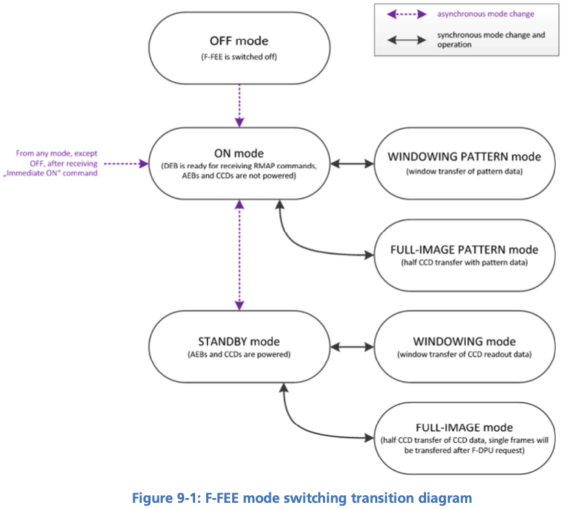

[#f-fee-operations]
== Operating the F-FEE
:xrefstyle: short
:tabs:

This section describes some basic principles on the F-FEE design and their practical impact on the F-FEE, CCD and camera operations.

=== Glossary

* *Parallel:* direction parallel to the columns of the CCD (sometimes referred to as “vertical”).
* *Serial:* direction parallel to the rows of the CCD (sometimes referred to as “horizontal”).
* *Readout register:* single row of pixels below the active region of the CCD, used to transfer the charges in the serial direction towards the readout amplifier.
* *Partial readout:* describes a CCD readout process in which only a given range of CCD rows are digitized. The rows between the region and the readout register are dumped during the readout process, i.e., the recorded signal is not digitized, it is not transferred to the FEE and will not appear in the data.
* *Windowing:* refers to an FEE operating mode in which a pre-defined collection of windows on the CCDs is transferred to the DPU (during CAM-tests: the EGSE). The entire CCDs are readout and digitized, but only the pre-defined windows are transferred. The windowing mode is not used during alignment nor TVAC Camera testing and will not be discussed in this document.
* *Dumping:* a row during readout means to continuously reset the readout register. The charges transferred from the active region of the CCD are lost. The absence of serial transfer makes it much faster to dump a line (90 µs) than to read it out normally (parallel transfer 110μs + serial transfer ~800μs).
* *Clearout*: dumping all or part of a CCD.
* *E and F*: the Plato CCDs dispose of 2 readout amplifiers. The left and right halves of the CCD are transferred to the corresponding amplifier (they behave almost like independent CCDs). For some reason that thy shall not ask, E and F refer to the right and left halves of a CCD (mnemonic: same order as in “FEE”) respectively.
* *Cycle*: period between two long-synchronisation pulses (see below)

[#sec-f-fee-operating-modes]
=== F-FEE operating modes

A complete list of the F-FEE operating modes can be found in <<reference-documents, RD-16>>. The main modes for camera testing are:

* *ON*: FEE powered on; CCDs powered off. This mode allows transitions to the test-pattern acquisition modes and to the STANDBY mode.
* *STANDBY*: FEE powered on; CCDs powered on. The CCDs are properly biased but not readout, i.e., they are “indefinitely integrating”.
* *FULL_IMAGE*:
** allowing for full-CCD acquisition
** allows for reverse clocking (serial direction only)
** This is the workhorse for the ground-based tests.
* *WINDOWING*:
** allowing for the acquisition of multiple windows on the CCDs
** This mode is the baseline for the in-flight operations.

.FEE Operating modes (RD-16)
[#fig-ffee-operation-modes]

//The F-FEE Operating modes are described in more detail in <<reference-documents, RD-16>>. The mode identifiers that you will probably see in Grafana screens or in housekeeping entries, are defined in the F-FEE Register Map and listed here for your convenience.

//The N-FEE modes as defined in the Register Map for the PFM [<<reference-documents, RD-15>>]. The N-FEE mode is defined by the `ccd_mode_config` parameter in register 21.
//[#tab-n-fee-modes]
//|===
//|Mode                     |ID (hex)
//
//|On-Mode                  |0x0
//|Full Image Pattern Mode  | 0x1
//|Windowing-Pattern Mode   | 0x2
//|Stand-By-Mode            | 0x4
//|Full Image Mode          | 0x5
//|Windowing-Mode           | 0x6
//|Soft asynchronous Reset  | 0x7
//|Immediate On-Mode (Command)  | 0x8
//|Parallel trap pumping mode 1 – Full-Image  | 0x9
//|Parallel trap pumping mode 2 – Full-Image  | 0xA
//|Serial trap pumping mode 1 – Full Image  | 0xB
//|Serial trap pumping mode 2 – Full Image  | 0xC
//|Reserved  | 0xD
//|Reserved  | 0xE
//|Reserved  | 0xF
//|===

[#sec-cycle-timing]
=== Cycle, Timing and Synchronisation

*CCD* In this section we assume that `CCD` refers to the half-CCD that is exposed to light.
The 'bottom' half, i.e. the storage area is never discussed.
The term 'half-CCD' here refers to either the F or the E side of (half) a detector, hence physically one fourth CCD, i.e. 2255 x 2255 pixels (+ pre- and over-scans).

* *Readout timing:* The AEU sends synchronization pulses to the FEE every 2.5 seconds.
Every pulse triggers a CCD-readout. In windowing mode, the 4 CCDs in one camera are addressed simultaneously, but
on the ground we only use full-image mode. In that mode maximum 2 CCDs can be addressed simultaneously (see below).

* *Cycle time and FEE configuration:* Cycle time is defined as 2.5 seconds. Given that not all CCDs can be read within a cycle, it will require
more to command more than one cycle for each frame to acquire from a given CCD.

* *Exposure time:* the PLATO cameras have no shutter. Consequently, the CCDs integration never stops. In practice, the sync-pulses trigger the readout process, and the exposure time effectively corresponds to the cycle-time minus the frame-transfer time.
Unless otherwise stated, all CCDs are readout at every cycle, even if the data cannot be transferred to the DPU.
Consequently the effective exposure time is fixed to 2.5 seconds minus transfer-time for all CCDs, even if it takes 2 or 4 cycles to acquire the next image of a given CCD.

* *Modifying the exposure time*: is not possible by default. One work-around is to leave some CCDs in STANDBY mode while reading out one or two other detectors. This is the goal of the keyword 'others_standby' provided in the observing mode f_cam_full_ccd

* *F-FEE internal sync-pulses*: are unaccessible to user-commands

* *E and F CCD sides*  <<reference-documents, RD-16>> designate the E and F sides of the CCD as 'left' and 'right' respectively
when looking from the sky (readout register at the bottom), i.e. the opposite convention as used for the N-CAMs. In order to avoid confusion and simplify the commanding an analysis,
it was decided to take care of that in the EGSE software, so that *the commanding and the data products follow the same convention as for the N-CAMs*,
i.e. F on the left, and E on the right when looking from the sky, assuming the readout register is at the bottom.

* *pre-scans and over-scans* The F-CAMs will have 24 serial pre-scan and 16 serial overscan columns. It will have 15 parallel overscan rows. None of those parameters is commandable.

* *partial readout* is not possible with the F-FEEs

* *CCD clearout* is not possible with the F-FEEs. This is a consequence of the fixed parallel overscan.

* *Charge injection* is not possible with the F-FEEs.

* *Reverse clocking* is only possible in the serial direction.

=== Commanding the F-FEEs

The following sections describe a collection of building blocks designed
to configure and operate the FEEs and the CCDs.

In this section, for the sake of simplicity, the names of the building
blocks directly appear at the python prompt (`>>>`), but remember that a
commanding building block will exclusively be accepted either within
another building block or function, or (hence generating an observation)
by the execute command (see <<test-execution>>).

==== CCD and pixel references

<<fig-ccd-numbering-coordinates-fm>> shows the CCD numbering adopted for the commanding.
We will further refer to these coordinate systems as CCDn_PIX n = 1,2,3,4. Note that
* each cover an entire CCD, without interruption at the “border” between E & F (columns 2254 to 2255), and
* these differ from the CCD coordinate systems adopted in RD-10 (pix [1,1] close to the optical axis),
as well as of those adopted at FEE-level (2 coord. systems/CCD, with the x-axes in opposite directions on E & F).

//
//[tabs]
//======
//FM::
//+
//.CCD numbering and pixel coordinates for the FM camera on every CCD (CCD_PIXn reference frames). The thicker black border lines represent the readout registers.
//[#fig-ccd-numbering-coordinates-fm]
//image::../images/ccd-numbering-coordinates-fm.png[width=80%,align=center]
//
//EM::
//+
//.CCD numbering and pixel coordinates for the EM camera on every CCD (CCD_PIXn reference frames). The thicker black border lines represent the readout registers.
//[#fig-ccd-numbering-coordinates-em]
//image::../images/ccd-numbering-coordinates-em.png[width=80%,align=center]
//======

[#standard-building-block-parameters]
==== Standard building block parameters

Some of the input parameters are common to several building blocks. We
list some below, to avoid repeating them for every building block.

* *num_cycles*
** num_cycles = 0 sets the FEEs in the required configuration until commanded otherwise
** num_cycles > 0 indicates a finite number of cycles after which the N-FEE will automatically be (re)set to dump mode (see dump_mode below).
   Since not all CCDs are recorded every cycle, contrary to the N-CAMs, num_cycles does not always correspond to the number of frames acquired on each requested detector. See the descritpion of the observing modes for more details.
* *ccd_order*
** During nominal operations, the four CCDs are addressed simultaneously, every cycle. This is not possible in FULL-IMAGE-MODE though.
   This parameter allows to specify the detectors to readout (when applicable).
* *ccd_side*
** This parameter indicates which side(s) of the CCD will be recorded.
With the readout register at the bottom, the E-side is the right half and
the F-side is the left half.

** This parameter accepts the following values:
*** “E”, “F”, or “BOTH”
*** “BOTH” means both E and F sides are recorded every cycle. While
standard in windowing mode, this is not possible in full-image mode when
the camera is connected to an actual DPU, e.g. at integrated system
level (spacecraft). Since it doubles the required bandpass and since some EGSE have shown problems
to cope with high datarates during the N-CAM testing, it shall be used with caution but remains a possibility
to speed up full-CCD image acquisition if needed due to scheduling constraints.

==== F-FEE mode transitions

Two F-FEE-specific building blocks currently exist to put them into
specific operational “modes”:

*ON mode* (<<sec-f-fee-operating-modes>>).

[source]
----
>>> f_fee_to_on_mode() -- building block
>>> f_fee_is_on_mode() -- function
----

NB: ON mode is the default mode after FEE switch on, but this building
block cannot be used to power on the FEE. That is handled by the AEU
(<<aeu-operations>>).

*STANDBY mode* (<<sec-f-fee-operating-modes>>).

[source]
----
>>> f_fee_to_standby_mode() -- building block
>>> f_fee_is_standby_mode() -- function
----

[#dump-mode]
==== DUMP mode

DUMP is not a genuine FEE operation mode. Given that the dump-gate cannot be commanded on the F-CAMs, we defined
DUMP mode as it as a full-image mode where the data are just not recorded. That means that the readout cycle or the thermal
behaviour of the camera are not affected, we just stop recording the data.
That is a convenient way to avoid saturation between tests that would occur in STANDBY mode.

[source]
----
>>> f_fee_to_dump_mode() – building block
>>> f_fee_is_dump_mode() – function
----

==== F-CAM full-image, standard

This is the baseline mode for F-CAM FULL-IMAGE-MODE acquisition.

The parameters are:

* *num_cycles*: duration of the image acquisition. Each cycle is 2.5 seconds long.
* *ccd_side*: 'E', 'F' or 'BOTH'. This parameter has no impact on the test duration
* *fast*: controls if one or two CCDs are acquired every cycle
** Fast = True:
*** CCDs 1 and 3 are acquired simultaneously, alternating with CCDs 2 and 4
*** num_cycles must be a multiple of 2
*** the test results in num_cycles / 2 images for every detector (or half-detector, depending on ccd_side)
** Fast = False:
*** the CCDs are acquired in sequence, 1, 2, 3, 4.
*** num_cycles must be a multiple of 4
*** the test results in num_cycles / 4 images for every detector (or half-detector, depending on ccd_side)

[source]
----
>>> f_cam_full_standard(num_cycles, ccd_side, fast)
----

==== F-CAM full CCD

Identical to f_cam_full_standard, but allows for more flexibility on the configuration of individual detectors.

The parameters are:

* *num_cycles*: duration of the image acquisition. Each cycle is 2.5 seconds long.
* *ccd*: detector selection. Integer number in [1, 2, 3, 4], equivalent to ccd_order=[ccd, ccd, ccd, ccd] in the N-CAMs
* *ccd_side*: 'E', 'F' or 'BOTH'. This parameter has no impact on the test duration
* *others_standby*:
** others_standby = False: the other CCDs are readout normally, but not recorded, i.e. they are in the F-FEE equivalent
of DUMP mode.
** others_standby = True: the other CCDs are in STANDBY mode, i.e. not readout and accumulating charges as long as this command lasts.

[source]
----
>>> f_cam_full_ccd(num_cycles, ccd, ccd_side, others_standby)
----

==== F-FEE reverse clocking

Reverse clocking consists in clocking the CCD transfer voltages so that
the charges are moved away from the readout register and readout
amplifier rather than towards it.

With the F-FEEs, it is not possible to configure the F-FEE to operate reverse clocking in the parallel direction. It is
only possible in the serial direction.

This mode should provide access to estimates of the offset and readout noise.

It can be operated via the following building block:

[source]
----
>>> n_cam_reverse_clocking(num_cycles, ccd, ccd_side)
----

=== Synchronization with CCD-readouts

To synchronize some commands with the CCD readouts, please refer to <<sec-synchronisation-detector-mgse>>