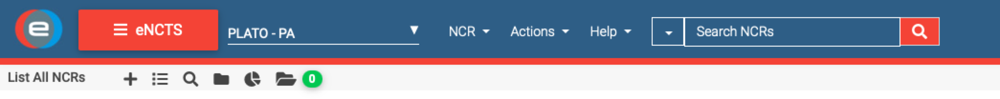

[#app-issue-ncr-pvs]
[appendix]
=== GitHub issues, NCR, and PVS

In this section we explain what the difference is between a GitHub issue, a non-conformance report (NCR) and a procedure variation sheet (PVS). All three have their value and life cycle, but its important to understand when and where they have to be used, and how they are tracked.

==== GitHub issues

A GitHub issue is a software issue that is raised in the GitHub repository of that part of the software. Issues on the common software, device drivers, storage etc. should be raised on the https://github.com/IvS-KULeuven/plato-common-egse[`plato-common-egse`] repository, while issues with test scripts or, e.g., the Operator Task GUI shall be raised on the https://github.com/IvS-KULeuven/plato-test-scripts[`plato-test-scripts`] repo. We have also the https://github.com/IvS-KULeuven/plato-cgse-conf[`plato-cgse-conf`] repo which is used for the configuration and calibration of the camera and test equipment, and where the Setups are stored/tracked. Finally, there is the https://github.com/IvS-KULeuven/plato-cgse-doc[`plato-cgse-doc`] repo which contains the documentation suite (of which you are reading one part right now).

An issue doesn't necessarily mean there is a problem or an error. GitHub issues can be raised for various reasons: feature requests, software improvements, documentation update, bug, clarification request, system crash, dependency problem, etc. Whenever you want to raise an issue, use the button at the top of the GitHub repo page and fill in a clear title and a proper description. Some issues have a template that help you provide all information that a developer would need to analyse and reproduce the problem or to proceed with an implementation.

[cols="1,1"]
|===
a|image::../images/github-issues-button.png[]
|at the top-left of the repo Project page, click the _Issues_ button to navigate to the overview page of open issues...

|then at the top-right of the Issues page, click the _New issue_ button to create a new issue...
a|image::../images/github-new-issue-button.png[]
|===

When you raise an issue, make sure you associate as many labels to it as applicable. Labels identify the issue and provide a powerful way to filter and search issues. If an issue is urgent and needs to go into a release, attach it to the milestone for that release.

Anyone who has access to the repository can inspect and create issues. If you encounter a problem, contact the maintainer of the GitHub repos.

* Examples:
** a process doesn't start: processes are all part of the CGSE and you will notify when their LED is red in the process manager GUI. Try to investigate, but if you can not solve it, raise an issue in plato-common-egse.
** an ERROR or Exception is raised in the console area of the operator Task GUI. Raise an issue in the test scripts and copy the error message from the console area into the issue description. If needed, the GitHub maintainer will migrate the issue to the CGSE repo.
** the test script is aborted: This can be due to incorrect input values, or a system component that is not connected etc. Most of the time such an issue can be solved, but if the problem remains, raise an issue on the test scripts.
** data is missing: This can be HK, metrics, FITS or CSV files, etc. This is usually a problem on the CGSE since all data files are handled by the Storage component. Only reduction and analysis scripts that are started from the Operator Task GUI generate intermediate results or PNGs.

GitHub issues is an issue tracking system, not a software configuration control system.

How is the software configuration tracked? Where is that described?

* milestones -> CCB -> releases

==== NCR

A NCR is a _Non-Conformance Report_ and this type of report is used when there is a problem with either the Camera or one of the GSE that are under the responsibility of an ESA contract. As a consequence, NCRs are tracked and handled by ESA. An NCR can however be a result of an analysis on an issue that was previously raised in GitHub. When that is the case, add a link to or the ID of the GitHub issue to the NCR description. You should also add the link to the NCR (or the ID) to the GitHub issue.

The NCRs are tracked from the https://sre-polaris.esa.int/eclipse/[Eclipse system] used at ESA. Select the `PLATO – PA` scope and then `eNCTS`:

This page is the starting point for creating and viewing all NCRs.

Examples::

* the N-FEE reports errors on the SRAM Buffer Full continuously, we could not identify a cause in the CGSE or site hardware/network setup.
* CCD 2 of FM2 is not working properly anymore after Camera vibration. (PLATO-CSL-PL-NCR-0032)
* after a camera switch ON, we measure a background of 650 ADU instead of 1300 ADU (PLATO-IAS-PL-NCR-0029)

==== PVS

A PVS is a _Procedure Variation Sheet_ and is used to describe any changes or deviations from a test procedure like TP-11 or TP-12. We make a distinction between changes in the procedure due to (1) an error in the procedure, lacking or incomplete information and (2) a small deviation or command that is used which is basically not part of the procedure. The former changes should actually go into a PVS since they introduce a change in the procedure itself and need to be tracked in a proper way. The latter change is usually done by red-lining the as-run copy of the procedure. This way, when the steps that were executed are checked, it is clear some extra commands have been executed or some commands have been skipped. That is not necessarily a permanent change in the procedure.

The PVS is a sheet, so where does this reside? Is the PVS attached to the procedure itself, to the as-run, or is it a separate document?
