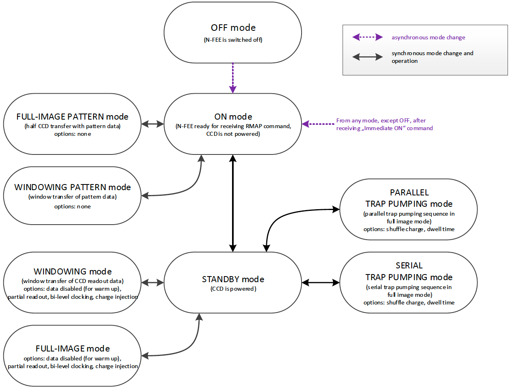

[#n-fee-operations]
== Operating the N-FEE
:xrefstyle: short
:tabs:

This section describes some basic principles on the N-FEE design and their practical impact on the N-FEE, CCD and camera operations.

=== Glossary

* *Parallel:* direction parallel to the columns of the CCD (sometimes referred to as “vertical”).
* *Serial:* direction parallel to the rows of the CCD (sometimes referred to as “horizontal”).
* *Readout register:* single row of pixels below the active region of the CCD, used to transfer the charges in the serial direction towards the readout amplifier.
* *Partial readout:* describes a CCD readout process in which only a given range of CCD rows are digitized. The rows between the region and the readout register are dumped during the readout process, i.e., the recorded signal is not digitized, it is not transferred to the FEE and will not appear in the data.
* *Windowing:* refers to an FEE operating mode in which a pre-defined collection of windows on the CCDs is transferred to the DPU (during CAM-tests: the EGSE). The entire CCDs are readout and digitized, but only the pre-defined windows are transferred. The windowing mode is not used during alignment nor TVAC Camera testing and will not be discussed in this document.
* *Dumping:* a row during readout means to continuously reset the readout register. The charges transferred from the active region of the CCD are lost. The absence of serial transfer makes it much faster to dump a line (90 µs) than to read it out normally (parallel transfer 110μs + serial transfer ~800μs).
* *Clearout*: dumping all or part of a CCD.
* *E and F*: the Plato CCDs dispose of 2 readout amplifiers. The left and right halves of the CCD are transferred to the corresponding amplifier (they behave almost like independent CCDs). For some reason that thy shall not ask, E and F refer to the right and left halves of a CCD (mnemonic: same order as in “FEE”) respectively.
* *Cycle*: period between two long-synchronisation pulses (see below)

[#sec-n-fee-operating-modes]
=== N-FEE operating modes

A complete list of the N-FEE operating modes can be found in <<reference-documents, RD-06>>. The main modes for camera testing are:

* *ON*: FEE powered on; CCDs powered off. This mode allows transitions to the test-pattern acquisition modes and to the STANDBY mode.
* *STANDBY*: FEE powered on; CCDs powered on. The CCDs are properly biased but not readout, i.e., they are “indefinitely integrating”.
* *FULL_IMAGE*:
** allowing for full-CCD acquisition
** highly configurable mode, also allows partial readout, reverse clocking, charge injection etc.
** This is the workhorse for the ground-based tests.
* *WINDOWING*:
** allowing for the acquisition of multiple windows on the CCDs
** Highly configurable mode, also allows partial readout, reverse clocking, charge injection etc.
** This mode is the baseline for the in-flight operations.

.FEE Operating modes (RD-06)
[#fig-fee-operation-modes]

The N-FEE Operating modes are described in more detail in the appendix attached to <<reference-documents, RD-14>>. The mode identifiers that you will probably see in Grafana screens or in housekeeping entries, are defined in the N-FEE Register Map and listed here for your convenience.

.The N-FEE modes as defined in the Register Map for the PFM [<<reference-documents, RD-15>>]. The N-FEE mode is defined by the `ccd_mode_config` parameter in register 21.
[#tab-n-fee-modes]
|===
|Mode                     |ID (hex)

|On-Mode                  |0x0
|Full Image Pattern Mode  | 0x1
|Windowing-Pattern Mode   | 0x2
|Stand-By-Mode            | 0x4
|Full Image Mode          | 0x5
|Windowing-Mode           | 0x6
|Soft asynchronous Reset  | 0x7
|Immediate On-Mode (Command)  | 0x8
|Parallel trap pumping mode 1 – Full-Image  | 0x9
|Parallel trap pumping mode 2 – Full-Image  | 0xA
|Serial trap pumping mode 1 – Full Image  | 0xB
|Serial trap pumping mode 2 – Full Image  | 0xC
|Reserved  | 0xD
|Reserved  | 0xE
|Reserved  | 0xF

|===

[#sec-cycle-timing]
=== Cycle, Timing and Synchronisation

*Readout timing:* The AEU sends synchronization pulses to the FEE every 6.25 seconds. Every pulse triggers a CCD-readout. In nominal operations, the 4 CCDs in one camera are addressed sequentially, i.e. readout one at a time, delayed by one pulse period, i.e. 6.25 seconds.

*Cycle time and FEE configuration:* all sync-pulses trigger a CCD readout. During nominal operations, every fourth pulse is “long” (it lasts 400ms instead of 200ms). *We define the long-pulse period as the “cycle-time”.* The cycle-time is important in two respects. First, in nominal operations, it takes 4 pulses to cycle over the 4 CCDs, i.e. each CCD is readout every cycle-time seconds. Second, the FEEs, i.e. the operating mode of the CCDs can be reconfigured whenever, but only when the FEE receives a long pulse. The FEE-register (containing the configuration parameters) is read during the pulse and the *new configuration is* immediately *applied* to the subsequent readouts, i.e. _to integrations that were already on-going._ This is important to keep in mind for the timing of your tests (see the timing examples in Appendix).

*Exposure time:* the PLATO cameras have no shutter. Consequently, the CCDs integration never stops. In practice, the sync-pulses trigger the readout process, and the exposure time effectively corresponds to the cycle-time minus the readout time. That means for instance that for a given cycle-time, the effective exposure time will be longer when performing partial readout than when acquiring full-CCD images.

*Modifying the exposure time*: the exposure time itself cannot be commanded at the level of the FEE. There are nevertheless various ways to modify the exposure time:

* Increase it by changing the cycle time (see building block `n_cam_partial_cycle_config`, <<sec-n-cam-partial-cycle-config>>)
* Shorten it by changing the order in which we address the CCDs in the course of a cycle: e.g. readout the same CCD at every pulse instead of cycling through the 4 CCDs (see parameter `ccd_order` in <<standard-building-block-parameters>>).
* Increase it by not addressing a given CCD. If some given CCDs are not addressed for readout, they continue to integrate. The next time they are addressed (after reconfiguring the FEE), their effective exposure time will have been much longer than the nominal exposure time (e.g. for dark current or faint ghosts).
* Disregard the AEU sync pulses and use FEE internal sync-pulses instead. This allows for exposure times shorter than 6.25 seconds (e.g. ambient).

*N-FEE internal sync-pulses*: to accommodate short exposure times, the FEE can generate its own sync-pulses. The source of the sync pulses and period of the internal pulses can be configured with the following EGSE commands to the DPU:
[source]
----
>>> n_fee_set_internal_sync(int_sync_period) # in milliseconds
>>> n_fee_set_external_sync()
----
You shouldn’t use these commands directly but rather call the dedicated building block:

[source]
----
>>> n_cam_partial_int_sync(...)
----
IMPORTANT: all N-FEE-generated pulses are long pulses. The cycle-time is hence identical to the CCD readout period, and there is no “natural” cycling through the 4 CCDs. Only when in DUMP mode, the 4 CCDs will be cycled also in internal sync. This is a feature of the DPU Processor implemented in the CGSE and is not available in flight. This CCD cycling in DUMP mode internal sync was implemented as of release 2023.19.0+CGSE.

=== Commanding the N-FEEs

The following sections describe a collection of building blocks designed
to configure and operate the FEEs and the CCDs. A list of the building
blocks can also be found on the PLATO Confluence, in the PCOT space, by
following links to the “On-Ground Testing”.

Examples of time-sequencing for some operational approaches are
presented in <<app-a-ex-ccd-acquisition>>.

In this section, for the sake of simplicity, the names of the building
blocks directly appear at the python prompt (`>>>`), but remember that a
commanding building block will exclusively be accepted either within
another building block or function, or (hence generating an observation)
by the execute command (see <<test-execution>>).

==== CCD and pixel references

<<fig-ccd-numbering-coordinates-fm>> (for FM) and <<fig-ccd-numbering-coordinates-em>> (for EM) show the CCD numbering adopted for the commanding. We will further refer to these coordinate systems as CCDn_PIX n = 1,2,3,4. Note that these

* each cover an entire CCD, without interruption at the “border” between E & F (columns 2254 to 2255), and
* differ from the CCD coordinate systems adopted in RD-10 (pix [1,1] close to the optical axis), as well as of those adopted at FEE-level (2 coord. systems/CCD, with the x-axes in opposite directions on E & F).

[tabs]
======
FM::
+
.CCD numbering and pixel coordinates for the FM camera on every CCD (CCD_PIXn reference frames). The thicker black border lines represent the readout registers.
[#fig-ccd-numbering-coordinates-fm]

EM::
+
.CCD numbering and pixel coordinates for the EM camera on every CCD (CCD_PIXn reference frames). The thicker black border lines represent the readout registers.
[#fig-ccd-numbering-coordinates-em]

======

[#standard-building-block-parameters]
==== Standard building block parameters

Some of the input parameters are common to several building blocks. We
list some below, to avoid repeating them for every building block.

* *num_cycles*
** num_cycles = 0 sets the FEEs in the required configuration until commanded otherwise
** num_cycles > 0 indicates a finite number of cycles after which the N-FEE will automatically be (re)set to dump mode (see dump_mode below).
* *row_start, row_end*
** These parameters configure the region of the CCD that will be readout, resulting in partial readout mode.
** First, the rows < row_start are transferred and dumped.
** Then (row_end – row_start + 1) rows are readout and digitized.
** If rows_final_dump = 0, nothing else happens
* *rows_final_dump*
** If rows_final_dump > 0, after the requested number of lines have been read, `rows_final_dump` rows to transfer and dumped.
** This allows e.g. for a clearout of the CCD from all dark-current charges accumulated during the readout process before starting a new integration (important at ambient temperature)
* *ccd_order*
** During nominal operations, the four CCDs are sequentially addressed during every cycle. This parameter allows to specify and alter that sequence.
** Examples: [1,2,3,4], [1,3,1,3], [2,2,2,2]
* *ccd_side*
** This parameter indicates which side(s) of the CCD will be recorded.
With the readout register at the bottom, the E-side is the right half and
the F-side is the left half.
** In full-image mode, the SpaceWire link to the DPU cannot cope with
transferring full frames. Consequently, a choice must be made, either E
or F.
+
The entire CCDs (E and F) is readout and transmitted to the FEE, but
only one side is transmitted to the DPU (or EGSE) every cycle.
Consequently, it takes a minimum of 2 cycles to obtain full-CCD images,
while the exposure time nevertheless still corresponds to one cycle

** This parameter accepts the following values:
*** “E”, “F”, or “BOTH”
*** [.line-through]#A string of 4 characters, being either “E” or “F”, e.g. [“EFEF”]#
*** [.line-through]#A string of 8 characters, being either “E” of “F”, e.g. [“EEEEFFFF”]#
** [.line-through]#If a 4 values are given, the ccd_side will be changed at every sync
pulse, long or short. Four values will hence cover one cycle_time, but
it will take two full cycles to iterate over 8 values.#
** “BOTH” means both E and F sides are recorded every cycle. While
standard in windowing mode, this is not possible in full-image mode when
the camera is connected to an actual DPU, e.g. at integrated system
level (spacecraft). The N-FEEs were also neither designed nor
extensively tested for this (i.e. full image) by MSSL, but they can do
it, and this mode was shortly tested at EGSE level (with a real FEE). It
shall be used with caution but remains a possibility to speed up
full-CCD image acquisition if needed due to scheduling constraints.

==== N-FEE mode transitions

Two FEE-specific building blocks currently exist to put them into
specific operational “modes”:

*ON mode* (<<sec-n-fee-operating-modes>>).

[source]
----
>>> n_fee_to_on_mode() -- building block
>>> n_fee_is_on_mode() -- function
----

NB: ON mode is the default mode after FEE switch on, but this building
block cannot be used to power on the FEE. That is handled by the AEU
(<<aeu-operations>>).

*STANDBY mode* (<<sec-n-fee-operating-modes>>).

[source]
----
>>> n_fee_to_standby_mode() -- building block
>>> n_fee_is_standby_mode() -- function
----

[#dump-mode]
==== DUMP mode

DUMP is not a genuine FEE operation mode. We defined it as a full-image mode in which the dump-gate is maintained high, i.e. the readout register is continuously reset. That is a convenient way to avoid saturation between tests, or building blocks of a given test. In addition, the N-FEE is configured with digitisation disabled which means the image data is not transmitted to the DPU.

*External sync*

The CCD operation proceeds over the 4 CCDs with a nominal cycle-time of 25 seconds, but the data are dumped. The default is to read out 0 lines, then do a full-frame clearout (rows_final_dump=4510).

[source]
----
>>> n_fee_to_dump_mode() – building block
>>> n_fee_is_dump_mode() – function
----

*Internal sync*

The CCD operation proceeds over the 4 CCDs. In this mode, we read out 10
lines normally, then perform a full-frame clearout (rows_final_dump =
4510). The cycle time is a free parameter, but it must by all means not
be chosen shorter than the readout+clearout time. We therefore recommend
cycle_time >= 1 second.

[source]
----
>>> n_fee_to_dump_mode_int_sync(cycle_time, ccd_order) – building block
>>> n_fee_is_dump_mode() – function
----

==== N-CAM full-image, basic

Standard full-image acquisition, with a nominal cycle time of 25
seconds, cycling over the 4 CCDs, and 30 rows of over-scan. Only the
duration and ccd_side must be specified. The simplest mode to acquire
full, or half-CCD images.

[source]
----
>>> n_cam_full_standard(num_cycles, ccd_side)
----

==== N-CAM full-image

Identical to n_cam_full_standard, but allows to configure the ccd_order
and number of over-scan rows as well.

[source]
----
>>> n_cam_full_ccd(num_cycles, ccd_order, ccd_side, rows_overscan)
----

==== N-CAM full image, partial readout and final clearout

Identical to n_cam_full_ccd, but allows for partial readout & clearout
after readout. The over-scan rows are commanded via the partial-readout
parameters: over-scan is only acquired if row_end > 4509.

[source]
----
>>> n_cam_partial_ccd(num_cycles, row_start, row_end, rows_final_dump, ccd_order, ccd_side)
----

[#sec-n-cam-partial-cycle-config]
==== N-CAM full image, with configurable cycle-time

Identical to n_cam_partial_ccd, including the possibility to configure longer cycle times (from 25 to 50 sec, by steps of 6.25 seconds). The readout process is not affected by the cycle_time, so the additional time directly corresponds to an increase in exposure time.

[source]
----
>>> n_cam_partial_cycle_config (num_cycles, row_start, row_end, rows_final_dump, ccd_order, ccd_side, cycle_time)
----

[#sec-n-cam-partial-ccd-int-sync]
==== N-CAM full image, with internal sync-pulses

Identical to n_cam_partial_ccd, with configurable exposure time. As explained in <<sec-cycle-timing>>, the exposure time cannot be commanded directly at CCD level but results indirectly from the long-pulse period(cycle-time). In this mode, the input parameters are used to compute the duration of a CCD readout, and that in turn is used to compute the cycle time allowing for the desired exposure time.

[source]
----
>>> n_cam_partial_int_sync(num_cycles, row_start, row_end, rows_final_dump, ccd_order, ccd_side, exposure_time)
----

In this mode, all sync-pulse are long pulses, i.e. the FEEs can be reconfigured before any readout.

==== N-FEE reverse clocking

Reverse clocking consists in clocking the CCD transfer voltages so that
the charges are moved away from the readout register and readout
amplifier rather than towards it. It is described in <<reference-documents,RD-07>>, and exists
in two flavors, depending on the operation of the readout register:

* 1: serial REV
* 2: serial FWD

Both modes provide a reliable measure of the readout noise, but only the
second one guarantees a reliable measure of the digital offset. In both
cases, the parallel clocks are REV.

It can be operated via the following building block:

[source]
----
>>> n_cam_reverse_clocking(num_cycles, clock_dir_serial, ccd_order, ccd_side)
----

`clock_dir_serial` must be either "FWD" (standard readout,
representative digital offset), or "REV", for reverse clocking in the
serial direction as well.

==== Charge injection

Charge injection is described in <<reference-documents,RD-08>>. It is envisaged as a means to
reduce the negative effects of an increasing CTI towards EOL.

[source]
----
>>> n_cam_charge_injection_full(num_cycles, row_start, row_end, rows_final_dump, ccd_order, ccd_side, ci_width, ci_gap)
----
* ci_width expresses the number of rows covered by charge-injection in each block
* ci_gap expresses the number of rows between two blocks of charge-injection.

=== Synchronization with CCD-readouts
[#sec-synchronisation-detector-mgse]
It may be beneficial to synchronize some commands with the CCD readouts.
For instance small movements of the source on the detector (dithering)
may be fast enough to occur entirely during the CCD readout.
Synchronizing the movements on the readout hence alleviates the need to
lose one image cycle or more to “let things happen”. This can be
achieved with the following approach (e.g. in standard mode)

[source]
----
from camtest.commanding.dpu import on_long_pulse_do, wait_cycles, n_cam_full_standard

n_cam_full_standard(num_cycles=0, ccd_side=”E”)
for i in range(n_dithers):
    wait_cycles(num_images-1)
    on_long_pulse_do(point_source_to_fov, theta[i], phi[i], wait=False)
----
The first command sets the FEE into an infinite image-acquisition loop,
and returns immediately. In the loop, the wait command “counts” the
right number of cycles (images) before returning. Finally, the command
`on_long_pulse_do` will wait until the next long synchronisation pulse
and then trigger the embedded command, making sure it starts
simultaneously with the CCD readout.

The `on_long_pulse_do` command will only execute the function passed as
the argument to `on_lon_pulse_do`. If you want to execute several
commands, or include a delay: use `wait_cycles(1)` to hold till the system
sees the long pulse. The subsequent commands in your script will be
executed after the long pulse.

Notes:

* `on_long_pulse_do(command)` triggers the command on the long pulse, i.e.
it synchronize it with the readout of one particular CCD (the first one
appearing in the parameter `ccd_order`), not all four.
* A mechanical movement + its stabilisation may take a significant
amount of time, even for small movements. If this turns out to be longer
than the readout time, it will spill over the next integration time,
which is undesirable. In order to avoid losing a 25 sec cycle for just a
few hundred milliseconds, one can artificially increase the readout
duration thanks to the parameter `n_rows_final_dump`, available in all
partial readout observing modes (<<standard-building-block-parameters>>).
