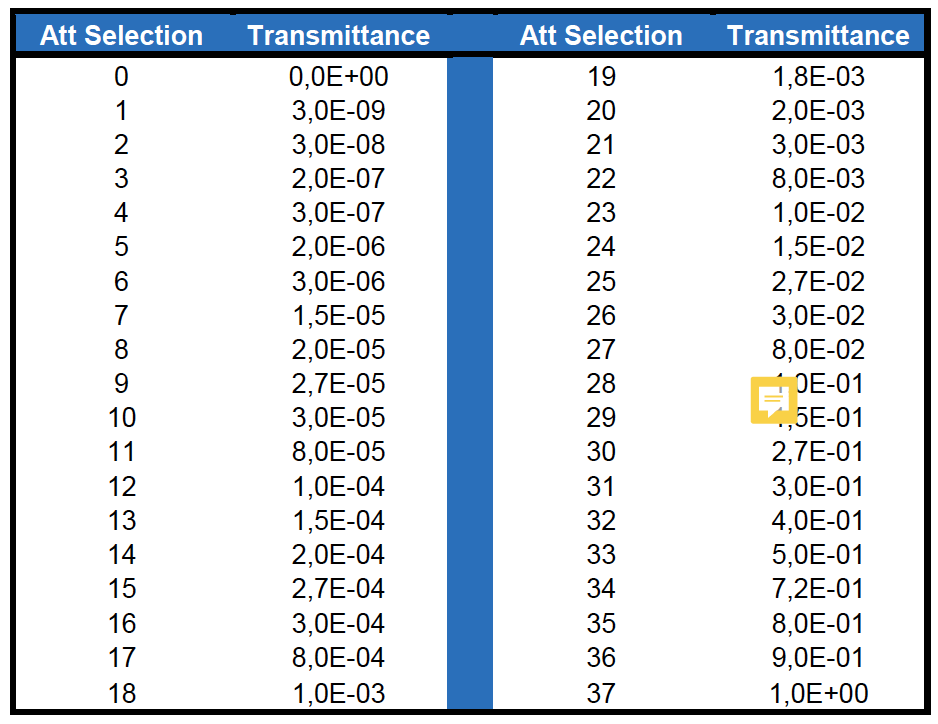

== Operating the OGSE

The OGSE (optical Ground Support Equipment) consists of a collimator
with a pattern mask in the focus. This pattern mask is illuminated by a
fiber. The fiber is fed with a laser-driven light source that produces a
flat spectrum. Between the light source and the collimator, there is a
control box that has:

* Two filter wheels with neutral density filters, allowing to attenuate
the light injected into the collimator to the different flux levels
required
* A slow asynchronous shutter (not implemented at all test-houses)
* A fast shutter that is synchronised to the AEU synchronisation signal
(not implemented at all test-houses)
* A power meter monitoring the light intensity from the light source
(power meter channel 1)
* A power meter monitoring the light injected into the collimator (power
meter channel 2)

=== Switching entire OGSE on

*Utility building block*

The OGSE can be switched on with one simple command:

----
>>> execute(ogse.ogse_swon)
----

or the command `ogse.ogse_swon()` can be used in a test script.

*Effect*

* Switches on the OGSE controllers
* Closes the shutter (if present)
* Puts the filter wheels in a position with 100% attenuation (blank position)
* Switches on the power meter
* Switches on the light source.
* OGSE telemetry is recording.

NOTE: the light source needs warming up and stabilisation; the OGSE start up script does not wait for that.

=== Switching entire OGSE off

*Utility building block*

----
>>> execute(ogse.ogse_swoff)
----

*Effect*

* Switches off the power meter
* Switches off the light source.
* Switches off the OGSE controllers
* OGSE telemetry is recording.

=== Attenuation with Neutral density filters

The attenuation is set by a double filter wheel where specific combinations of the wheel positions define a predefined attenuation. The following commands can be used to set the attenuation:
----
>>> ogse.att_level_up()
----
Effect: changes filter wheel combination one attenuation step higher.
----
>>> ogse.att_level_down()
----
Effect: changes filter wheel combination one attenuation step lower.
----
>>> ogse.set_fwc_fraction(<attenuation factor>)
----
Effect: will choose combination of ND filters that matches commanded
factor of the full-well capacity as close as possible.

[NOTE]
.Attenuation examples
====
* Attenuation factor 1.00 : both filter wheels are in the position with no Neutral density filter, no attenuation.
* Attenuation factor 0.01: filter wheels are in a combination of Neutral density filters delivering approximately 99% attenuation - the signal will be 100 times smaller than with no attenuation.
* Attenuation factor 0 will put a filter wheel in the opaque plate position.
====

----
>>> ogse.set_fw_position((<wheel_a_pos>, <wheel_b_pos>))
----
Effect: choose manual ND filters in the two wheels, note the argument is a tuple.

You can also read this back through the housekeeping:
----
>>> get_housekeeping("GOGSE_ATT_LVL")
----
Returns the actual attenuation factor realised with the ND filter combination

The CSL ambient alignment collimator provides the following attenuation factors:

.CSL ambient alignment collimator attenuation factors (from )

=== Attenuation specifying the full well fraction

For every facility, a calibration will be done to relate the attenuation
factor (0...1) to the fraction of the full well that will be filled in a
nominal (25sec) integration near the center of the field.
----
>>> ogse.set_fwc_fraction(0.5)
----

Will set the OGSE attenuation factor that results in the brightest pixel
in the PSF near the center of the field to be about 50% of the full well
(which is roughly `1E6` for PLATO CCDs)

=== Switching on/off light intensity stabilisation loop

Only implemented at IAS (TBD)

The N-camera reads out a different CCD every 6.25 seconds. You want to
synchronise the shutter open to the start of the new integration on the
CCD you are interested in (where the collimator image is seen). Setting
the exposure time allows to avoid exposing the CCD during readout
(avoiding e.g. smearing) and/or attenuate the light source in finer
steps than allowed by the neutral density filter wheels.
----
>>> ogse.shutter_startloop(<ccd number to synchronise to>, <exposure time>)
>>> ogse.shutter_stoploop()
----

=== Power meter

The readings of the power meters are store in OGSE housekeeping
telemetry.

If you need access to the power, read the housekeeping parameters
GOGSE_PM_CH1_PWR (light source monitor) or GOGSE_PM_CH2_PWR (light
injected into the collimator)

NOTE: CSL collimator power meter 2 will only provide readings between
attenuation levels 2E-3 and 1.

=== OGSE housekeeping parameters

[width="100%",cols="30%,31%,15%,12%,12%",options="header",]
|===
|Parameter name |Description |Grafana screen |type |unit
|GOGSE_LDLS_INTERLOCK |Laser Driven Light Source Power Interlock on
|GOGSE_MON |bool |

|GOGSE_LDLS_POWER |Laser Driven Light Source power on |GOGSE_MON |bool |

|GOGSE_LDLS_LAMP |Laser Driven Light Source lamp on |GOGSE_MON |bool |

|GOGSE_LDLS_LASER |Laser Driven Light Source laser on |GOGSE_MON |bool |

|GOGSE_LDLS_LAMP_FAULT |Laser Driven Light Source lamp fault |GOGSE_MON
|bool |

|GOGSE_LDLS_CTRL_FAULT |Laser Driven Light Source controller fault
|GOGSE_MON |bool |

|GOGSE_LDLS_PSU |Power Supply Unit on |GOGSE_MON |bool |

|GOGSE_LDLS_OPERATE |Laser Driven Light Source operate status on
|GOGSE_MON |bool |

|GOGSE_PM_CH1_PWR |Power meter channel 1 power |GOGSE_MON |Uint16 |

|GOGSE_PM_CH1_TEMP |Power meter channel 1 temperature |GOGSE_MON |Uint16
|DegCelsius

|GOGSE_PM_CH1_STATUS |Power meter channel 1 on |GOGSE_MON |bool |

|GOGSE_PM_CH2_PWR |Power meter channel 2 power |GOGSE_MON |Uint16 |

|GOGSE_PM_CH2_TEMP |Power meter channel 2 temperature |GOGSE_MON |Uint16
|DegCelsius

|GOGSE_PM_CH2_STATUS |Power meter channel 2 on |GOGSE_MON |bool |

|GOGSE_ATT_LVL |Attenuation factor (0..1) |GOGSE_MON |Uint16 |

|GOGSE_ATT_FWELL |Attenuation factor (approximate fraction of Full well)
|GOGSE_MON |Uint16 |
|===
