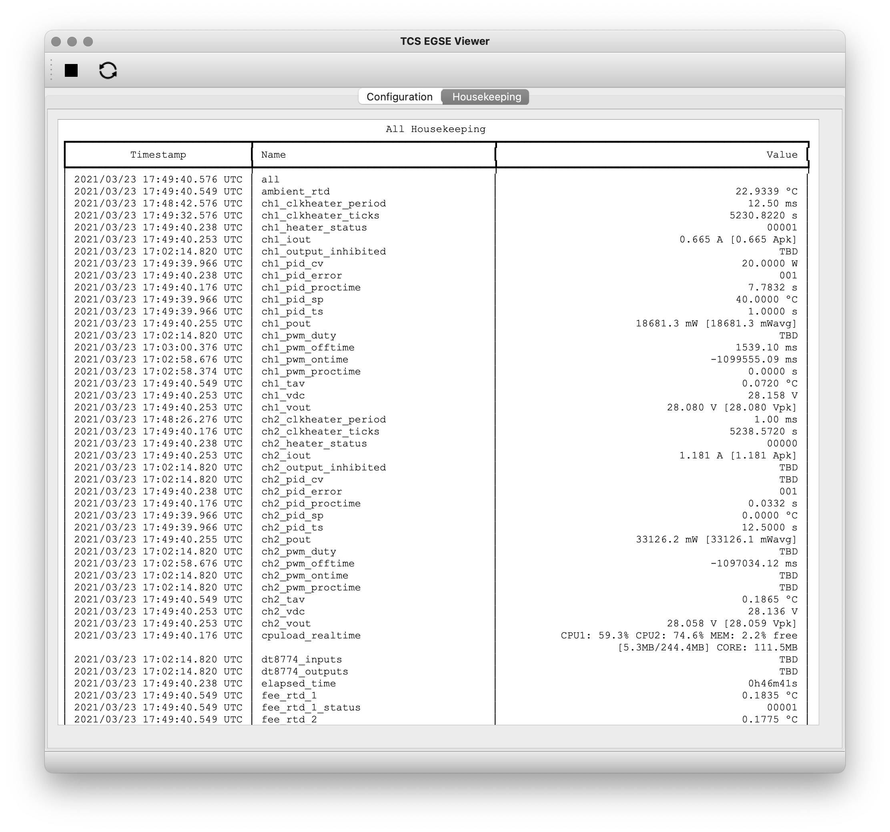

== Operating the TCS EGSE

TCS EGSE is providing monitoring and control of some temperatures on the
camera (TOU and FEE).

TRP (Thermal Reference Points) that are monitored:

* TRP1 (3 sensors, 1nominal/1redundant heater): the TRP controlling the
overall TOU temperature, used for thermal focusing
* TRP 22 (1 sensor, 1 nominal / 1 redundant heater): the survival heater
on the FEE. This is not used when the FEE is on, it is only used to
bring the FEE to its operational temperature if it is too cold to be
switched on.

The TCS EGSE has different operating modes:

* *Normal* operating mode of the camera: all the temperatures are
acquired and nominally only the TRP1 heater is controlled but TRP22
heater could be added (change of configuration in configuration mode
required)
* *Safe* operating mode: all the temperatures are acquired and TRP1
heater is controlled as well as FEE heater
* *Decontamination* mode or de-icing mode: all the temperatures are
acquired and nominally only TRP1 heater is controlled but TRP22 heater
could be added (change of configuration in configuration mode required)
* Camera *calibration* mode: only thermistor reading is performed and
heaters are not activated
* *EMC* mode: replay of a heater control sequence, sensor used only for
monitoring and switch off in case of temperature limit is exceeded
* *Extended* mode: all parameters are fully configurable.

The TCS EGSE is changing the TRP1 heater power with PWM (Pulse Width
Modulation): the current is varied by changing the width of square
full-power pulses. The width of the pulses can only be changed at the
time of an AEU clk_heater sync pulse, between CCD readouts.

The PWM pulses come at frequencies between 30 and 50 Hz - this frequency
is configurable.

Clk_heater sync pulse, to avoid switching the power during a CCD
readout. The TCS EGSE is updating the heater power within 200ms after
the leading edge (up-stroke) of the Clk_heater pulse.

The TCS EGSE can be operated in a _local_ mode using the
man-machine-interface (MMI). During camera tests, for monitoring and
commanding the TCS EGSE shall be in _Remote Control_ mode.

=== Switching between operating modes

Switching between modes is done with just one command,
set_operating_mode. The command takes one parameter that defines the
mode.

[arabic]
. normal
. safe
. decontamination|de-icing
. calibration
. EMC
. self-test
. extended

You can use either the number or the name of the mode as the argument,
but it is preferred to use the constants defined in the egse.tcs module.

[source]
----
>>> from egse.tcs import OperatingMode

>>> tcs.set_operating_mode(OperatingMode.NORMAL)
>>> tcs.set_operating_mode(OperatingMode.SAFE)
>>> tcs.set_operating_mode(OperatingMode.DECONTAMINATION)
>>> tcs.set_operating_mode(OperatingMode.CALIBRATION)
>>> tcs.set_operating_mode(OperatingMode.EMC)
>>> tcs.set_operating_mode(OperatingMode.SELF_TEST)
>>> tcs.set_operating_mode(OperatingMode.EXTENDED)
----

The mode that will be used most during camera testing is the _extended_
mode, which allows all parameters to be configurable.

==== Decontamination

The Decontamination heating is performed by turning ON the TRP1 heaters
at full power

==== Replay

=== Remote Commanding

The TCS EGSE has a set of commands at your disposal for remote
commanding the device. These commands can only be used in _Remote
Control_ mode, i.e., when the button shows orange in the MMI. We can
categorise these commands as follows:

*Change the operating mode*: as seen above, the command for changing the
operating mode is tcs.set_operating_mode( … ) which takes one parameters
that defines the mode.

[source]
----
>>> tcs.set_operation_mode(OperatingMode.EXTENDED)
----

*Set configuration parameter*: to change configuration parameters, use
the command tcs.set_parameter( … ) which takes two arguments, the
parameter name and its value. The following command changes the
temperature set point for the PI controller on channel 1 to -40ºC.

[source]
----
>>> tcs.set_parameter("ch1_tset", -40)
----

A full list of parameters that can be configured is available in table
6.8 on page 61-68 of RD-09.

Please note that several parameters can form a group, e.g., to configure
the PI controller for a certain channel. In this case the best approach
is to set all the parameters needed for that configuration and switch to
the proper mode, i.e., closed loop or open loop.

After your configuration is finished, the parameter set needs to be
committed on the device. This is done by sending a tcs.commit() command.

*Run the task*: When you have properly configured the TCS EGSE, you need
to run the task. This is needed to drive the controllers for the heaters
and to execute the PID controller to reach and maintain the intended
temperatures.

A task is run with the tcs.run_task() command and stopped with
tcs.stop_task(). Only when a task is running, the housekeeping
parameters will be updated continuously.

*Retrieve Information*: several commands are available to retrieve
information from the TCS EGSE.

* `get_data()`: this command works in both local mode and remote-control
mode. It retrieves telemetry from the TCS EGSE. When a task is running,
the full housekeeping is available through this command, if no task is
running, only load time and system resources are available.
* `get_housekeeping_value(<parameter name>)`: a list of all housekeeping
parameters is available in table 6.6 on page 50-58 of RD-09.
* `get_all_housekeeping()`: this command only work in remote-control mode
and retrieves all the housekeeping values from the TCS EGSE. Note
however, that, when no task is running, the housekeeping will be
outdated. To follow up-to-date telemetry with this command, make sure
the task is running.
* `get_error()`: this command returns any error that occurred and showed
up in the MMI display. Note that there is no way to clear the errors, so
the output of this command can be outdated also.
* `get_configuration()`: this command retrieves the full set of
configuration parameters with their current value.

.The TCS EGSE Viewer gives an overview of the TCS Housekeeping parameters with their latest engineering values. There are two TABs (1) the Configuration tab which shows the current configuration parameters and their values, and (2) the Housekeeping tab which updates every 10s with the latest housekeeping parameters.

*Convenience Functions*: two convenience functions are available to show
information in a nice colour table. If you need a quick overview of the
configuration or the housekeeping in the REPL or in a Jupyter Notebook,
use the following functions:

[source]
----
>>> from egse.tcs.tcs import print_all_housekeeping
>>> from egse.tcs.tcs import print_configuration

>>> print_all_housekeeping()
>>> print_configuration()
----
=== The TCS Data Acquisition System —DAS

Monitoring TCS EGSE telemetry can best be done with the TCS data
acquisition das. The das command is used from the terminal as follows:
----
$ das tcs --interval 10
----
The above command will retrieve TCS housekeeping telemetry every 10
seconds. The data is sent to the Storage Manager that saves the
telemetry in a CSV file on the egse-server. The das also makes the
temperatures of the TOU, FEE, and the ambient and internal temperatures
available for Prometheus to be monitored by Grafana.

Please note that this command should preferably run on the egse-server
and be started by the site-operator (see ‎2.3 above). The test-operator
can inspect the metrics from the TCS EGSE data acquisition in the
Grafana display.

=== Setting the temperature setpoints

TBW

=== Enabling / disabling temperature control

TBW

=== Temperature sensor configuration

TBW

==== Disabling TRP1 sensors to verify redundancy function

==== Switching from TRP1 mean to median

=== Changing temperature sensor calibration curves

TBW

=== Changing PI control parameters

TBW

=== Changing the PWM frequency

TBW
