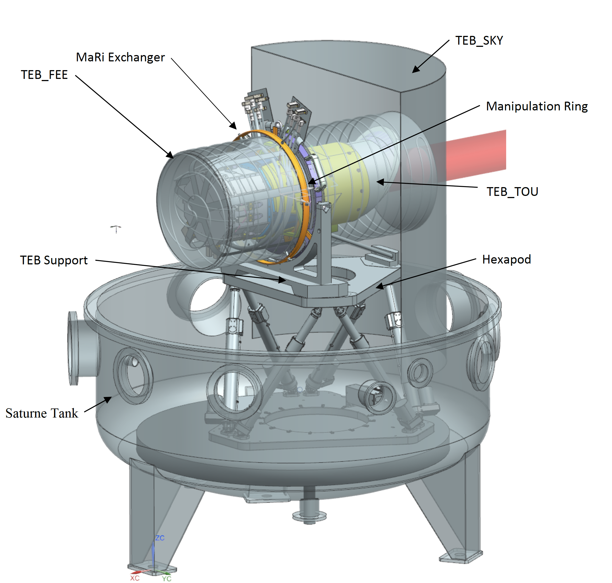
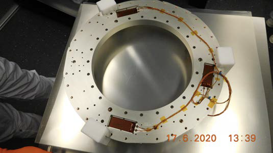
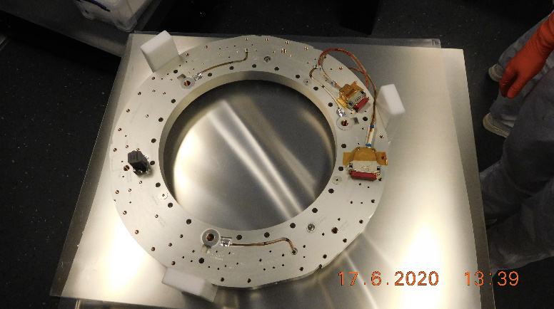

== Operating the TEB, shroud and MARI thermal control

=== Context

The test houses implement the temperature control of 6 Temperature
Reference points (TRP) of temperature interfaces to the camera: three
temperatures of the Thermal Environment Box (TEB): the TEB_SKY, a shroud
offering a cold radiative cooling sink to the TOU baffle, an upper
segment TEB_TOU, offering the radiative environment seen by the TOU tube
(covered in MLI) above the optical bench on the spacecraft, a lower
segment TEB_FEE offering the radiative environment in the optical bench
cavity seen by the FEE onboard the spacecraft, and the mounting points
of the 3 TOU bipods on the manipulation ring (TRP2,3,4) which are
representing the conductive interface of the optical bench as seen by
the TOU bipods on the spacecraft.

All six TRPs are controlled independently, and we can check and change
the temperature setpoints, and switch the control on / off for each TRP.

.Test setup at IAS, with TEB_SKY, TEB_FEE, TEB_TOU and MaRi indicated
[#fig-test-setup-ias]

=== Checking and setting the temperature setpoints

.Heater patches at the bottom of the MaRi for control of TRP 2, 3,4 (left) and corresponding temperature sensors on the top, right next to the interface holes for the TOU bipods (right)
|===
|Heater patches |Temperature Sensors

|
|
|===

Changing the setpoints:
----
>>> execute(tgse.set_temp_setpoint(trp=tgse.TRP.TEB_SKY, temperature=<temperatureCelsius>))
>>> execute(tgse.set_temp_setpoint(trp=tgse.TRP.TEB_TOU, temperature=<temperatureCelsius>))
>>> execute(tgse.set_temp_setpoint(trp=tgse.TRP.TEB_FEE, temperature=<temperatureCelsius>))
>>> execute(tgse.set_temp_setpoint(trp=tgse.TRP.TRP2, temperature=<temperatureCelsius>))
>>> execute(tgse.set_temp_setpoint(trp=tgse.TRP.TRP3, temperature=<temperatureCelsius>))
>>> execute(tgse.set_temp_setpoint(trp=tgse.TRP.TRP4, temperature=<temperatureCelsius>))
>>> execute(tgse.set_temp_setpoint(trp=tgse.TRP.TRP234, temperature=<temperatureCelsius>))
----
The effect of the last command (changing TRP234) is the same as setting TRP2, 3, 4 to the same setpoint.

Checking the setpoints:
----
>>> setpoint = tgse.get_temp_setpoint(trp=tgse.TRP.TEB_SKY)
>>> setpoint = tgse.get_temp_setpoint(trp=tgse.TRP.TEB_TOU)
>>> setpoint = tgse.get_temp_setpoint(trp=tgse.TRP.TEB_FEE)
>>> setpoint = tgse.get_temp_setpoint(trp=tgse.TRP.TRP2)
>>> setpoint = tgse.get_temp_setpoint(trp=tgse.TRP.TRP3)
>>> setpoint = tgse.get_temp_setpoint(trp=tgse.TRP.TRP4)
----

=== Starting / stopping the temperature control loop

----
>>> execute(tgse.start_control(trp=tgse.TRP.TEB_SKY))
>>> execute(tgse.start_control(trp=tgse.TRP.TEB_TOU)
...
>>> execute(tgse.stop_control(trp=tgse.TRP.TEB_SKY))
>>> execute(tgse.stop_control(trp=tgse.TRP.TEB_TOU)
...
----
