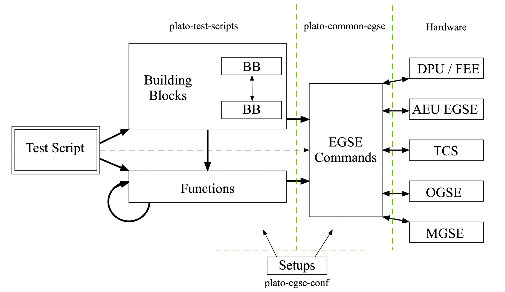

== Test script architecture

=== Overview

At the user level, the PLATO commanding resides upon a few key concepts

* *Building-block*: a building block is a Python function implementing the commands corresponding to a logical entity within a test (a Lego©-bloc) or an entire test (the Lego©-house, called “test-script”).
* *Test-script*: a test-script is a building block encapsulating all the commands necessary for a given test. The name of a test-script should identify it in the test-specification document (RD-03). The test-script should be unique, i.e. the test script for any given test should be useable in all test-houses.
* *Execution*: building blocks, and only building blocks, can be executed, i.e. run on the operational machine inside the test-environment.
* *Observation*: executing a building block triggers the creation of an “observation”. An observation is defined by a unique “observation identifier” (obsid) and lasts as long as the execution of the corresponding test (building block).
* *Setup*:  a Setup encapsulates the complete configuration of the test-environment (test-equipment) and of the camera (test-item) as well as all calibration files associated either to the hardware, or necessary for a given test.

More information on some of these elements are given in the next sections. The figure below describes the generic software architecture in place for the PLATO commanding:

* At the top level
    - a test script implements an entire test.
* At an intermediate level
    - The test script can call Python functions (e.g. “calculate the next FOV position to visit”) or lower level building blocks (e.g. “go to the next FOV position” or “acquire images over a 5x5 dither pattern”)
    - Building blocks can call other building blocks, or regular Python functions (recursion is forbidden within building blocks)
    - Functions can call other functions, but should not call building blocks
* At the lowest level, the Common-EGSE software provides all the “atomic commands” necessary to interface with the hardware. This layer allows to provide the users with user-friendly commands (e.g. human-readable parameter names, and no bit-field or hexadecimal numbers to provide).
* The active test-setup is available at all levels to provide all necessary information with respect to hardware or calibration.

.Test Scripts architecture and its relation to the Common-EGSE and the GSE and SUT.

=== Building block

==== Definition of a building block

A building block is a Python function marked with a specific decorator in the code. That simply means that the line directly above the definition of the building block in the code should be `@building_block`:

Example of a building block definition:
[source]
----
@building_block
def move_filter_wheel(position=None):
    # your code comes here
    return True
----
All parameters of a building block are keyword parameters. That means the parameter name and its value must be specified when calling the building block.
[source]
----
...
move_filter_wheel(position="A")
...
----

==== Building block justification

*Execution*: Building blocks are the only entity in the code that will be accepted for execution on the operational machines in the test-environments (THs).

*Structure*: a unique identifier (BBID) is automatically attributed to every building block entering the plato-test-scripts repository. At every moment during a test execution, the current BBID is recorded in the data (TBC).

Organising a test script into a logical structure and implementing the underlying building blocks accordingly will help structure the data, which in turn will be precious to ease the analysis.

For instance, if a test-script (BB1) is calling building blocks BB2 and BB3 sequentially, the telemetry will contain a sequence of timestamps where the individual building-blocks start, or end.

Note that, as a further convenience, a building block counter (BBCOUNT) will also be recorded, which is a natural number incremented by one every time the active BBID is changing, hence running from 0 to 4 in the example above (TBC).

==== The properties of a building block

Building blocks implement some safeguards, imposing a number of limitations on the code

* Building blocks cannot be called recursively. Beware of building blocks calling other building blocks. Avoid too many layers. Avoid functions calling building blocks
* At run time, the names and the values of every arguments of a building blocks must be explicitly given. Building blocks with many parameters are hence strongly discouraged
* `def my_block(param1, param2=3)`: is forbidden for 2 reasons
    - Positional arguments are forbidden (`param1`)
    - All arguments must be given the default value `None` (`param2`). The reason for this is that we want, when the building block is called, all arguments to be passed explicitly, not implicitly.

==== Using default argument values in a building block

WARNING: we strongly discourage using this way of '_work around default parameters_'. It is currently still implemented in the core system, but this behaviour might/will be removed in the future.

In the code definition, it is not possible (prev. subsection).

It is nevertheless possible via an input file. The input file must

* be in YAML format
* bear the same name as the building block it corresponds to
* be put in directory camtest/commanding/input

Example: building block `camtest/commanding/hk_only.py`
[source]
----
@building_block
def hk_only(wait_time=None):
    time.sleep(wait_time)
----
Corresponding input file `camtest/commanding/input/hk_only.yaml`
----
# 'hk_only' - Building Block
Args:
    wait_time:         10         # System idle time [seconds]
----

==== Utility building blocks

A collection of low-level, general purpose building blocks is already provided in the commanding section of the plato-test-scripts (`camtest/commanding`), to help the test-developer, for instance to manipulate some hardware device, tune the OGSE light intensity, set the FEEs in different operating modes, acquire a number of full-frame images etc.
