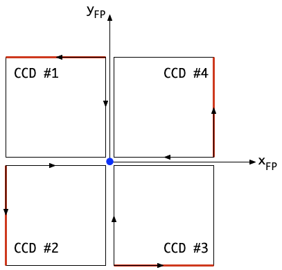
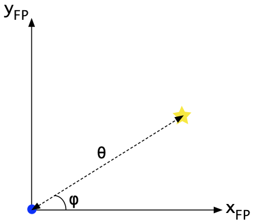

== Utility functions

=== Logging

Errors, warnings, general debugging or any useful information can be
logged using the logging infrastructure. The logging infrastructure will
take care that the messages you generate are stored in the log files
associated with the measurement. It also takes care of visualising the
messages to the operator.

Log levels: CRITICAL, ERROR, WARNING, INFO, DEBUG

To log a message in your script:
[%nowrap]
----
>>> from camtest import camtest_logger
>>> camtest_logger.info("Starting performance verification test")
2023-06-15 17:10:30,857:             IPython:    INFO:    1:camtest             :Starting performance verification test
----
This will print a log message in the REPL and send a log record with the
message to the Logger. Messages for any of the above levels will end up
in the Common-EGSE log file, but only messages of level INFO and above
will also be printed in the terminal. So, if you need to check any
debugging messages, make sure you check the log file at
`$PLATO_LOG_FILE_LOCATION`.

=== Handling Errors

Inevitably, the code other developers write will generate error and
exceptions. Whenever you expect an exception and you know what to do
with it or how to handle it, catch it with the following construct:
----
try:
    call_a_function_from_another_dev(...)
except ZeroDivisionError:
    # do something to recover here
----
If you cannot handle the error, just let it pass to the next level in
you script and eventually to the top building_block.

There is a fully detailed description of exception handling in the on-line Common-EGSE documentation in the section https://ivs-kuleuven.github.io/plato-cgse-doc/asciidocs/developer-manual.html#_best_practices_for_error_and_exception_handling[Exception Handling] of the developer manual.

=== Coordinate transformations

xref:fig-fp-ref-frame[xrefstyle=short] below shows the schematic overview of the focal plane with the four
CCDs. The focal-plane reference frame (x~FP~, y~FP~, z~FP~) is
associated with the focal plane of one camera. Its origin is in the
middle of the four CCDs (indicated by the blue dot in the figure) and
the z~FP~–axis coincides with the optical axis (pointing towards the
reader). The coordinates in the (x~FP~, y~FP~) reference frame are
typically expressed in mm.

Each of the four CCDs has its own CCD reference frame (x~CCD~, y~CCD~)
assigned to it (indicated with the small arrows in the figure). When
keeping the readout register of a CCD at the bottom, the origin of the
associated CCD reference frame is at the lower left corner of the CCD.
The parallel charge transfer happens in the negative y~CCD~ direction;
the serial charge transfer in the readout register happens in the
negative x~CCD~ direction for the left detector half and in the
positive x~CCD~ direction for the right detector half. The coordinates
in the (x~CCD~, y~CCD~) reference frame are typically expressed in
pixels (where a pixel measures 18µm in both directions)

* Definition of important coordinate systems
* Field of view position (degrees) to CCD number and pixel coordinates
* CCD number and pixel coordinates to field of view position (degrees)

[[fig-fp-ref-frame]]
.Schematic overview of the focal plane of one camera, with the four CCDs. The blue dot in the middle of the CCDs is the origin of the focal-plane reference frame (x~FP~, y~FP~) and denotes the location where the optical axis intersects with the focal-plane. The readout registers of the CCDs are marked in read and the associated CCD reference frames are indicated with the small arrows.

Alternatively, the position in the focal plane can be expressed in field
angles (θ, φ), as shown in xref:fig-fp-field-angles[xrefstyle=short]. The angular distance to the
optical axis (marked with a blue dot in the figure) is denoted by angle
θ, whereas φ represents the in-field angle, measured in
counter-clockwise direction from the x ~FP~ axis.

[[fig-fp-field-angles]]
.Definition of the field angles θ and φ. The former is the angular distance to the optical axis (marked by means of the blue dot), the latter is the in-field angle, measured in the counter-clockwise direction from the x~FP~ axis.

The following coordinate conversions can be imported from `egse.coordinates`:
----
row, column, ccd_code = focal_plane_to_ccd_coordinates(x_fp, y_fp)
----
* Identifies the CCD on which the given focal-plane coordinates (`x_fp`,`y_fp`) are located, and returns the pixel coordinates (`row`, `column`) in the corresponding CCD reference frame and the CCD code (`ccd_code`).

** The input focal-plane coordinates (`x_fp`, `y_fp`) should be specified in
mm.
** The output pixels coordinates (`row`, `column`) are given in pixels.
** The output CCD code `ccd_code` should be 1/2/3/4 (as in xref:fig-fp-ref-frame[xrefstyle=short]).
** If the given focal-plane coordinates do not fall on any of the CCDs, (None, None, None) is returned.

----
theta, phi = focal_plane_coordinates_to_angles(x_fp, y_fp)
----
* Converts the given focal-plane coordinates (`x_fp`, `y_fp`) to field angles (`theta`, `phi`).

** The input focal-plane coordinates (`x_fp`, `y_fp`) should be specified in mm.
** The output field angles (`theta`, `phi`) are given in degrees.

----
x_fp, y_fp = ccd_to_focal_plane_coordinates(row, column, ccd_code)
----
* Converts the given pixel coordinates (`row`, `column`) in the reference
frame of the CCD with the given code `ccd_code` to focal-plane coordinates
(`x_fp`, `y_fp`).

** The input pixel coordinates (`row`, `column`) should be given in pixels.
** The input CCD code ccd_code should be 1/2/3/4 (as in xref:fig-fp-ref-frame[xrefstyle=short]).
** The output focal-plane coordinates (`theta`, `phi`) are given in mm.

----
x_fp, y_fp = angles_to_focal_plane_coordinates(theta, phi)
----
* Converts the given field angles (`theta`, `phi`) to focal-plane coordinates (`x_fp`, `y_fp`).

** The input field angles (`theta`, `phi`) should be given in degrees.
** The output focal-plane coordinates (`x_fp`, `y_fp`) are given in mm.

----
x_distorted, y_distorted = undistorted_to_distorted_focal_plane_coordinates(
    x_distorted, y_distorted, distortion_coefficients, focal_length)
----
* Converts the given undistorted focal-plane coordinates (`x_undistorted`, `y_undistorted`) to distorted focal-plane coordinates (`x_distorted`, `y_distorted`), based on the given distortion coefficients(`distortion_coefficients`) and focal length (`focal_length`).

** The input undistorted focal-plane coordinates (`x_undistorted`, `y_undistorted`) should be given in mm.
** The input distortion coefficients (`distortion_coefficients`) should be an array [k1, k2, k3] with the coefficients of the distortion polynomial.
** The input focal length (`focal_length`) should be given in mm.
** The output distorted focal-plane coordinates (`x_distorted`, `y_distorted`) should be given in mm.
