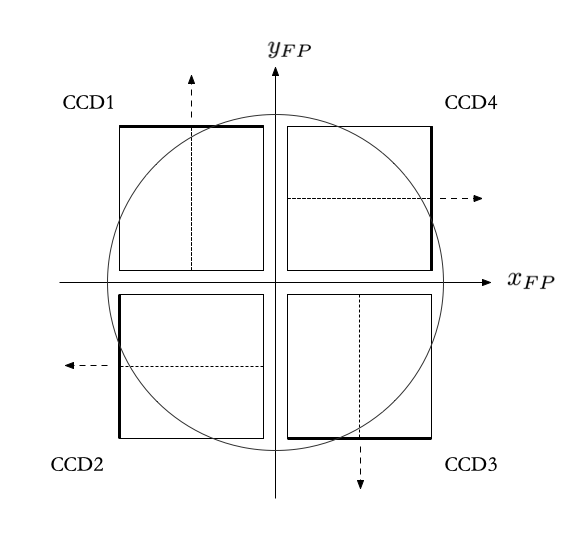
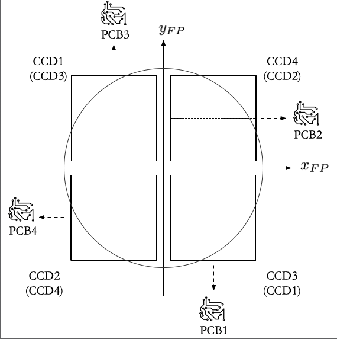
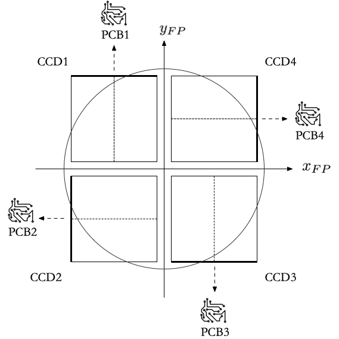

== CCD Numbering

Throughout the PLATO camera test campaigns, the CCD numbering, used throughout the CGSE, will remain the same (see figure below), but the underlying numbering, used by MSSL for the N-FEE will be different for EM, PFM, and FM.

=== MSSL Numbering

The MSSL numbering of the CCDs is used in:

- the SpW packets with the raw image data;
- the N-FEE register map (used for configuration and queries).

=== Conversions MSSL &#8646; CGSE

Originally, the conversion back and forth between the MSSL and CGSE numbering was configured in `egse.fee` in the following variables:

- `CCD_BIN_TO_ID`: for the conversion from MSSL numbering to CGSE numbering (used in the FITS persistence layer, DPU UI and HDF5 viewer);
- `CCD_BIN_TO_IDX`: for the conversion from MSSL numbering to display index in the DPU UI;
- `CCD_ID_TO_BIN`: for the conversion from CGSE numbering to MSSL numbering;
- `+++<del>CCD_IDX_TO_BIN</del>+++`.

The `DEFAULT_CCD_READOUT_ORDER` variable holds the default order of the CCD readout, as defined in the N-FEE register.

=== Register map

=== Moving to the Setup

The idea is that these conversions will be moved to the setup file, under `setup.camera.fee.ccd_numbering`.  The name of the relevant parameters is the same as above, but in small case.

---

=== EM
The CCD numbering in the CGSE and the connections to the PCBs for EM are shown in the figure below.  Between brackets are the CCD numbers by MSSL.  Not only do the CCD numbers not match between MSSL and the CGSE, but the connections between the CCDs and the corresponding PCBs is incorrect.  The latter will be corrected for in PFM.

==== Reference Documents

The entries in the N-FEE register map for EM are stipulated in the following reference document:

|===
|N-FEE ICD | PLATO-MSSL-PL-ICD-0002 (issue 12.0, 05/05/2022)
|Register map (Attachment) | PLATO-MSSL-PL-PL-FI-0003_1.0_N-FEE_EM1_EM2_Register_MAP.xlsx
|===

==== Common EGSE

===== CDD conversions
- CCD_BIN_TO_ID: [3, 4, 1, 2]
- CCD_BIN_TO_IDX: [2, 3, 0, 1]
- CCD_ID_TO_BIN: [0, 0b10, 0b11, 0b00, 0b01]
- +++<del>CCD_IDX_TO_BIN: [0b10, 0b11, 0b00, 0b01]</del>+++

===== CCD IDs
- CCD1: 0b10
- CCD2: 0b11
- CCD3: 0b00
- CCD4: 0b01

==== Default readout order

===== Deviations from the N-FEE ICD

Incorrect connection between the PCBs and the CCDs:

- According to the spreadsheet for EM (see above), the default CCD readout order is 228 (decimal value).  This is supposed to correspond to the requested CCD readout scheme 1 - 2 - 3 - 4 (e.g. when going to dump mode), but - due to the incorrect connections between the PCBs and the CCDs - this actually corresponds to 3 - 4 - 1 - 2.
- To compensate for this, the default CCD order as configured in the setup does not correspond to what is in the spreadsheet: instead of using 0b11100100 (228), we use 0b01001110 (0x4E or 78).

==== CGSE Configuration

- Register map: plato-cgse-conf/data/common/n-fee: n_fee_register_em_v2.yaml
- HK map: plato-cgse-conf/data/common/n-fee: n_fee_hk_em_v2.yaml
- Sensor calibration: plato-cgse-conf/data/common/n-fee: nfee_sensor_calibration_em_v3.yaml

---

=== PFM

For PFM, the following modifications will be applied w.r.t. EM:

- The CCDs will be connected to the PCB with the same number;
- Part of the entries in the N-FEE register map will move places.

The CCD numbering and the connections to the PCBs for PFM are shown in the figure below.  Note that the underlying MSSL numbering is the same as for EM.

==== Reference Documents

The entries in the N-FEE register map for PFM are stipulated in the following reference document:

|===
|N-FEE ICD | PLATO-MSSL-PL-ICD-0002 (issue 12.0, 05/05/2022)
|Register map (Attachment) | PLATO-MSSL-PL-PL-FI-0003_1.0_N-FEE_PFM_Register_MAP.xlsx
|===

==== Common EGSE

===== CDD conversions
- CCD_BIN_TO_ID:
- CCD_BIN_TO_IDX:
- CCD_ID_TO_BIN:
- +++<del>CCD_IDX_TO_BIN:</del>+++

===== CCD IDs
- CCD1:
- CCD2:
- CCD3:
- CCD4:

==== Default readout order

==== CGSE Configuration

- Register map: plato-cgse-conf/data/common/n-fee: n_fee_register_pfm_v1.yaml
- HK map: plato-cgse-conf/data/common/n-fee: n_fee_hk_pfm_v1.yaml
- Sensor calibration: plato-cgse-conf/data/common/n-fee: nfee_sensor_calibration_em_v3.yaml

---

=== FM

The CCD numbering and the connections to the PCBs for FM are the same as for PFM.

==== Reference Documents

The entries in the N-FEE register map for FM are stipulated in the following reference document:

|===
|N-FEE ICD | PLATO-MSSL-PL-ICD-0002 (issue 12.0, 05/05/2022)
|Register map (Attachment) | PLATO-MSSL-PL-PL-FI-0003_1.0_N-FEE_PFM_Register_MAP.xlsx
|===

==== Common EGSE

===== CDD conversions
- CCD_BIN_TO_ID:
- CCD_BIN_TO_IDX:
- CCD_ID_TO_BIN:
- +++<del>CCD_IDX_TO_BIN:</del>+++

===== CCD IDs
- CCD1:
- CCD2:
- CCD3:
- CCD4:

==== CGSE Configuration

- Register map: plato-cgse-conf/data/common/n-fee: n_fee_register_fm_v1.yaml
- HK map: plato-cgse-conf/data/common/n-fee: n_fee_hk_fm_v1.yaml
- Sensor calibration: plato-cgse-conf/data/common/n-fee: nfee_sensor_calibration_em_v3.yaml

==== Default readout order
