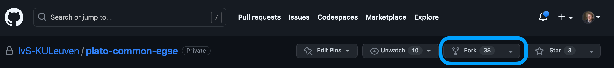
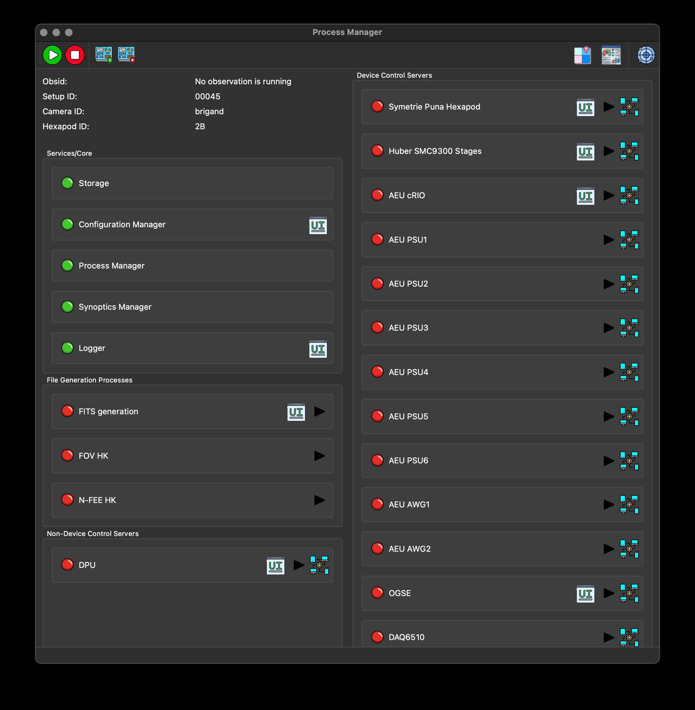

:toc:
:icons: font

[#set-up-dev-env]
== Set up your development environment

This section guides you through the installation of the Common-EGSE, test scripts, and configuration files on your development machine. The result will be a development environment where you can implement features and fix issues in both CGSE and TS, and be able to push these changes to your originfootnote:[In the context of 'git', 'origin' refers to the default name given to the remote repository from which a local repository was cloned or with which it is associated and receives updates.] after which you can make a pull request to the upstream repository (i.e. the IvS-KULeuven original).

NOTE: The commands in this section have been tested on a MacBook Pro running Ventura 13.4 and using iTerm2 with a bash shell. The Python version I use is 3.8.15 managed by https://github.com/pyenv/pyenv[pyenv]. If you are using a different 'unix-like' environment and experience problems, raise an issue on the https://github.com/IvS-KULeuven/plato-cgse-doc[plato-cgse-doc] repository and we will try to give you support asap.

=== Create a GitHub account and request access

First thing to do is make sure you have access to GitHub and have a GitHub account (personal or professional) so wefootnote:[Rik Huygen (rik.huygen at kuleuven.be) or Sara Regibo (sara.regibo at kuleuven.be)] can give you access to the relevant repositories. Therefore,

* create a –free-of-charge– GitHub account on https://github.com
* request access to the following GitHub repositories:
** for CGSE, i.e. https://github.com/IvS-KULeuven/plato-common-egse[plato-common-egse,]
** for TS, i.e. https://github.com/IvS-KULeuven/plato-test-scripts[plato-test-scripts]
** for CONF, i.e. https://github.com/IvS-KULeuven/plato-cgse-conf[plato-cgse-conf]

=== Fork the repositories on GitHub

[NOTE]
--
If you don't know what a _fork_ is, please spend some time to learn what it means. A good introduction can be found at GitHub documentation: https://docs.github.com/en/get-started/quickstart/fork-a-repo[fork a repo].

For those who just need a refresher image:

image::../images/fork-clone.png[width=60%]
--

Make sure you have a fork of the repositories that you want to contribute to. Through this fork (which resides on the GitHub server) you will create pull requests. If you do not contribute to any code, you don't need a fork and can clone the IvS-KULeuven repositories directly.

You can easily create a fork from the IvS-KULeuven repositories by the button in the top-right of the website.

The fork will be created in your personal GitHub account.

=== Clone GitHub repository

Execute the following code in a terminal. It will create a folder where all git repositories reside, then clone your fork of the plato-common-egse. A new folder will be created for `plato-common-egse`.
[source%nowrap]
----
$ mkdir -p ~/plato-git-repos
$ cd ~/plato-git-repos
$ git clone https://github.com/<username>/plato-common-egse.git <1>
$ cd plato-common-egse
----
<1> replace `<username>` with your GitHub account user name!

You should do the same for the two other repositories, `plato-test-scripts` and `plato-cgse-conf`. Remember that you do not need a fork if you are not going to make changes to the repository, like e.g. for the configuration repo.

----
$ cd ~/plato-git-repos
$ git clone https://github.com/<username>/plato-test-scripts.git <1>
$ git clone https://github.com/IvS-KULeuven/plato-cgse-conf.git <2>
----
<1> replace `<username>` with your GitHub account user name!
<2> the clone is here directly from the IvS-KULeuven repo

You should now have three folders in your `~/git` location:
----
$ ls -l
total 0
drwxr-xr-x   8 rik  staff  256 Jun 14 23:01 plato-cgse-conf
drwxr-xr-x  28 rik  staff  896 Jun 14 22:54 plato-common-egse
drwxr-xr-x  16 rik  staff  512 Jun 14 23:01 plato-test-scripts
----

=== Set up the environment variables

Add the following lines to a file that can be sourced into your terminal session, e.g. `~/.bash_profile`. Preferably, you should use https://lmod.readthedocs.io/en/latest/[modules] to maintain your environment.
[%nowrap]
----
export SITE_ID=KUL <1>
export PATH=$PATH:~/plato-git-repos/plato-common-egse/venv/bin:~/plato-git-repos/plato-test-scripts/venv/bin
export PYTHONPATH=~/plato-git-repos/plato-test-scripts/src:~/plato-git-repos/plato-common-egse/src:~/plato-git-repos/plato-common-egse/venv/lib/python3.8/site-packages
export PYTHONSTARTUP=~/plato-git-repos/plato-common-egse/startup.py
export PLATO_DATA_STORAGE_LOCATION=~/data/
export PLATO_CONF_DATA_LOCATION=~/plato-git-repos/plato-cgse-conf/data/${SITE_ID}/conf
export PLATO_LOG_FILE_LOCATION=~/data/${SITE_ID}/log
export PLATO_LOCAL_SETTINGS=~/cgse/local_settings.yaml
export PLATO_CONF_REPO_LOCATION=~/plato-git-repos/plato-cgse-conf/
----
<1> replace `KUL` with your favorite site id in upper case, CSL1, CSL2, IAS, INTA, or SRON. Beware that when you choose an unknown site id, you will have to provide all the site specific Setups, device driver implementations in test scripts etc.

=== Create a Python virtual environment

Create a virtual environment for Python 3.8 (the version to be used for the CGSE and TS), then activate the venv and update https://pip.pypa.io/en/stable/user_guide/[pip] and setuptools packages.
[source]
----
$ cd ~/plato-git-repos/plato-common-egse
$ python3.8 -m venv venv --prompt venv-cgse  <1>
$ source venv/bin/activate
(venv-cgse) $ python -m pip install --upgrade pip setuptools wheel
----
<1> the prompt will appear in your terminal, so you will know which environment you are using.

Now install all the packages needed to run the CGSE and TS. These packages are installed from a `requirements.txt` file which is currently not yet added to the repository. The file can be downloaded from XXXXX.

----
(venv-cgse) $ python -m pip install -r requirements.txt
(venv-cgse) $ deactivate
----

Also for the test scripts you will need to create a virtual environment. You won't need to install any additional dependencies since all dependencies are installed in the CGSE virtual environment and this location was added to the PYTHONPATH above.

----
$ cd ~/plato-git-repos/plato-test-scripts
$ python3.8 -m venv venv --prompt venv-ts
----

=== Install the CGSE

It's now time to finally install the Common-EGSE as a developer installation, also called _editable mode_ (`-e` or `--editable`). This means the CGSE will be installed as a normal package, only the source code will be linked to the actual checked out source tree in you project. The result is that any changes that you make to the code in your source tree will be used in subsequent executions of scripts or in the Python REPLfootnote:[A REPL (Read-Eval-Print Loop) is an interactive programming environment that allows users to enter Python code, which is then executed, and the results are immediately displayed.].

----
$ cd ~/plato-git-repos/plato-common-egse
$ source venv/bin/activate
(venv-cgse) $ python -m pip install -e .
(venv-cgse) $ deactivate
$
----

and also do a developer install for plato-test-scripts:

----
$ cd ~/plato-git-repos/plato-test-scripts
$ source venv/bin/activate
(venv-ts)$ python -m pip install -e .
(venv-ts) $ deactivate
$
----

=== Start the core services

From the project folder, run the invoke task `start-core-egse` to start up the five core services.
----
$ cd ~/plato-git-repos/plato-common-egse
$ invoke start-core-egse
----

You should now be able to see the core services running on your system:
[%nowrap]
----
$ ps -ef|grep _cs
459800007 15196     1   0 11:48AM ttys003    0:00.56 /Users/rik/git/plato-common-egse/venv/bin/python3.8 /Users/rik/git/plato-common-egse/venv/bin/log_cs start
459800007 15197     1   0 11:48AM ttys003    0:09.79 /Users/rik/git/plato-common-egse/venv/bin/python3.8 /Users/rik/git/plato-common-egse/venv/bin/sm_cs start
459800007 15208     1   0 11:48AM ttys003    0:14.22 /Users/rik/git/plato-common-egse/venv/bin/python3.8 /Users/rik/git/plato-common-egse/venv/bin/cm_cs start
459800007 15359     1   0 11:49AM ttys003    0:08.78 /Users/rik/git/plato-common-egse/venv/bin/python3.8 /Users/rik/git/plato-common-egse/venv/bin/pm_cs start
459800007 15370     1   0 11:49AM ttys003    0:07.35 /Users/rik/git/plato-common-egse/venv/bin/python3.8 /Users/rik/git/plato-common-egse/venv/bin/syn_cs start
----

[WARNING]
--
The first time you start the core services after installation, the `pm_cs` and `syn_cs` will not start because you have not loaded a valid Setup in the configuration manager. Do that from the terminal as follows (replace `45` with a valid Setup ID):
----
$ cm_cs load-setup 45
----
Then start the core services again with the invoke command.
--

Now you can also start the process manager GUI with the following command:
----
$ pm_ui
----
If you get the following error of _too many open files_, increase the limit of open files with `ulimit -n 4096` and restart the process manager GUI.

----
Too many open files (src/kqueue.cpp:62)
Abort trap: 6
----

The process manager GUI should now start and show something like the screenshot below depending on the site id you have defined and the Setup ID you have loaded.

NOTE: If you try to start the Operator GUI from the toolbar, note that this will only work after you have also installed the test scripts.

=== Updating the CGSE and TS

.Prepare for updates (only once)
[sidebar]
--
The `update_cgse` and `update_ts` scripts use a remote named `updates` to fetch new updates from the IvS-KULeuven repository. Therefore add this remote for both repos:

----
$ cd ~/plato-git-repos/plato-common-egse
$ git remote add updates https://github.com/IvS-KULeuven/plato-common-egse.git
$ cd ~/plato-git-repos/plato-test-scripts
$ git remote add updates https://github.com/IvS-KULeuven/plato-test-scripts.git
----
--
It's important that you keep your local repo up-to-date with the upstream repositories. We have two commands defined for this, `update_cgse` and `update_ts`. There are however a few guidelines (or rules) that you have to adhere to in order to keep a clean development environment.

1. *use branches!* For each fix or feature that you are working on, create a separate branch off the develop branch. The git branches are very fast, so that is a cheap operation and it keeps your develop branch clean.
2. an update shall be done in the develop branch, so make sure you are on the develop branch and not in one of your feature or fix branches.
3. if you have uncommitted changes, you will not be able to update the develop branch or ven switch branches. To solve this, either commit the changes in the branch you are working before switching to develop. In the develop branch, there should be no changes as they should all be in the feature/fix branches. If, for some reason, there  has been a change that you do not want to loose, stash these changes before starting the update and put them back afterwards.

----
$ cd ~/plato-git-repos/plato-common-egse
$ git checkout develop
$ (git stash)
$ update_cgse develop
$ (git stash pop)
----

----
$ cd ~/plato-git-repos/plato-test-scripts
$ git checkout develop
$ (git stash)
$ update_ts
$ (git stash pop)
----

You can request the version of the CGSE and TS as follows [for an explanation on version numbers, see <<version-numbers>>]:

----
$ python -m egse.version
CGSE version in Settings: 2023.24.0+CGSE  <1>
CGSE git version = 2023.24.0+CGSE-0-ga54e786b
CGSE installed version = 2023.24.0+cgse
$ python -m camtest.version
CAMTEST version in Settings: 2023.24.1+TS  <1>
CAMTEST git version = 2023.24.1+TS-0-geedbdef
----
<1> of course on your machine, by the time you will execute these lines, the versions will be different.
