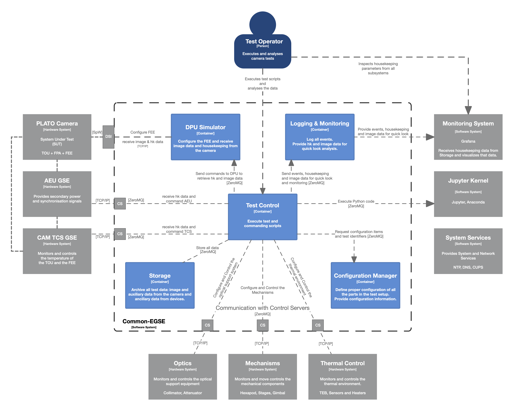

== Miscellaneous

WARNING: Below this point we have miscellaneous topics that still need their place in the developer manual.

This file contains sections that are not assigned a proper location in the developer document. When we are ready for one of the sections, just move it out into its dedicated file.

Sections below are copied from the Word document PLATO-KUL-PL-MAN-0003.

==	System Configuration

* Which files to edit for configuring the system?
** `egse/settings.yaml` do not edit this, instead edit the local_settings file pointed to by PLATO_LOCAL_SETTINGS environment variable.
* Where do I describe which components are part of the system?
* What if CSL has two Keithley DAQ6510 devices? How will they be distinguished?

===	System Components

This section describes the main components of the Common-EGSE system.

* Storage Manager
* Configuration Manager
* Process Manager
* Device Control Servers
* System Under Test (SUT)

===	Data Flows

The Common-EGSE provides functionality to configure, control and/or readout the following devices:

* Camera N-FEE and F-FEE, i.e. configure the camera and readout the CCDs
* CAM TCS EGSE, i.e. thermal control of the TOU and FEE
* AEU EGSE, i.e. provide secondary power and synchronisation to the FEE
* Optical, e.g. control and attenuate laser light source
* Mechanisms, e.g. hexapod, translation and rotation stages, gimbal
* Thermal control or monitoring of test setup

All data that is output by any of these devices will be archived in global and/or test specific files. The file types and formats are described in section Error! Reference source not found. Error! Reference source not found..

[#img-cgse-components]
.The main components of the Common-EGSE (bleu) and how they interface to each other (internal interfaces) and to the test setup (grey) and the PLATO camera (SUT) (external interfaces).

The Common-EGSE consists of several components, each with specific responsibilities, that communicate over a ZeroMQ network protocol. The following components have been identified and are part of the core functionality of the Common-EGSE:

* Test Control: execution of test and commanding scripts
* Configuration Manager: control the systems configuration
* DPU Simulator: configuration of the FEE and readout of the CCD and housekeeping data
* Logging: central logging component for status information and events
* Monitoring: monitor crucial housekeeping and telemetry and perform limit checks
* Storage: archive all data like images, housekeeping, telemetry, SpaceWire packets, commanding sequences etc.

xref:img-cgse-components[xrefstyle=short] above summarises the main components in the core Common-EGSE and test setup and defines their connections.

==	Installation and Update

The Common-EGSE software system is installed and updated via GitHub. The installation is more complex than a simple download-and-install procedure and is fully described in its installation guide [RD-01].

==	Getting Started

If you work with the system for the first time, you should go through the user manual [RD-02] to get familiar with the Common-EGSE setup, services and interactions. This section will explain how to log onto the Common-EGSE and how to prepare your development environment.

===	Log on to the System

* Who does login to the system?
* How, as which user, privileges is the user logged in?
* What services are running anyway, started at system boot?
* Developer Desktop versus operational desktop

===	Setting up the development environment

* Git
* Fork and clone the GitHub repository
* Install the Common-EGSE system – see the installation guide [RD-01]
* PYTHONPATH
* Being in the right directory
* PyCharm or another IDE
