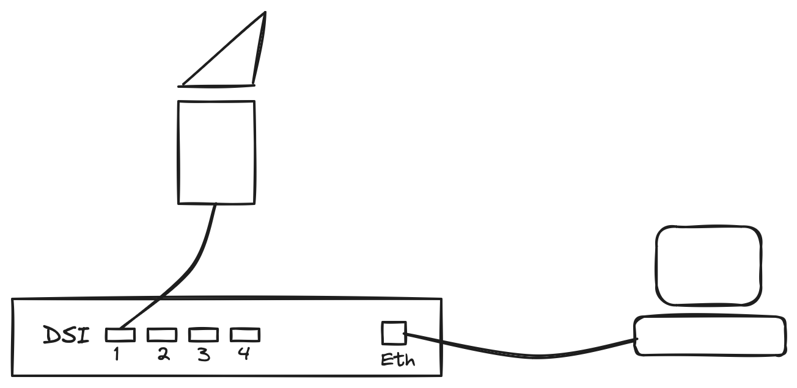

[#spacewire]
== SpaceWire

This chapter describes all facets of the SpaceWire interface from and to the camera. We use the 4Links Diagnostic SpaceWire Interface (DSI) with one port to connect to the N-CAM and 4 ports to connect to the F-CAM. The following topics will be explained in this chapter.

* The SpaceWire Lab interface
* SpaceWireInterface class
** SpaceWireOverDSI
** SpaceWireOverZeroMQ
* Connecting to the device
** Speed
** active link
* testing your connection

=== The SpaceWire Lab Interface – Hardware

In the lab we use a SpaceWire interface from 4Links. This company provides devices to communicate over SpaceWire, but also to monitor, diagnose, develop your SpaceWire connections.

Two of these devices are used in the different institutes that test the PLATO cameras, i.e. the Diagnostic SpaceWire Interface (DSI) and the portable version of that (P-DSI). These devices have 2, 4, or 8 SpaceWire ports that can work concurrently at a speed up to 400Mbps. A 1Gbps Ethernet port connects your server to the DSI. 4Links provides software to drive the DSI and communicate with the camera over SpaceWire. The main component is a dynamic shared library `EtherSpaceLink` which is a C library that provides functionality to read and write SpaceWire packets from the active ports.

A Python wrapper module exists and is also delivered by 4Links, but at the time we were developing the CGSE, this Python interface was not available yet. We have implemented our own wrapper functions using the `ctypes` Python module.

The setup that is used in the lab is shown in the figure below. The N-CAM is connected to SpW port 1 on the DSI and the egse-server is connected to the Ethernet port.

The IP address of the DSI is different for each test house and is therefore configured in the local Settings file. The DSI is listening on TCP port 4949.

=== The SpaceWire Interface class – Software

The `SpaceWireInterface` class is the high-level base class that is used to communicate with a SpaceWire device. This class is intended as an interface class and shall not be used directly. We have provided two concrete sub-classes that inherit from the `SpaceWireInterface`, i.e. the `SpaceWireOverDSI` and the `SpaceWireOverZeroMQ`. The interface defines the following methods:

`connect()`:: open a connection to the SpaceWire interface. All parameters that are needed to establish the connection must be passed when instantiating the concrete sub-class.
`disconnect()`:: disconnect from the SpaceWire interface.
`configure()`:: configure the SpaceWire device interface. All parameters that are needed to configure the connection must be passed when instantiating the concrete sub-class.
`flush()`:: flush any remaining data from the wire.
`send_timecode(timecode: int)`:: send a timecode packet.
`read_packet(timeout: int = None)`:: read a SpaceWire packet. The packet is returned as a bytes object and can be converted using the factory method `SpaceWirePacket.create_packet()`.
`write_packet(data: bytes)`:: write a SpaceWire packet.
`read_register(self, address: int, length: int = 4, strict: bool = True)`:: read data from the register map of the camera. There are restrictions on the address space and the number of bytes that can be read. The `strict=True` argument enforces these restrictions.
`write_register(self, address: int, data: bytes)`:: write a register to the given address location in the memory map of the camera. The data shall be at least 4 bytes (only 4 bytes will be written).
`read_memory_map(self, address: int, size: int)`:: read data from the memory map of the camera. The size of the data that can be read is dependent on the address space from which the data is read.

Sub-classes of the interface class can implement additional methods that are specific for that device, but only the interface methods shall be used in processes like the DPU Processor and the FEE Simulator.

The interface class can also be used as a context manager where it will open the connection upon entry and close the connection upon exit or when an exception happens.

[source,python]
----
with SpaceWireOverDSI(dsi_address) as transport:
    transport.configure()

    while True:
        flags, data = transport.read_packet(timeout=2000)

        if 0 <= len(data) <= 1:
            break

        ...
----
Note that the connection is only established by entering the `with` statement, so, what usually  is done is that the SpaceWireInterface sub-class is instantiated at a higher level in a caller function and past into the functions that use it.

----

transport = SpaceWireOverZeroMQ(endpoint="tcp://localhost:5555", identity="PEER-TO-PEER")

...

def serve(transport: SpaceWireInterface):

    with transport:
        transport.configure()
        ...

----

==== Connecting to the DSI

TBW

* Set/Get speed
* Set/Get active port
* Low-level functions: `esl_*`

=== Testing your connection

TBW

Using the unit tests....

=== The RMAP Protocol

TBW

Give a brief overview of the RMAP protocol as it is used in PLATO and describe how RMAP and DSI commands and functions work together.

* ReadRequest and ReadRequestReply
* WriteRequest and WriteRequestReply
* ...

=== A more elaborate example

In this section we will present a more in-depth example of both connections of the SpaceWireInterface, i.e. the sending and the receiving part.
