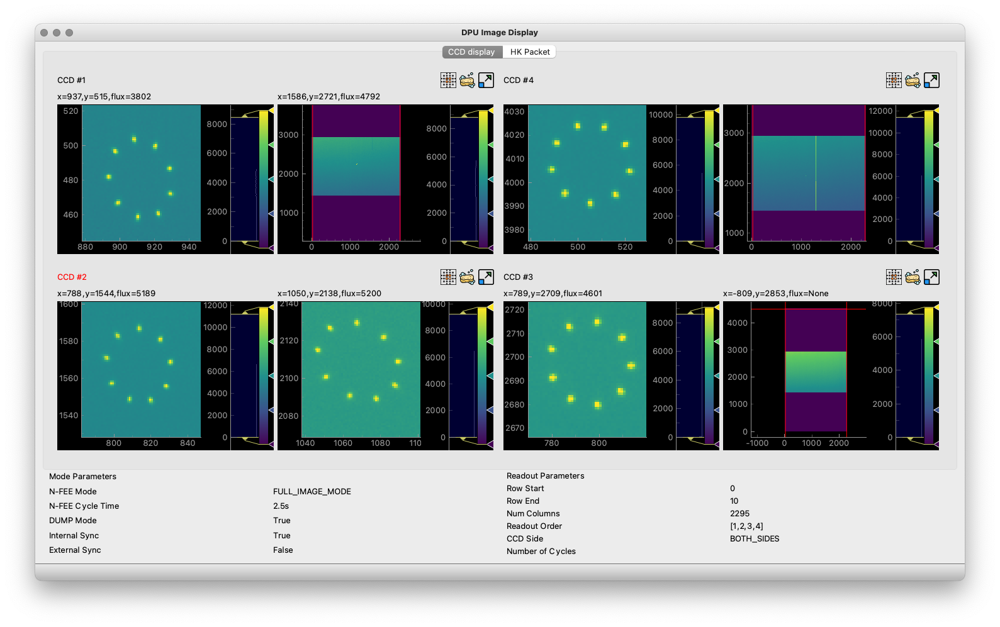
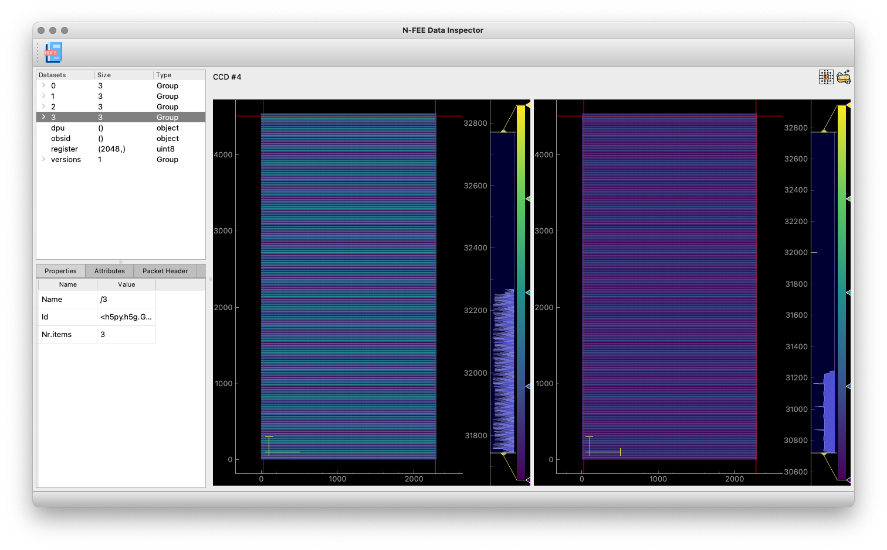

[#hdf5-format]
== The format of the HDF5 files

The HDF5 files contain the raw data that is read out from the camera through the spacewire interface that is connected to the front-end-electronics (FEE).

In contrast to the FITS files, which are organised around the image data, the HDF5 files are organised around the readout sequence and the telemetry that is sent out by the camera. Each HDF5 file contains exactly one readout sequence, i.e. four frames in external sync mode and one frame for internal sync. The data is not processed, but the raw data packets are saved as an Numpy array of type `uint8`, all values are unsigned integers of 8 bits, i.e. a byte.

Inspecting the HDF5 files can be done with the `h5py` module or you can use the CGSE module `egse.h5` which provides convenience functions to work with HDF5 files. We normally use the CGSE module to explore the HDF5 files, but will provide equivalent code for inspection with the `h5py` module where possible.

[tabs]
======
egse.h5::
+
----
>>> from egse import h5
----
h5py::
+
----
>>> import h5py
----
======

Let's take an example file from IAS taken on 7th February 2023. The file is loaded with the `h5.get_file()` function and we can visualize the top level structure as follows:

[tabs]
======
egse.h5::
+
----
>>> h5_fd = h5.get_file("20230207_IAS_N-FEE_SPW_06174.hdf5")
>>> h5.show_file(h5_fd)
[G] 0
[G] 1
[G] 2
[G] 3
[D] dpu (104 bytes)
[D] obsid (104 bytes)
[D] register (2.109 KB)
[G] versions
Total size of Group = 159.597 MB
Total size of attributes: 0 bytes
----

h5py::
+
----
>>> h5_fd = h5py.File("20230207_IAS_N-FEE_SPW_06174.hdf5")
>>> [x for x in h5_fd]
['0', '1', '2', '3', 'dpu', 'obsid', 'register', 'versions']
----

======
We can see that there are five top-level groups and three datasets. This is data taken in external sync mode, so we have four readouts per cycle. The data from each readout is in the groups 0, 1, 2, and 3. These numbers correspond to the frame number. Each of these groups has the following structure:

[tabs]
======
egse.h5::
+
----
>>> h5.show_groups(h5_fd["/0"], max_level=1)
[G] data
[D] hk (266 bytes)
[D] timecode (104 bytes)
Total size of Group = 39.899 MB
----
h5py::
+
----
>>> [x for x in h5_fd["/0"]]
['data', 'hk', 'timecode']
----
======

The `data` group contains all the SpaceWire packets that have image data, i.e. normal data packets and overscan packets. The `data` group also has the following attributes that are used to decode the SpaceWire packets into image data arrays. We will describe the `data` groups into more detail later in this section.

[tabs]
======
egse.h5::
+
----
>>> h5.show_attributes(h5_fd["/0/data"])
DG_en: 0 (32 bytes)
ccd_mode_config: 5 (32 bytes)
ccd_read_en: 1 (32 bytes)
ccd_readout_order: 228 (32 bytes)
digitise_en: 1 (32 bytes)
h_end: 2294 (32 bytes)
int_sync_period: 2500 (32 bytes)
n_final_dump: 0 (32 bytes)
sensor_sel: 3 (32 bytes)
sync_sel: 0 (32 bytes)
v_end: 4539 (32 bytes)
v_start: 0 (32 bytes)
Total size of attributes: 384 bytes
----
h5py::
+
----
>>> [x for x in h5_fd["/0/data"].attrs]
[
    'DG_en',
    'ccd_mode_config',
    'ccd_read_en',
    'ccd_readout_order',
    'digitise_en',
    'h_end',
    'int_sync_period',
    'n_final_dump',
    'sensor_sel',
    'sync_sel',
    'v_end',
    'v_start'
]
----
======

The two datasets in group `'/0'` contain the timecode and the housekeeping information that is sent on every sync pulse. The `timecode` dataset contains the timecode itself and the timestamp when this timecode was received by the DPU Processor. Remember the timecode is an integer from 0 to 63. The `timecode` dataset is an array with one integer element, the timestamp is an attribute of the `timecode` dataset. The `timecode` dataset and the timestamp can be visualised as follows.

[tabs]
======
egse.h5::
+
----
>>> h5.get_data(h5_fd["/0/timecode"])
array(53)
>>> h5.get_attribute_value(h5_fd["/0/timecode"], "timestamp")
'2023-02-07T15:13:10.397+0000'
----
h5py::
+
----
>>> h5_fd["/0/timecode"][()]
53
>>> h5_fd["/0/timecode"].attrs["timestamp"]
'2023-02-07T15:13:10.397+0000'
----
======

The raw content of the `hk` dataset can be shown as follows. The `hk` dataset has no attributes currently.
[tabs]
======
egse.h5::
+
----
>>> h5.get_data(h5_fd["/0/hk"])
array([ 80, 240,   0, 144,   5, 130,  24,  29,   0,   0, 128,   0, 128,
         0, 128,   0, 128,   0, 128,   0, 128,   0, 127, 255, 127, 255,
       127, 255, 127, 255, 127, 255, 127, 255, 127, 255, 127, 255, 127,
       255, 128,  21,   0,   0, 128,  88, 128,  87, 128,  88, 128,  88,
       128,  88, 128,  87, 128,  88, 128,  88, 128,  85, 128,  86, 128,
        86,  57, 191, 252, 138, 250, 233, 128,  87, 128,  88,  26, 159,
       231,  93,  25, 121, 231, 110,  26, 140, 223,  53,  26, 128,  83,
       191,  64, 186,   7,  68, 251, 124,  58, 236,  10, 181,   0,   0,
       128,  87, 128,  88, 148, 193, 128,  85, 128,  89, 148, 193, 128,
        88, 128,  88, 148, 186, 128,  86, 128,  89, 148, 202, 128,  86,
       128,  87, 128,  85, 128,  89, 128,  90,   0,  53,   0,   1,  24,
        29,   0,   0,   0,   0,   0,   0,   0,   0,   0,  24], dtype=uint8)
----
h5py::
+
----
>>> h5_fd["/0/hk"][()]
array([ 80, 240,   0, 144,   5, 130,  24,  29,   0,   0, 128,   0, 128,
         0, 128,   0, 128,   0, 128,   0, 128,   0, 127, 255, 127, 255,
       127, 255, 127, 255, 127, 255, 127, 255, 127, 255, 127, 255, 127,
       255, 128,  21,   0,   0, 128,  88, 128,  87, 128,  88, 128,  88,
       128,  88, 128,  87, 128,  88, 128,  88, 128,  85, 128,  86, 128,
        86,  57, 191, 252, 138, 250, 233, 128,  87, 128,  88,  26, 159,
       231,  93,  25, 121, 231, 110,  26, 140, 223,  53,  26, 128,  83,
       191,  64, 186,   7,  68, 251, 124,  58, 236,  10, 181,   0,   0,
       128,  87, 128,  88, 148, 193, 128,  85, 128,  89, 148, 193, 128,
        88, 128,  88, 148, 186, 128,  86, 128,  89, 148, 202, 128,  86,
       128,  87, 128,  85, 128,  89, 128,  90,   0,  53,   0,   1,  24,
        29,   0,   0,   0,   0,   0,   0,   0,   0,   0,  24], dtype=uint8)
----
======
The CGSE provides a module to inspect and work with PLATO SpaceWire packets. The above housekeeping packet can be inspected using the `HousekeepingPacket` class from the `egse.spw` package:
[tabs]
======
egse.h5::
+
----
>>> from egse.spw import HousekeepingPacket
>>> hk_data = h5.get_data(h5_fd["/0/hk"])
>>> hk = HousekeepingPacket(hk_data)
>>> print(hk)
print(hk)
HousekeepingPacket:
  Logical Address = 0x50
  Protocol ID = 0xF0
  Length = 144
  Type = mode:FULL_IMAGE_MODE, last_packet:True, CCD side:E, CCD number:0, Frame number:0, Packet Type:HOUSEKEEPING_DATA
  Frame Counter = 6173
  Sequence Counter = 0
  Data =
b'\x80\x00\x80\x00\x80\x00\x80\x00\x80\x00\x80\x00\x7f\xff\x7f\xff\x7f\xff\x7f\xff\x7f\xff\x7f\xff\x7f\xff\x7f\xff\x7f\xff\x80\x15\x00\x00\x80X\x80W\x80X\x80X\x80X\x80W\x80X\x80X\x80U\x80V\x80V9\xbf\xfc\x8a\xfa\xe9\x80W\x80X\x1a\x9f\xe7]\x19y\xe7n\x1a\x8c\xdf5\x1a\x80S\xbf@\xba\x07D\xfb|:\xec\n\xb5\x00\x00\x80W\x80X\x94\xc1\x80U\x80Y\x94\xc1\x80X\x80X\x94\xba\x80V\x80Y\x94\xca\x80V\x80W\x80U\x80Y\x80Z\x005\x00\x01\x18\x1d\x00\x00\x00\x00\x00\x00\x00\x00\x00\x18'
----
h5py::
+
In this case only the retrieving of the `hk_data` is different:
+
----
>>> hk_data = h5_fd["/0/hk"][()]
----
======
Thus far we have explored the following format of the HDF5 file:
----
h5_file
  ├──── 0
  │     ├──── data
  │     ├──── hk
  │     └──── timecode
  ├──── 1
  │     ├──── data
  │     ├──── hk
  │     └──── timecode
  ├──── 2
  │     ├──── data
  │     ├──── hk
  │     └──── timecode
  ├──── 3
  │     ├──── data
  │     ├──── hk
  │     └──── timecode
  ├──── dpu
  ├──── obsid
  ├──── register
  └──── versions
        └──── format_version
----
We haven't inspected the `versions` group yet, it currently contains only one dataset, `format_version`. This version describes the changes in the HDF5 file with respect to available groups, datasets and attributes. The format version can be accessed as follows.

[tabs]
======
egse.h5::
+
----
>>> h5.show_attributes(h5_fd["/versions/format_version"])
major_version: 2 (32 bytes)
minor_version: 4 (32 bytes)
Total size of attributes: 64 bytes
----
h5py::
+
----
>>> list(h5_fd["/versions/format_version"].attrs)
['major_version', 'minor_version']
>>> h5_fd["/versions/format_version"].attrs["major_version"]
2
>>> h5_fd["/versions/format_version"].attrs["minor_version"]
4
----
======

Up to now, the format versions have changed from 2.0 to 2.4 as follows:

----
2.0 - introduced the format_version
2.1 - Added obsid as a dataset to the HDF5 file
2.2 - Multiple commands can now be saved under the same frame number
2.3 - introduced /dpu/num_cycles attribute
2.4 - introduced /dpu/slicing_num_cycles attribute
----

Before we dive into the `data` groups, let's first inspect the three remaining datasets `dpu`, `obsid` and `register`. The `obsid` dataset contains the full observation identifier where this HDF5 file belongs to as a bytes object. If the `obsid` is empty, no observation was running.

[tabs]
======
egse.h5::
+
----
>>> h5.get_data(h5_fd["/obsid"]).item()
b'IAS_00088_00938'
----
h5py::
+
----
>>> h5_fd["/obsid"][()]
b'IAS_00088_00938'
----
======

The `dpu` dataset contains DPU Processor specific parameters that are needed to properly process the data. These parameters are available as attributes to this dataset and are mainly used by the FITS generation process.

[tabs]
======
egse.h5::
+
----
>>> h5.show_attributes(h5_fd["/dpu"])
num_cycles: 10 (32 bytes)
slicing_num_cycles: 0 (32 bytes)
Total size of attributes: 64 bytes
----
h5py::
+
----
>>> list(h5_fd["/dpu"].attrs)
['num_cycles', 'slicing_num_cycles']
>>> h5_fd["/dpu"].attrs["num_cycles"]
10
----
======

Finally, the `register` dataset is a Numpy array that is a mirror of the register memory map in the N-FEE at the time of the sync pulse.

[tabs]
======
egse.h5::
+
----
>>> h5.get_data(h5_fd["/register"])
array([ 17, 187,   0, ...,   0,   0,   0], dtype=uint8)
----
h5py::
+
----
>>> h5_fd["/register"][()]
array([ 17, 187,   0, ...,   0,   0,   0], dtype=uint8)
----
======

The content of the `register` dataset can be inspected using the `RegisterMap` class from the CGSE. If you are using a slightly older version of the CGSE, your output might looks different, i.e. not in a nicely formatted table. The content is however the same.
----
>>> import rich
>>> from egse.reg import RegisterMap
>>> reg_data = h5.get_data(h5_fd["/register"])
>>> reg = RegisterMap(name="N-FEE", memory_map=reg_data)
>>> rich.print(reg)
┏━━━━━━━━━━━━━━━┳━━━━━━━━━━━━━━━━━━━━━━━━━━━━━━┳━━━━━━━━┓
┃ Register      ┃ Parameter                    ┃ HEX    ┃
┡━━━━━━━━━━━━━━━╇━━━━━━━━━━━━━━━━━━━━━━━━━━━━━━╇━━━━━━━━┩
│ reg_0_config  │ v_start                      │ 0x0    │
│ reg_0_config  │ v_end                        │ 0x11bb │
│ reg_1_config  │ charge_injection_width       │ 0x64   │
│ reg_1_config  │ charge_injection_gap         │ 0x64   │
│ reg_2_config  │ parallel_toi_period          │ 0x36b  │
│ reg_2_config  │ parallel_clk_overlap         │ 0xfa   │
│ reg_2_config  │ ccd_readout_order            │ 0xe4   │
│ reg_3_config  │ n_final_dump                 │ 0x0    │
│ reg_3_config  │ h_end                        │ 0x8f6  │
│ reg_3_config  │ charge_injection_en          │ 0x0    │
│ reg_3_config  │ tri_level_clk_en             │ 0x0    │
│ reg_3_config  │ img_clk_dir                  │ 0x0    │
│ reg_3_config  │ reg_clk_dir                  │ 0x0    │
│ reg_4_config  │ packet_size                  │ 0x7d8c │
│ reg_4_config  │ int_sync_period              │ 0x9c4  │
│ reg_5_config  │ Trap_Pumping_Dwell_counter   │ 0x30d4 │
│ reg_5_config  │ sync_sel                     │ 0x0    │
│ reg_5_config  │ sensor_sel                   │ 0x3    │
│ reg_5_config  │ digitise_en                  │ 0x1    │
│ reg_5_config  │ DG_en                        │ 0x0    │
│ reg_5_config  │ ccd_read_en                  │ 0x1    │
│ reg_5_config  │ conv_dly                     │ 0xf    │
│ reg_5_config  │ High_precision_HK_en         │ 0x0    │
│ reg_6_config  │ ccd1_win_list_ptr            │ 0x0    │
│ reg_7_config  │ ccd1_pktorder_list_ptr       │ 0x0    │
│ reg_8_config  │ ccd1_win_list_length         │ 0x0    │
│ reg_8_config  │ ccd1_win_size_x              │ 0x0    │
│ reg_8_config  │ ccd1_win_size_y              │ 0x0    │
│ reg_8_config  │ reg_8_config_reserved        │ 0x0    │
│ reg_9_config  │ ccd2_win_list_ptr            │ 0x0    │
│ reg_10_config │ ccd2_pktorder_list_ptr       │ 0x0    │
│ reg_11_config │ ccd2_win_list_length         │ 0x0    │
│ reg_11_config │ ccd2_win_size_x              │ 0x0    │
│ reg_11_config │ ccd2_win_size_y              │ 0x0    │
│ reg_11_config │ reg_11_config_reserved       │ 0x0    │
│ reg_12_config │ ccd3_win_list_ptr            │ 0x0    │
│ reg_13_config │ ccd3_pktorder_list_ptr       │ 0x0    │
│ reg_14_config │ ccd3_win_list_length         │ 0x0    │
│ reg_14_config │ ccd3_win_size_x              │ 0x0    │
│ reg_14_config │ ccd3_win_size_y              │ 0x0    │
│ reg_14_config │ reg_14_config_reserved       │ 0x0    │
│ reg_15_config │ ccd4_win_list_ptr            │ 0x0    │
│ reg_16_config │ ccd4_pktorder_list_ptr       │ 0x0    │
│ reg_17_config │ ccd4_win_list_length         │ 0x0    │
│ reg_17_config │ ccd4_win_size_x              │ 0x0    │
│ reg_17_config │ ccd4_win_size_y              │ 0x0    │
│ reg_17_config │ reg_17_config_reserved       │ 0x0    │
│ reg_18_config │ ccd_vod_config               │ 0xeef  │
│ reg_18_config │ ccd1_vrd_config              │ 0xe65  │
│ reg_18_config │ ccd2_vrd_config              │ 0x65   │
│ reg_19_config │ ccd2_vrd_config              │ 0xe    │
│ reg_19_config │ ccd3_vrd_config              │ 0xe65  │
│ reg_19_config │ ccd4_vrd_config              │ 0xe65  │
│ reg_19_config │ ccd_vgd_config               │ 0x9    │
│ reg_20_config │ ccd_vgd_config               │ 0xb1   │
│ reg_20_config │ ccd_vog_config               │ 0x19a  │
│ reg_20_config │ ccd_ig_hi_config             │ 0xfff  │
│ reg_21_config │ ccd_ig_lo_config             │ 0x0    │
│ reg_21_config │ trk_hld_hi                   │ 0x4    │
│ reg_21_config │ trk_hld_lo                   │ 0xe    │
│ reg_21_config │ cont_rst_on                  │ 0x0    │
│ reg_21_config │ cont_cdsclp_on               │ 0x0    │
│ reg_21_config │ ccd_mode_config              │ 0x5    │
│ reg_21_config │ cont_rowclp_on               │ 0x0    │
│ reg_21_config │ reg_21_config_reserved       │ 0x0    │
│ reg_21_config │ clear_error_flag             │ 0x1    │
│ reg_22_config │ r_cfg1                       │ 0x7    │
│ reg_22_config │ r_cfg2                       │ 0xb    │
│ reg_22_config │ cdsclp_lo                    │ 0x9    │
│ reg_22_config │ adc_pwrdn_en                 │ 0x1    │
│ reg_22_config │ reg_22_config_reserved_1     │ 0x0    │
│ reg_22_config │ cdsclp_hi                    │ 0x0    │
│ reg_22_config │ rowclp_hi                    │ 0x0    │
│ reg_22_config │ rowclp_lo                    │ 0x2    │
│ reg_22_config │ reg_22_config_reserved_2     │ 0x0    │
│ reg_23_config │ ccd1_last_Epacket            │ 0x0    │
│ reg_23_config │ ccd1_last_Fpacket            │ 0x0    │
│ reg_23_config │ ccd2_last_Epacket            │ 0x0    │
│ reg_23_config │ reg_23_config_reserved       │ 0x0    │
│ reg_24_config │ ccd2_last_Fpacket            │ 0x0    │
│ reg_24_config │ ccd3_last_Epacket            │ 0x0    │
│ reg_24_config │ ccd3_last_Fpacket            │ 0x0    │
│ reg_24_config │ reg_24_config_reserved       │ 0x0    │
│ reg_25_config │ ccd4_last_Epacket            │ 0x0    │
│ reg_25_config │ ccd4_last_Fpacket            │ 0x0    │
│ reg_25_config │ Surface_Inversion_counter    │ 0x64   │
│ reg_25_config │ reg_25_config_reserved       │ 0x0    │
│ reg_26_config │ Readout_pause_counter        │ 0x7d0  │
│ reg_26_config │ Trap_Pumping_Shuffle_counter │ 0x3e8  │
└───────────────┴──────────────────────────────┴────────┘
----
The last group to inspect is the `data` group which is part of each of the readout groups. The `data` group contains all the SpaceWire packets that contain the CCD image data. The packets contain the serial prescan, serial overscan, the actual image data and the parallel overscan (if present). From the attributes of the `dpu` dataset we learned that `h_end=2294`, `v_start=0` and `v_end=4539`. The `h_end` attribute defines what is in the row data. The value `h_end=2294` means 25 pixels of serial prescan, 2255 pixels of image data, and 15 pixels of serial overscan data. Each packet in the `data` group is a Numpy array of type `uint8`, but the actual pixel data is a 16bit integer. The header of a SpW data packet is 10 bytes, so from this information we can calculate that there are 7 lines contained in each packet of length 32140. We also have data packets of 9190 bytes which contain only two rows of data.
----
>>> (32140-10)/2/2295
7.0
>>> (9190-10)/2/2295
2.0
----

We requested 4540 rows (`v_end - v_start + 1`) which is a full CCD of 4510 rows + 30 rows parallel overscan data. Image data and overscan data are sent in separate packets, so we have 644 + 1 packets of image data and 4 + 1 packets of parallel overscan data.
----
>>> 644*7 + 1*2  # 644 packets of 32140 bytes + 1 packet of 9190 bytes
4510
>>> 4*7 + 1*2  # 4 packets of 32140 bytes + 1 packet of 9190 bytes
30
----
This gives us a total of 650 packets for one side of the CCD, but since we requested both sides of the CCD (see `sensor_sel=3` in the `dpu` attributes or the `register` dataset above), we end up with a total of 1300 packets (datasets) in each of the `data` groups in `/0`, `/1`, `/2`, and `/3`.
----
>>> len(h5_fd["/0/data"])
1300
----

[#hdf5-inspection]
== Inspecting HDF5 files with the toolset from the CGSE

So far, we have been inspecting the HDF5 files using code entered in the Python REPL. The Common-EGSE however also provides a nice GUI to visualise all groups, datasets and attributes from the PLATO HDF5 files. If you were involved in camera testing, you have probably seen the DPU Image Display GUI that in real-time updates the image data and other metadata received from the camera. The life data is constructed from the SpaceWire data packets on-the-fly, not from an HDF5 file. An example of a measurement at CSL during alignment is given in the screenshot below.

The same visualisation is provided by the stand-alone application `hdf5_ui` that can be started from the terminal. This N-FEE Data Inspector GUI re-uses parts of the code from the DPU Image Display GUI, only the data that is shown is now read from an HDF5 file. Let's explore the functionality provided by the HDF5 GUI using a dataset that was taken at CSL during Short Functional Tests (SFT), i.e. data taken with the N-FEE simulator instead of the real instrument. When the GUI starts up, select the dataset '3' which will show the simulated image data as in the screenshot below.

----
$ hdf5_ui 20221222_CSL1_N-FEE_SPW_00433.hdf5
----

Now you can start navigating through the data by clicking and unfolding items in the upper-left panel. The screenshots below show typically some of the actions you can do and what type of data is presented.

[cols="a,a", frame=none, grid=none]
|===
| image::../images/hdf5_ui-02.png[caption="Screenshot 1 – ", title="Inspecting the Register Map"]
| image::../images/hdf5_ui-03.png[caption="Screenshot 2 – ", title="The Housekeeping Packet"]
| image::../images/hdf5_ui-04.png[caption="Screenshot 3 – ", title="Image zoom and data attributes"]
| image::../images/hdf5_ui-05.png[caption="Screenshot 4 – ", title="Inspection of individual data packets"]
|===

*Screenshot 1* shows the Register Map for this cycle. There is only one Register Map per HDF5 file. The register map is the status at the time the timecode is sent for the first readout frame. Commanding is possible at the end of any readout, but the changes are only activated in the FPGA on a long pulse of 400ms. That is when also the register map is stored in the HDF5 file. There are two register parametersfootnote:[There are actually more register parameters that are updated on every sync pulse, but those are all windowing parameters that are not used in camera testing.] that are updated on every pulse, long and short pulse. Those parameters are `sensor_sel` and `ccd_readout_order` and because of this more regular update possibility these parameters are also available as attributes in each of the `data` groups. So, in principle, the CCD side can be changed at every readout, and this will be recorded in the `sensor_sel` attribute to the `data` group. Above the register map table, you can see an empty text field. In this field you can type a string pattern to filter the parameters shown in the table. The string pattern shall be a simple string or a regular expression and it will match either the register name or the parameter name. For example, to list only parameters for register '3' enter 'reg_3_config' in this search field, to see all windowing size parameters you can enter something like `win.*size`.

*Screenshot 2* shows the view of the housekeeping packet for that readout frame. The housekeeping packet is sent for each sync pulse (long and short) right after the timecode. So, you will find a `hk` dataset for each of the readout frames. The housekeeping view currently only shows the data as raw values, no conversion to engineering values like voltages or temperatures is done at this stage.

*Screenshot 3* shows a combination of information. The images are zoomed in to show (1) that we have 25 serial prescan pixels, these are the pixels before the red line in the left part of the screenshot (F-side), and (2) we have 30 parallel overscan pixels, above the red horizontal line in the right part of the screenshot (E-side). We can now also clearly see that we have image pattern data (XXXX add reference here). The cross that is visible in the image data is put there by the N-FEE simulator to ease the validation of the image coordinates and pixel positions. Clicking the '3' group in the tree view will show the image data, if you expand the entry by clicking the small handle before the '3', you can then click the `data` group. This will not change the image display, but will update the details panel in the lower-left part of the screenshot. Select 'attributes' to see the specific parameters attached to this 'data' group.

In *Screenshot 4* I have further expanded the `data` group and the tree view now shows the individual SpaceWire data packets. If you click on one of them, the content of the packet is printed in different formats and also the header is printed in a human readable format. The parameter 'w' is the number of pixels in the data part of the SpW packet. As said above, we have 7 rows per packet -> 16065 / 7 = 2295, which is the number op pixels per row. This view is mainly there for debugging and can change in the future.

---

TBW

- [ ] How can we inspect the content of the data packets -> DataPackets class
- [ ] Explain when we have a commands group and what it contains
- [ ] What is the relation between the number of HDF5 files and the `num_cycles` value?
- [x] How to visualize the HDF5 files with the GUI `hdf5_ui`
- [ ] Which scripts do we have to inspect and check HDF5 files?
