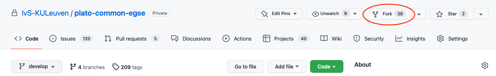

= Common-EGSE : Installation Manual
Sara Regibo, Rik Huygen
1.0, 20 May, 2022
:toc:
:icons: font
:organization: KU Leuven
:doc-nr: PLATO-KUL-PL-MAN-0002
:doctype: book
:toc: left
:toclevels: 2
:sectnums:
:!chapter-signifier:
:xrefstyle: short
:imagesdir: ../images
ifdef::backend-pdf[]
:pdf-theme: cgse-light
:pdf-themesdir: ../themes/
:pdf-header-logo: image::cgse-logo.svg[]
:title-logo-image: image::cgse-logo-400x400.png[Front Cover]
:source-highlighter: rouge
//:rouge-style: github
endif::[]

include::todo.adoc[]

== Introduction

This guide explains the installation and configuration of the components:

* The operating system on the egse-server and egse-client
* The installation of basic tools like git, python
* The installation of the Common-EGSE (CGSE)
* The installation of the Test Scripts (TS)

== Installing the Operating System

include::server.adoc[leveloffset=1]

include::client.adoc[leveloffset=1]

=== Setting up the users

=== Installation of Python

=== Installation of PyCharm

PyCharm is the IDE that we will use to execute test scripts. For this purpose the PyCharm Community edition is sufficient.

== Installing and configuring Git and GitHub

The `plato-common-egse` code is under version control in https://github.com/[GitHub].  To be able to get the latest version of the code on your local machine and to share possible contributions with other people in the project, you need to install Git on your computer. Git might already be installed on your system, check it with the `git --version` command in your terminal.

Installation instructions for your operating system can be found on the https://git-scm.com/book/en/v2/Getting-Started-Installing-Git[Git reference documentation].

=== Access to GitHub Repository

The `plato-common-egse` code is located in a https://github.com/IvS-KULeuven/plato-common-egse[private repository in GitHub].  To be able to access it, we have to grant you access explicitly. Please, send your GitHub username to the development team and you will be granted read access to the repository.  You will then get an invitation by email to join.

If you have not done so already, you can make an https://github.com/join[account on GitHub] for free.

=== Forking & Cloning the Repository

The `plato-common-egse` repository can be found on the https://github.com/IvS-KULeuven/plato-common-egse[IvS-KULeuven GitHub pages].  This repository is referred to as **upstream**.

This section describes the process how to install a copy of the repository on your local machine. Note that this is a two step process as shown in the diagram below.

image::../images/fork-clone.png[]

==== Fork a repository

When you not only want use the code but also contribute to it, you have to "fork" this repository.  To do this,  go to the https://github.com/IvS-KULeuven/plato-common-egse[upstream GitHub page], shown below.

Press the `"Fork"` button at the top right (encircled in red in the screenshot above) and follow the instructions.  Your personal copy of the `plato-common-egse` repository will then show up on your personal GitHub pages.  This copy is referred to as **origin**.

==== Clone a repository

To create a local copy of the repository, _clone_ it to a designated directory on your local machine with the following command. This will create a folder `plato-common-egse` in the `~/git` directory.

----
$ cd ~/git
$ git clone https://github.com/<your GitHub username>/plato-common-egse.git
----

After executing these steps, you should see the following:

* on your personal GitHub page: the forked repository;
* on your local machine: a local copy (i.e. clone) of the repository in the `~/git` folder.

XXXXX: what's next?

Make sure the environment variables are set: PLATO_COMMON_EGSE_PATH, and PLATO_INSTALL_LOCATION

* install for develop -> `python -m pip install -e .`
* install for ops -> 'python setup.py install --force --home=$PLATO_INSTALL_LOCATION`

== Installing the Common-EGSE

=== First-time Installation

=== Update the Common-EGSE

== Installing the Test Scripts

=== First-time Installation

=== Update the Test Scripts

== Shared Libraries

Some components use a shared library that is loaded by the Python interpreter. In order to load the library, the absolute path to the shared object file must be known. Different modules handle this in their own way.

The `egse.dsi` module searches for the RMAP and ESL libraries in the operating system specific folder in the  `egse.lib` module. The libraries are then loaded using the `ctypes` module. If the CGSE is properly installed, this should work out-of-the-box.

The `egse.filterwheel.eksma` module needs a library `libximc` which is also provided in the `egse.lib` module, but the Python code needs the proper location in the environment variable `LD_LIBRARY_PATH`.  The required files are included in the CGSE repo at `~/git/plato-common-egse/src/egse/lib/ximc/libximc.framework`.  The library that is needed can also be downloaded from: https://files.xisupport.com/libximc/libximc-2.13.3-all.tar.gz.

The preferred solution is to add the location of the library files to the environment variable `$LD_LIBRARY_PATH`.  In your terminal or better in your bash profile:

[%nowrap,source]
----
export LD_LIBRARY_PATH=$LD_LIBRARY_PATH:~/git/plato-common-egse/src/egse/lib/ximc/libximc.framework/
----

Alternatively, you can install the '.deb' package from the link above on your system with dpkg. That will put the files under `/usr/lib`.

== Installating External Tools

=== Cutelog GUI

=== Textualog TUI

Textualog is a terminal application that allows you to inspect the log files in `$PLATO_LOG_FILE_LOCATION`. The package is open-source and can be installed in your virtual environment from PyPI using `pip`:

[bash]
----
python -m pip install textualog
----

Textualog is extremely useful to inspect and follow logging messages in a remote terminal.
