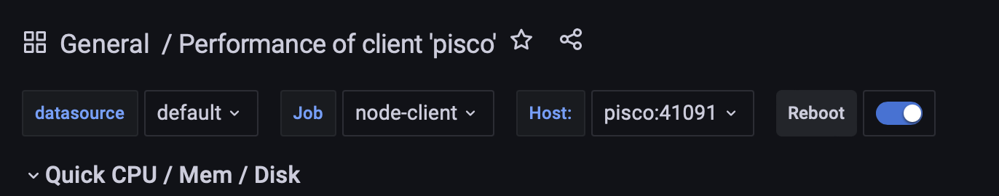

[#node-exporter-install]
== Install the Linux node-exporter

=== Install the exporter

One of the useful dashboards that we have in Grafana is the _Linux Host Dashboard_. This dashboard pulls data from Prometheus and the node exporter. Install the node exporter on the egse-server and egse-client with the following commands as explained on the https://prometheus.io/docs/guides/node-exporter/#monitoring-linux-host-metrics-with-the-node-exporter[node-exporter guide page].
----
$ cd ~/software
$ wget https://github.com/prometheus/node_exporter/releases/download/v1.5.0/node_exporter-1.5.0.linux-amd64.tar.gz
$ tar xzvf node_exporter-1.5.0.linux-amd64.tar.gz
$ ln -s node_exporter-1.5.0.linux-amd64 node_exporter
----

Then create a service in the `/etc/systemd/system` directory by copying the file `node_exporter.service` from the repository.
----
$ sudo cp ~/git/plato-common-egse/server/node_exporter.service /etc/systemd/system
----
Now enable the service, reload the systemd daemon and start the service withfootnote:[the daemon shall be reloaded because the service file was added]:
----
$ sudo systemctl enable node_exporter
$ sudo systemctl daemon-reload
$ sudo systemctl start node_exporter
----

Finally, the Prometheus service shall be restarted. Since this service is running on the egse-server, the configuration file `prometheus.yml` shall contain a scraping job for both the server and the client. The example below shows the entries for the machines at CSL where the server is 'localhost' and the client is 'pisco'.
----
  - job_name: node-server
    static_configs:
      - targets: ['localhost:41091']

  - job_name: node-client
    static_configs:
      - targets: ['pisco:41091']
----

=== Install the dashboard

The node exporter dashboard can be imported directly from Grafana with ID 1860 (see https://grafana.com/grafana/dashboards/1860-node-exporter-full/[node exporter dashboard]). Configure the dashboard at the top of the dashboard setting the 'Job' and the 'Host'. From the example scrape jobs above use 'node-server', 'node-client' for the Job and 'localhost', 'pisco' for the Host respectively for the server and client dashboards.

=== Testing the node exporter metrics

On the server machine where the node exporter is running, you can test its proper functioning with the following command:
----
$ curl localhost:41091/metrics  | egrep -v "^#"
----

That will print all metrics from the node exporter in the terminal.
