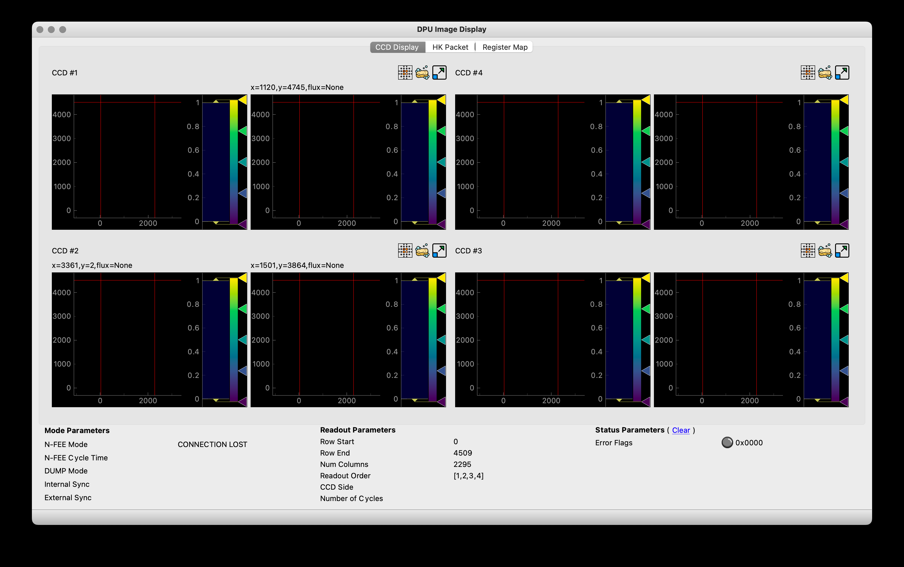
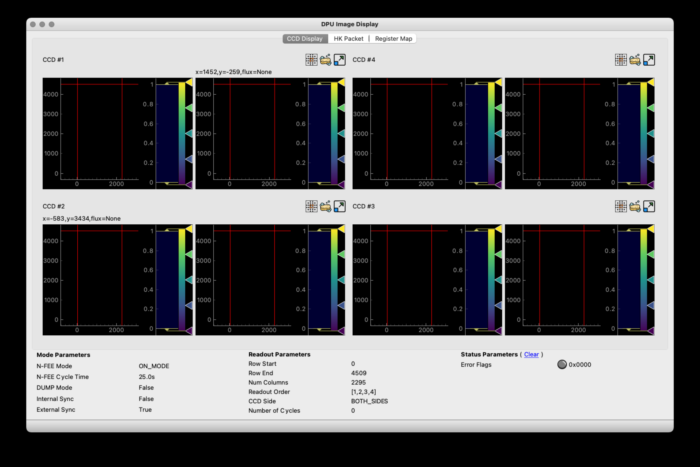
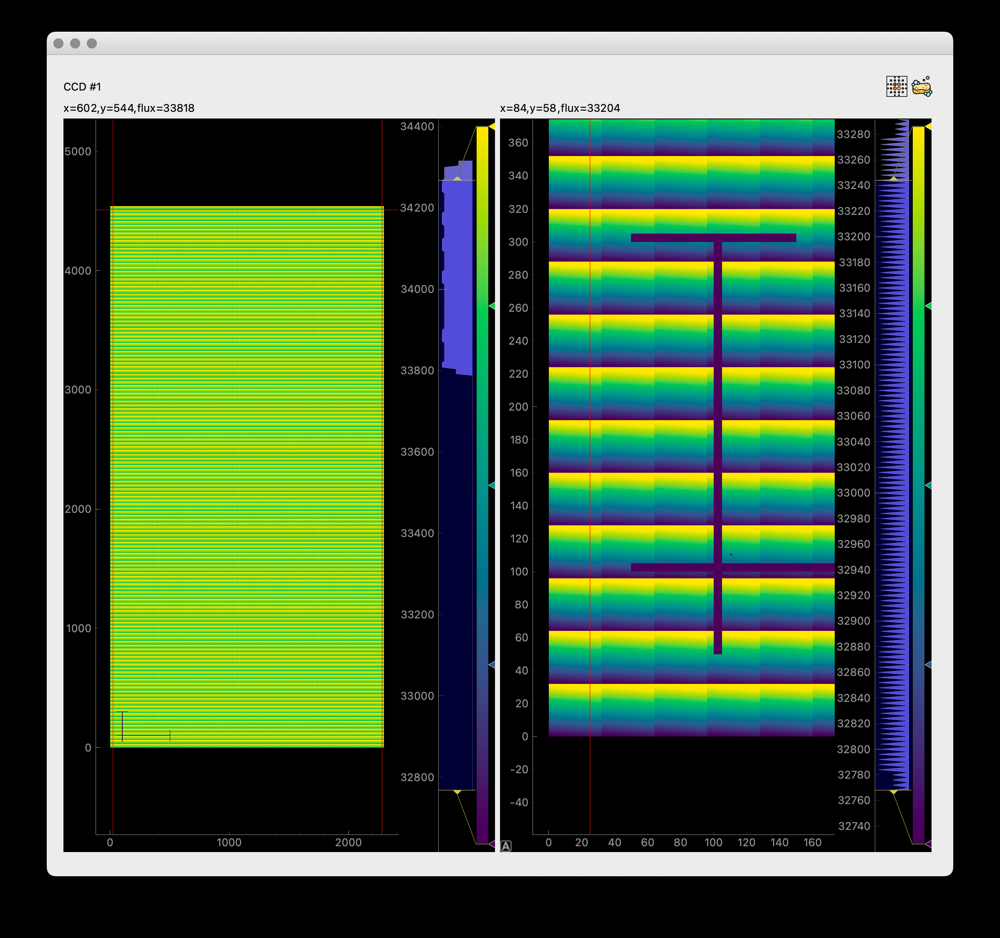
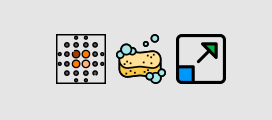

[#dpu-gui]
== The DPU GUI

The DPU GUI is a (near) real-time viewer for the data that is received from the N-FEE. I say _near_ real-time because the data comes with a small delay due to the nature of the interface and the inner working of the N-FEE. Image data e.g. can take up to four seconds to transfer from the N-FEE to the DPU Processor just for one frame of one of the four CCDs. The housekeeping data is only sent once on every (or right after) a synchronisation pulse, which takes 6.25s for external synchronisation measurements. Because of this delay, you need to be aware of the current operating mode and the synchronisation mode of your observation to estimate how long it will take before you can inspect the data. Sometimes its quick like with internal sync measurements of a partial readout and a period of a second versus full frame external sync measurements. Since mode changes only happen on the long (400ms) pulses, it can take up to 25s before you can see the change in the GUI.

The DPU GUI is usually started from the Process Manager GUI by pressing the UI button associated to the DPU Control Server. You can also start the DPU GUI from the terminal with the `dpu_ui` command. The DPU GUI always runs on the client machine in any test house.

To start up the DPU GUI, at least the core services need to be running on the server. The DPU GUI gets its information from the DPU Processor, so as long as this process is not running, you will see a `CONNECTION LOST` message as the N-FEE mode in the 'Mode Parameters' panel. As soon as the DPU Processor starts and connects to the N-FEE, the DPU GUI will receive data and update its displays. Whenever the DPU Processor loses connection with the N-FEE (e.g. because the camera was switched off) or the DPU Processor is terminated or crashed, the N-FEE Mode will show the `CONNECTION LOST` message again.

[tabs]
======
CONNECTION LOST::
+
--
.The DPU GUI when it is just been launched. There are no images for the CCDs, readout parameters have a default value and the N-FEE mode says 'CONNECTION LOST'. There is no connection with either the DPU Processor or the N-FEE.

--
ON MODE::
+
--
.The DPU GUI now shows 'ON_MODE' which means the DPU Processor is running and there is a connected with the N-FEE. In 'ON_MODE' all mode and readout parameters are shown. You can see we are in external synchronisation with a sync cycle of 25s.

--
======

Mode Parameters::
+
--
The _Mode_ parameters, which you find in the lower left of the DPU GUI, visualise the operating mode of the N-FEE. One special item here is the DUMP mode, which is not a genuine N-FEE mode, but a combination of settings that is defined within the CGSE as dump mode, see https://ivs-kuleuven.github.io/plato-cgse-doc/asciidocs/commanding-manual.html#\_dump_mode[dump mode] in the commanding manual. In the table below the _Mode_ parameters are matched against the N-FEE registers they visualise.

NOTE: These mode parameters are updated on long pulses (400ms) only. In external synchronisation it can therefore take up to 25s before you will see the update.

[cols="1,1,3"]
|===
|Mode Parameter |Register Parameter |Description

|N-FEE Mode
|`ccd_mode_config`
|The main operating mode of the N-FEE. In our tests we will navigate between ON_MODE, STANDBY_MODE, and FULL_IMAGE_MODE.

|N-FEE Cycle Time
|`int_sync_period`
|In external synchronisation, this value will be 6.25s. For internal sync, the actual pulse periodfootnote:[The `int_sync_period` doesn't represent the full time period between two pulses, apparently the full time period between two internal sync pulses is `int_sync_period` + 400ms. See the Commanding Manual XXXXX (link) for more details.] is the `int_sync_period` + 400ms.

|DUMP Mode
|`ccd_mode_config=5`, `DG_en=1`, `digitise_en=0`
|This mode is True when in full-image mode with the dump-gate high and digitisation disabled.

|Internal Sync
|`sync_sel=1`
|Internal synchronisation, i.e. the N-FEE internal clock will generate 400ms pulses every `int_sync_period` milliseconds.

|External Sync
|`sync_sel=0`
|External synchronisation where the N-FEE receives sync pulses from the AEU Test EGSE.

|===
--

Readout Parameters::
+
--
The _Readout_ parameters visualise which parts of which CCDs will be read out by the N-FEE.

NOTE: All readout parameters are updated on long pulses (400ms) only, except for the `sensor_sel` parameter which is also updated on short (200ms) pulses.

[cols="1,1,3"]
|===
|Readout Parameter |Register Parameter |Description

|Row Start
|`v_start`
|First row for the readout, base 0

|Row End
|`v_end`
|Last row to readout

|Num Columns
|`h_end`
|The number of serial registers to transfer. This number is fixed at 2295, i.e. 25 serial pre-scan pixels, 2255 real CCD pixels, and 15 serial over-scan pixels.

|Readout Order
|`ccd_readout_order`
|The order in which the CCDs are read out. The parameter consists of four values identifying the CCD to be read out during each part of the 25s readout cycle. The order is given from left to right.

|CCD Side
|`sensor_sel`
|Indicates which side of the CCD is read out, E-side, F-side, or BOTH sides simultaneously.

|Number of Cycles
|`num_cycles`
|The number of cycles is not a readout parameter of the N-FEE. It has no equivalent register parameter. This parameter is an internal counter of the DPU Processor and defines how many readout cycles the N-FEE will perform in FULL images mode. The parameter is fully explained in https://ivs-kuleuven.github.io/plato-cgse-doc/asciidocs/developer-manual.html#_dpu_control_server_and_dpu_processor[the developer manual].

|===
--

Status Parameters::
+
--
We have currently only one status parameter, _Error Flags_, which visualises the possible error flags that can occur and are reported by the N-FEE in the housekeeping packet. By default, the error flags are shown in hexadecimal format, if you click on the value it will toggle to binary, decimal and back to hexadecimal. When an error occurs in the N-FEE, its usually not a one-time event and there might be a several successive errors. Because that would be difficult to visualise, once we have an error flag, it is shown and *not* overwritten until you reset it by clicking the (blue, underlined) clear.

The error flag is a bit field, so you shall decode it in order to understand which errors are represented. The table below lists the errors and their bit values, there are currently 12 error flags. If you hover over the non-zero value it will show a tooltip explaining the error code.

[cols='1,6']
|===
|Bit Number |Description

|0  |Window pixels fall outside CDD boundary due to a wrong x-coordinate
|1  |Window pixels fall outside CDD boundary due to a wrong y-coordinate
|2  |E-side pixel external SRAM BUFFER is Full, corrupt image will be transferred
|3  |F-side pixel external SRAM BUFFER is Full, corrupt image will be transferred
|4  |Too many overlapping windows, could not complete AWLAfootnote:[AWLA = Active Window List Array], some pixels touching the window will be dropped
|5  |SRAM EDAC Correctable
|6  |SRAM EDAC Uncorrectable
|7  |Stat_Link_disconnect_Error
|8  |Stat_Link_Escape_Error
|9  |Stat_Link_Credit_Error
|10 |Stat_Link_Parity_Error
|11 |pll lock error. Loss of pll lock, N-FEE has a synchronisation issue
|===

--

'''

The CCD images are all oriented with the readout register at the bottom. The image that is visualised is a composition of —from left to right— the serial pre-scan pixels (25), the actual CCD pixels (2255), the serial overscan pixels (15), and on top of these the parallel overscan pixels (30). The red lines in the displays indicate the boundaries of the CCD pixels.

The four CCD image displays are build from a https://www.pyqtgraph.org[pyqtgraph] widget. This means you have all functionality available for interactive inspection of the image. Please refer to the https://pyqtgraph.readthedocs.io/en/latest/index.html[PyQtGraph documentation] to learn the details. The most used mouse interactions are:

* zoom in and out with the mouse wheel or a two-finger swipe on your trackpad,
* pan with click and drag
* reset the zooming level to the actual size by pressing the small 'A' symbols in the lower-left corner of the image (only visible when zoomed or panned)

In <<fig-dpu-ui-zoomed-window>>, we show the zoom window for CCD1. The image display is the same for the other CCDs and for the main DPU GUI window with all four CCDs. We see both sides of the CCD displayed next to each other in independent (pyqtgraph) widgets. Each side has the image data on the left and the histogram on the right. The histogram can be manipulated using the standard PyQtGraph interactions in order to change the color mapping or zoom and select the histogram range.

The right-side of the CCD is zoomed and we clearly see that there are 25 serial pre-scan pixels. The big cross is part of the simulated data in order to identify the orientation of the image (a debugging tool). In this right-side view you also see the small 'A' in the lower-left corner that you can use to bring the visualization back to the actual full size. Above each of the CCD sides are coordinates that represent the pixel position and the flux for that pixel where the mouse is pointed.

[#fig-dpu-ui-zoomed-window]
.Zoomed window for CCD1 with simulated image data.

The two icons in the upper-right corner of the display allow you to (1) select and zoom to the brightest pixels in the display, and to (2) clear the image data. In de main window there is a third button per CCD that will open de image data in a separate zoom window like in xref:fig-dpu-ui-zoomed-window[xrefstyle=short].

.Associated with each CCD widget, at the top-right, there are three buttons that allow to (1) zoom to the brightest pixel of the CCD image, (2) clear the CCD display, and (3) show the CCD image in a separate window.

There is no functionality to save CCD images because all data is automatically saved in HDF5 files by the DPU Processor. The HDF5 file is fully explained in the https://ivs-kuleuven.github.io/plato-cgse-doc/asciidocs/icd.html#hdf5-format[Interface Control Document] (ICD).

Describe the HK display...

Describe the Register Map display tab... when is this updated? Can we freeze it? Can we filter?

What improvements could we envisage for the DPU GUI?

* Simple one-button command to the N-FEE
* Navigation to previous frames?
* SpaceWire diagnostics?
