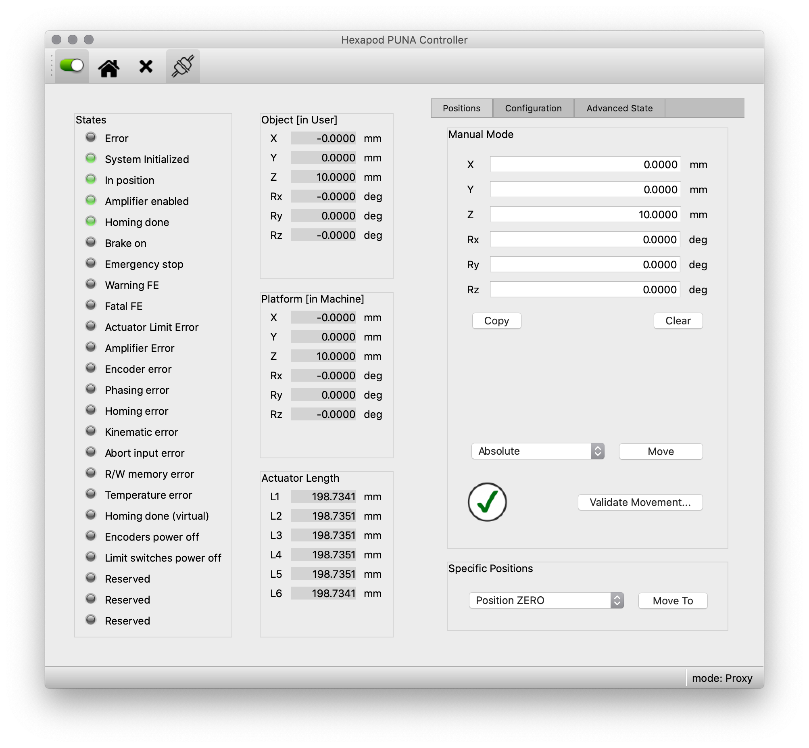
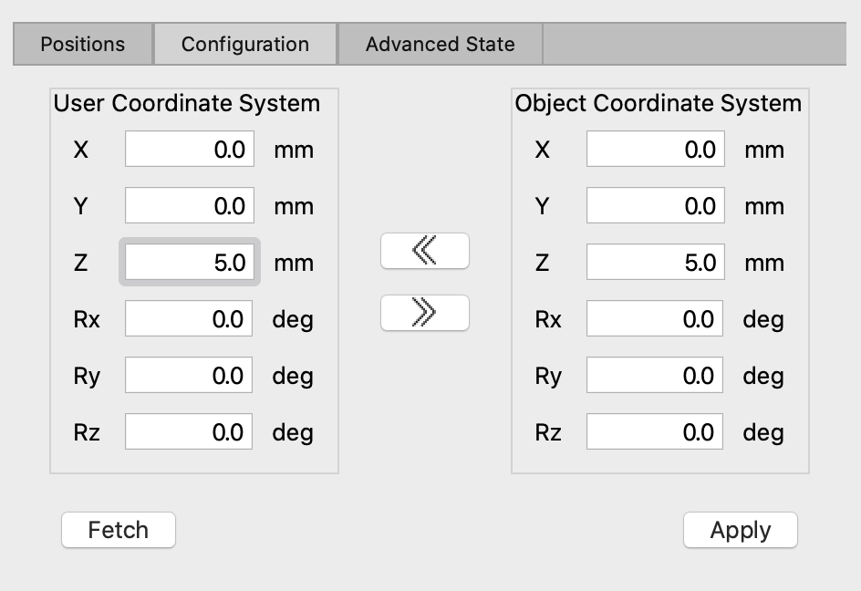
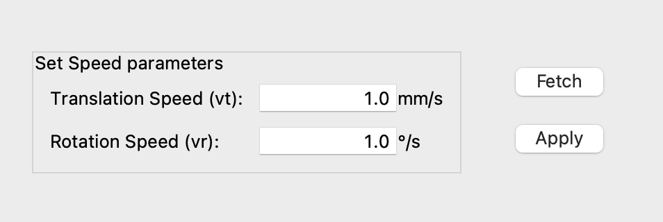
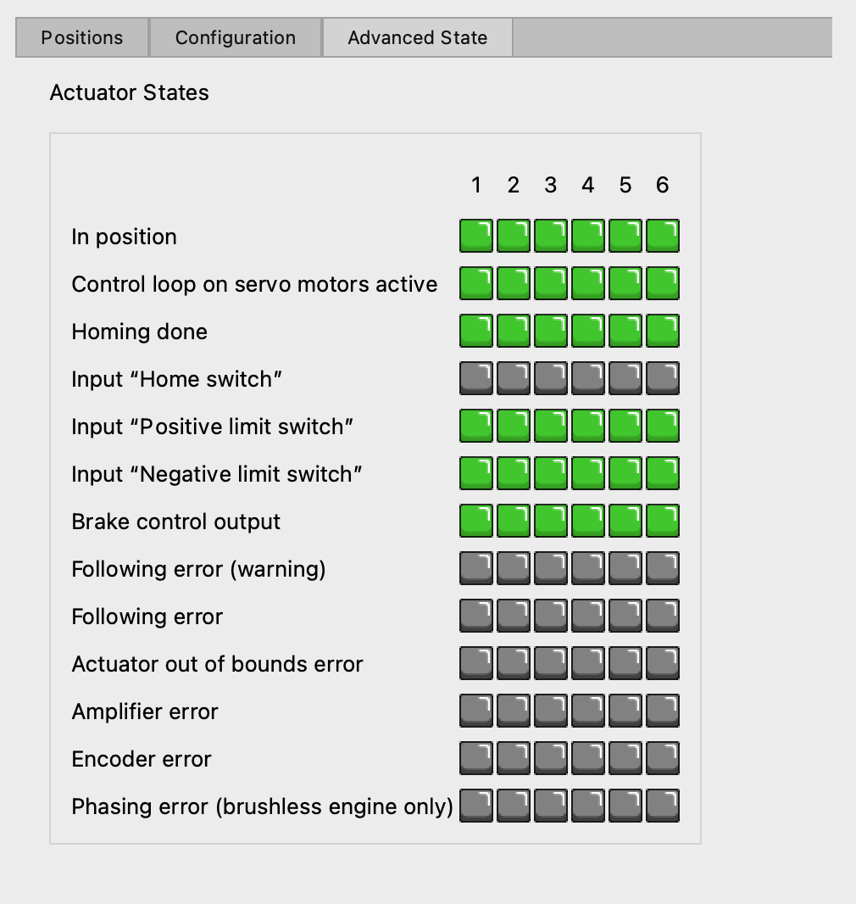

== The Hexapod Puna GUI

=== Monitoring and Commanding the Hexapod

Monitoring and commanding the hexapod can be done via a designated GUI. This
is described in the sections below.

=== Synopsis

To start the Hexapod Puna GUI, type the following command:

```bash
puna_ui --type [simulator/proxy/direct]
```

**Arguments**

The Hexapod GUI should be started with the following arguments:


`--type`::
The hexapod implementation you want to connect to. The options are `simulator`, `proxy`, and `direct`. The `simulator` option starts the GUI in simulation mode, which means that instead of connecting to the real hardware, the GUI communicates with a simulator. This option is mainly used for testing or demonstration when no hardware is available. The `direct` option connects the GUI directly to the hardware controller without a control server in between. The `proxy` option is the default and connects the GUI to the Puna Control Server allowing other processes to connection simultaneously for monitoring.

`--profile`::
Optional. Profile for logging.

=== Description

A screenshot of the Hexapod Puna GUI is shown below.



We discern the following components in the GUI:

* the [toolbar](#toolbar),
* the left panel, displaying the [status](#states) of the hexapod,
* the middle panel, with the
  [user and machine positions, and actuator lengths](#positions),
* and the right panel with the
  [tabs that allow settings, movements, maintenance, etc.](#tabs)

=== Toolbar

Enable/Disable Amplifier::

The first button, the switch, is used to enable/disable the amplifier, i.e. to
activate/de-activate the control loop of the motors.

Homing::
The second button in the toolbar, with the little house, currently does not
work yet. It will be used in the future to move the hexapod back to its homing
position.

Clear Errors::
The third butting in the toolbar, with the cross, currently does not work yet.
It will be used in the future to clear the errors.

Connectivity::
The fourth button in the toolbar, with the plug icon, indicates whether or not
a connection has been established to the Hexapod Control Server, and can be
used to re-connect to or disconnect from it. The connection is handled with
the [ZeroMQ](http://zeromq.org/) _request-reply_ protocol.

=== States

The left panel reports on the status of the hexapod. This is done by means of
a series of LEDS, where a green LED indicates information, an orange LED
indicated a warning, and a red LED indicates an error has occurred.

The meaning of the individual reported states can be found in the Application
programming interface (API) of the Hexapod controller (MAN_SOFT_API).

=== Positions

The middle panel displays the user and machine positions, and actuator
lengths.

Object [in User]::

At the top the position of the Object Coordinate System is given in the User
Coordinate System. The fields `X`, `Y`, and `Z` denote the translation (in mm)
along the $x$-, $y$-, and $z$-axis (of the User Coordinate System) resp. The
fields `Rx`, `Ry`, and `Rz` denote the rotation (in degrees) around these
axes.

Platform [in Machine]::

In the middle the position of the Platform Coordinate System is given in the
Machine Coordinate System. The fields `X`, `Y`, and `Z` denote the translation
(in mm) along the $x$-, $y$-, and $z$-axis (of the Machine Coordinate System)
resp. The fields `Rx`, `Ry`, and `Rz` denote the rotation (in degrees) around
these axes.

Actuator Lengths::

At the bottom, the fields `L1` to `L6` display the lengths (in mm) of the
corresponding actuators. Currently the underlying method polling these lengths
has not been implemented yet and all actuator lengths are set to NaN.

=== Tabs

The tabs in the right panel allow settings, movements, maintenance, etc. The
different tabs are discussed in the subsequent sections.

Positions::
    The first tab, `Positions`, allows to command the hexapod to move to a given position in manual mode. The type of movement, absolute or relative (user \& object), can be selected by the combo box. Before you perform a movement, it is always a good idea to validate. Press the _Validate Movement.._ button to send a check command to the Hexapod Controller and return a valid/invalid condition.

There are two specific positions that can be moved to with the combo box at the bottom of this tab, ZERO and RETRACTED.

Configuration::

The second tab, `Configuration`, allows to manually change the definition of the User coordinate system and the Object coordinate system. The User coordinate system is defined relative to the Machine coordinate system, and the Object coordinate system is defined relative to the Platform coordinate system. This configuration is not saved automatically and will be reset after power-on of the controller.



The double arrow buttons in the middle are used to copy the settings from one coordinate system to the other. Use the `Fetch` button to load the settings from the Hexapod controller and when you want to apply your changes, click the `Apply` button.

In the lower part of this tab you will find speed settings. Rotation and translation speed of the hexapod can be set independently. Use the `Fetch` button to retrieve the current speed settings from the hexapod and click the `Apply` button to save your changes to the controller.




Advanced State::

The third tab, `Advanced State`, shows the state of each of the actuators of the hexapod.


